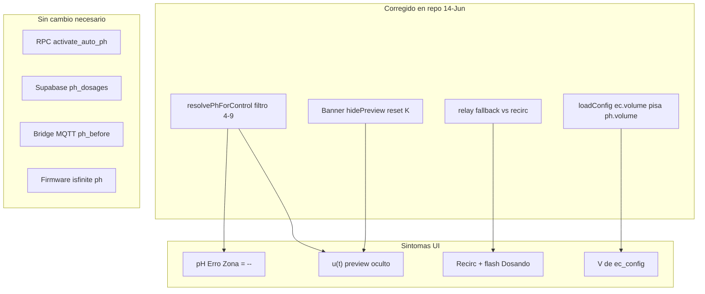

# Handoff — Auto pH coherencia UI + modo dev

**Fecha:** 14/06/2026 · **Device ref:** `ESP32_HIDRO_269844`  
**Contexto:** incoherencias en `/automacao` con Auto pH activo; petición de eliminar gates pH 4–9 en desarrollo para ver todo el debug sin bloqueos.

**Estado código (14/06):** fixes aplicados en repo (frontend). **Firmware (16/06):** Auto pH alineado con máquina de estados procedural de Auto EC (MVP). **Prod:** seguir gates S01→S08 en [`handoffs/ph/00_INDICE_SERIAL.md`](handoffs/ph/00_INDICE_SERIAL.md).

---

## Resumen ejecutivo

El operador veía la UI de Auto pH bloqueada (`pH Atual = --`, preview oculto, banner de PV inválido) mientras el histórico de dosagens y badges parecían contradictorios. Tras levantamiento por capa:

- **Causa principal:** frontend filtraba pH fuera de 4–9 (`resolvePhForControl`) y ocultaba preview/erro con banners UX.
- **No requirió cambios (14/06):** Supabase, RPC `activate_auto_ph`, bridge MQTT (ya aceptan cualquier pH **finito** con `PH_PROTOTYPE_RELAX_GUARDS=1`).
- **Firmware (16/06):** refactor Auto pH — ver sección [Firmware MVP — paridad EC](#firmware-mvp--paridad-ec-16062026).

Se ejecutaron dos intervenciones en código:

1. **Coherencia sistémica** — labels histórico vs preview, volume `ph_config` first, badges recirc > dosando, timestamp, SQL diagnóstico.
2. **Modo dev sin restricción 4–9** — revertir gates que bloqueaban PV/preview; regla: **finito = válido** (paridad EC + firmware `isfinite`).

---

## Síntomas reportados

| Síntoma en pantalla | Ejemplo observado |
|---------------------|-------------------|
| pH Atual / Erro / Zona de controle = `--` | Sensor con `ph = 2.24e-39` |
| Mensaje "ESP neste ciclo" | *Sem leitura pH — aguardando PV para dosagem* |
| u(t) preview oculto | `-- ml` con Auto pH activado |
| Última dosagem vs preview | 41,66 ml (histórico) vs 0,01 ml (live) — parecía incoherente |
| Badges simultáneos | *Aguardando recirculação 16s* + flash *Dosando ~3s* |
| Volume V incorrecto | `V = 2 L` cuando `ph_config` tenía otro valor — EC pisaba en `loadConfig` |
| s_L minúsculo | `0,001 via k aprendido` — K aprendido con PV basura |

---

## Mapa causa raíz



---

## Levantamiento por capa (14/06/2026)

| Capa | ¿Filtraba pH 4–9? | Acción tomada |
|------|-------------------|---------------|
| [`src/lib/realtime/hydro-ph.ts`](../src/lib/realtime/hydro-ph.ts) | Sí (temporal) | `resolvePhForControl*` delega a finito (`resolvePhForDisplay` / `isFinitePh`) |
| [`src/hooks/useHydroEcReading.ts`](../src/hooks/useHydroEcReading.ts) | Sí | Promueve `ph` vía `resolvePhForDisplay` |
| [`src/components/PhControllerPanel.tsx`](../src/components/PhControllerPanel.tsx) | Sí (UX) | Eliminados banner, `hidePreviewDose`, reset K condicionado; `displayPh` = finito |
| [`src/hooks/usePhOperationState.ts`](../src/hooks/usePhOperationState.ts) | No (badges) | Recirculación prioritaria sobre relay flash |
| **Supabase** (`ph_config_view`, `ph_dosages`, `hydro_measurements`) | **No** | CHECKs solo en direction, aggressiveness, volume>0, etc. |
| **RPC** `activate_auto_ph` | **No** | Valida relé pH+ configurado, no rango pH |
| **Bridge** [`infra/mqtt/bridge/index.js`](../../ESP-HIDROWAVE-main/infra/mqtt/bridge/index.js) | **No** | Grava `ph_before` si `Number.isFinite` |
| **Firmware** [`HydroControl.cpp`](../../ESP-HIDROWAVE-main/src/HydroControl.cpp) | **Sí (16/06)** | Máquina pH = EC: `phCycleDurationMs` + `phStateStartMs`, `ph_dose` al apagar relé |

**Conclusión (14/06):** no fue necesario migration SQL, cambio de RPC ni bridge para desbloquear la UI con `ph = 2e-39`. **16/06:** firmware corregido para `ph_operation remaining_sec` y timing de dosificación coherentes con Auto EC.

---

## Firmware MVP — paridad EC (16/06/2026)

### Síntoma previo (serial + MQTT)

| Observación | Causa |
|-------------|-------|
| Serial: `Dosagem relé 2 por 51 s` | `startPhAutoDosage` llamaba `toggleRelay` |
| MQTT/UI: `ph_operation dosing rem=0s` ~1 s | `timerSeconds[relay] = seconds/1000` (bug) + `getPhOperationRemainingSec` leía `timerSeconds` |
| `ph_dosages` con 50 ml sin bomba | `emitPhDoseEvent` al fin de recirc, no al apagar relé |

### Cambios en [`ESP-HIDROWAVE-main/src/HydroControl.cpp`](../../ESP-HIDROWAVE-main/src/HydroControl.cpp)

| Pieza | Antes | Después (paridad EC) |
|-------|-------|----------------------|
| Duración dosagem | `toggleRelay` + `timerSeconds` | `phCycleDurationMs` + `phStateStartMs` |
| Actuación relé | `toggleRelay()` | `pcf2.write` directo en state machine |
| `remaining_sec` | `timerSeconds - elapsed` | `computePhOperationRemainingSec()` |
| `ph_dose` / MQTT | Fin recirc | Al apagar relé (fin `PH_DOSING`) |
| Logs serial | Bloque adaptativo corto | `CONTROLE AUTOMÁTICO pH`, `DOSAGEM pH`, `RECIRC`, `SEQUÊNCIA COMPLETA` |
| `toggleRelay` manual | `seconds/1000` | `seconds` (fix colateral) |

Debug periódico `PH CONFIG DEBUG` añadido en [`HydroSystemCore.cpp`](../../ESP-HIDROWAVE-main/src/HydroSystemCore.cpp) (junto a `EC CONFIG DEBUG`).

### Checklist verificación post-flash

1. Activar `auto_enabled` pH desde frontend.
2. Serial: bloque `🤖 === CONTROLE AUTOMÁTICO pH ===` → `🚀 [DOSAGEM pH]` → `🔴 DESLIGADO após Xs` → `⏳ [RECIRC] Aguardando Ns` → `✅ SEQUÊNCIA pH COMPLETA`.
3. Bridge/AWS: `ph_operation dosing rem≈duración` (decreciendo), luego `recirculating rem≈tempo_recirculacao`.
4. `ph_dose` / fila `ph_dosages` **al apagar relé**, no ~1 s después.
5. Comparar con secuencia EC del mismo uptime (mismo patrón `rem` en MQTT).

### Fuera de alcance MVP (fase 2)

- Abortar ciclo si `!pcf2_ok` (evitar `ph_dosages` sin hardware)
- `relay_commands` failed si PCF ausente
- Mutex EC + PH simultáneos
- Gates pH 4–9 en firmware
- K_ec adaptativo en EC (EC sin cambios; `k`+`Kp` fijos)

---

## Lazo K post-recirc (16/06/2026)

### Modelo

Cada ciclo: medir → dosar con **K+A** → recirc **tau** → medir PV2 → aprender **K** → persistir.

| Parámetro | Rol |
|-----------|-----|
| K | Modelo planta (aprende al fin recirc) |
| A | Fracción de corrección por pulso |
| alpha | Velocidad EMA de K |
| tau | Dead-time (`ph_config.tempo_recirculacao`; EC sin cambios) |

### Fix PATCH Supabase

| Antes | Después |
|-------|---------|
| `handlePhDoseEvent` hacía PATCH `k_*` con K **viejo** | Solo INSERT `ph_dosages` |
| K aprendido solo en NVS | `handlePhGainLearned` PATCH tras `updateGainAfterDose` exitoso |

Serial esperado tras recirc: `💾 [PH K] PATCH k_acid/k_base post-recirc`.

Guards PV/hardware: **abiertos en dev** (`PH_PROTOTYPE_RELAX_GUARDS=1`).

## Cronología de intervenciones

### Plan A — Coherencia sistémica Auto pH (mantenido)

Mejoras UX que **no son restricciones** — siguen activas:

- Label **Última dosagem registrada** + timestamp (`ph_dosages.created_at`).
- Label **Próxima dose estimada (preview)** / **τ estimado (preview)**.
- Volume editable en Automacao con **Salvar volume** → solo `ph_config.volume`; fallback EC solo si `ph.volume` vacío.
- Badges: recirculación tiene prioridad sobre flash de relé durante `ph_operation_state=recirculating`.
- Aviso ámbar si preview diverge >20× del último ciclo (<5 min) — informativo, no bloquea.
- SQL [`scripts/VERIFICAR_PH_DOSAGES_E2E.sql`](../scripts/VERIFICAR_PH_DOSAGES_E2E.sql): columna `pv_range_note` (diagnóstico).

### Plan B — Remover restrições pH plausível (14/06)

Revierte gates 4–9 introducidos en Plan A:

- Regla dev: **cualquier pH finito parseado es PV válido** para display, erro, preview y zona de controle.
- `isPlausiblePh` (4–9) queda solo para QC visual opcional futuro — nunca oculta raw/preview.
- Línea informativa `PV bruto (debug)` para valores extremos (`|ph| < 1e-3`, `ph < 0`, `ph > 14`).
- pH Atual en notación científica cuando el valor es extremo.

---

## Estado actual del código (post-fix)

| Pieza | Comportamiento |
|-------|----------------|
| `hydro-ph.ts` | `resolvePhForControl` = alias de `resolvePhForDisplay` (finito) |
| `useHydroEcReading` | `ph` y `phRaw` coinciden para valores finitos incl. `2e-39` |
| `PhControllerPanel` | `displayPh` = `currentPh` finito → `pvRaw` → `stalePhFromDosage` finito |
| `ph-control-display.ts` | `no_pv` solo si `displayPh === null` (NaN/Inf o sin dato) |
| `usePhOperationState` | `isDosando` no compite con recirc por relay flash |

Referencias rápidas:

- Panel: `displayPh` + `pvDebugNote` en [`PhControllerPanel.tsx`](../src/components/PhControllerPanel.tsx)
- Hook lectura: [`useHydroEcReading.ts`](../src/hooks/useHydroEcReading.ts)
- Resolución pH: [`hydro-ph.ts`](../src/lib/realtime/hydro-ph.ts)

---

## Fuentes UI vs DB vs firmware

| Campo UI | Fuente real | ¿Cambia al editar V? | Notas |
|----------|-------------|----------------------|-------|
| **Última dosagem registrada** | `ph_dosages` último INSERT | No | Histórico; timestamp en `created_at` |
| **Próxima dose estimada (preview)** | `previewPhDoseOperatorMl` live | No si `activeS` viene de K aprendido | `u(t) = A × \|e\| × activeS` |
| **V (Volume)** | `ph_config.volume` | Sí en **s_L** display | Automacao prioriza ph_config; fallback EC solo si ph.volume vacío |
| **s_L** | `activeS / V` | Sí (inversamente) | `activeS` = ml/unid pH total (K o seed) |
| **pH Atual / Erro** | `useHydroEcReading` → `resolvePhForDisplay` | — | Dev: cualquier pH **finito** |
| **Badge Dosando** | `ph_operation_state` + relay fallback | — | Recirculación prioritaria |
| **Badge Recirculación** | `ph_operation_state=recirculating` | — | `usePhOperationState` |

### Comportamientos esperados (no son bug)

- **Última dosagem registrada ≠ preview u(t).** El histórico no debe cambiar al editar V en UI.
- **Cambiar V** actualiza la etiqueta `s_L`; u(t) puede permanecer estable si K está bien aprendido (K absorbe química del tanque).
- **PV extremo** (ej. `2e-39`): UI muestra valor + error grande + preview pequeño — correcto para debug; indica sensor sin calibrar o K corrupto, no fallo de UI.
- Ecuación simbólica `u(t) = A × V × s_L × |e|` vs código `u(t) = A × |e| × activeS`: `s_L` es derivada para display cuando `activeS` ya es total (ml/unid pH).

---

## Problemas abiertos / próximos pasos

| Item | Estado | Acción |
|------|--------|--------|
| K aprendido corrupto tras PV basura | Abierto (firmware futuro) | Reset manual en `/calibragem` (`reset_k_gains: true`); SQL `pv_range_note` |
| Gates S01–S08 prod | Pendiente | [`handoffs/ph/00_INDICE_SERIAL.md`](handoffs/ph/00_INDICE_SERIAL.md) |
| QC 4–9 solo visual en prod | Futuro | `NEXT_PUBLIC_PH_STRICT_QC=1` — badge visual, nunca ocultar raw/preview |
| Relay commands stuck | Paralelo | [`scripts/VERIFICAR_RELAY_COMMANDS_STUCK.sql`](../scripts/VERIFICAR_RELAY_COMMANDS_STUCK.sql), [`scripts/LIMPAR_RELAY_COMMANDS_STUCK.sql`](../scripts/LIMPAR_RELAY_COMMANDS_STUCK.sql) |
| Commit trabajo local | Pendiente | Muchos cambios sin commit en `main` |
| Firmware: no actualizar K si pH fuera de rango | Futuro | Documentar en handoff S03/S04 cuando se implemente |
| Firmware: paridad EC state machine pH | **Hecho (16/06)** | Reflash ESP32 y checklist arriba |
| PATCH K post-recirc (no en ph_dose) | **Hecho (16/06)** | `handlePhGainLearned` en HydroSystemCore |
| K_ec adaptativo EC | **Backlog** | EC/tau sin cambios |

---

## Checklist verificación manual (14/06)

Ejecutar en `/automacao` con device `ESP32_HIDRO_269844`:

1. Insert `hydro_measurements.ph = 2e-39` → **pH Atual** visible (ej. `2.240e-39`), **Erro** ~6,0, **u(t)** calculado — sin banner rojo ni `--`.
2. Insert `ph = 5.2` → erro ~0,8, preview coherente con A y ml/unid seed.
3. Cambiar V 2→10 L → **s_L** cambia; u(t) estable si K seed.
4. Durante recirc 16 s → solo badge recirc, sin flash dosando 3 s.
5. Tras dosagem real → nueva fila `ph_dosages` actualiza "Última registrada"; preview independiente.

Scripts de apoyo:

```sql
-- Últimas dosagens + nota de rango (no bloquea UI)
-- Ver sección 5 en scripts/VERIFICAR_PH_DOSAGES_E2E.sql
```

---

## Relacionado

| Doc | Uso |
|-----|-----|
| [HANDOFF_AUTO_PH_E2E.md](HANDOFF_AUTO_PH_E2E.md) | Sendero E2E completo S01–S08 |
| [HANDOFF_CHECKPOINT_JUN2026.md](HANDOFF_CHECKPOINT_JUN2026.md) | Checkpoint general jun/2026 |
| [handoffs/ph/S03_CONTROL_DOMINIO_H.md](handoffs/ph/S03_CONTROL_DOMINIO_H.md) | Dominio H⁺ y K adaptativo |
| [handoffs/ph/S09_EC_PH_COORDENACAO.md](handoffs/ph/S09_EC_PH_COORDENACAO.md) | Coordinación EC poll vs pH dosaje |
| [HANDOFF_ULTIMA_DOSAGEM_E2E.md](HANDOFF_ULTIMA_DOSAGEM_E2E.md) | Paridad EC última dosagem |

---

## Archivos tocados en este incidente (referencia git)

| Archivo | Tipo de cambio |
|---------|----------------|
| `src/lib/realtime/hydro-ph.ts` | Control = finito |
| `src/hooks/useHydroEcReading.ts` | Promoción pH finito |
| `src/components/PhControllerPanel.tsx` | UX coherencia + sin gates 4–9 |
| `src/hooks/usePhOperationState.ts` | Badges recirc prioritarios |
| `src/components/PhDosageDetail.tsx` | Labels + timestamp |
| `src/app/automacao/AutomacaoPageClient.tsx` | `currentPhRaw` debug |
| `scripts/VERIFICAR_PH_DOSAGES_E2E.sql` | `pv_range_note` |
| `docs/HANDOFF_CHECKPOINT_JUN2026.md` | Tabla coherencia UI |

---

## Bloqueo nombres/relé durante operación (14/06)

[`src/lib/relay-naming-lock.ts`](../src/lib/relay-naming-lock.ts): selects pH+ / pH− en Actuação bloqueados durante `isDosando` / recirc Auto pH y si el relé tiene `relay_commands` manual pending (origen EC).
