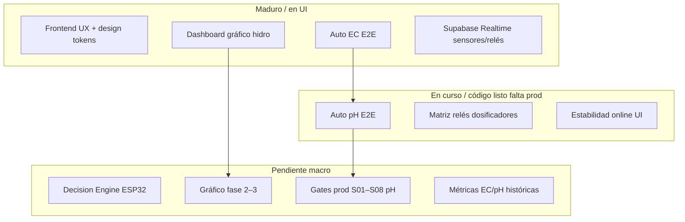

# Checkpoint Handoff — HydroWave (Jun/2026)

**Fecha:** 14 jun 2026 · **Device ref:** `ESP32_HIDRO_269844`  
**Objetivo:** no perder el hilo — qué está hecho, qué falta en **macro** (senderos) y **micro** (tareas concretas).

**Repos:**
- Frontend: `HIDROWAVE-main/`
- Firmware + bridge: `ESP-HIDROWAVE-main/`

**Dosing vs métricas (EC + pH):** [`docs/handoffs/00_GUIA_DOSING_VS_METRICAS.md`](handoffs/00_GUIA_DOSING_VS_METRICAS.md) — 4 tablas, gates V1–V4, matriz debug por capa.

**Grow cycle (schedules + rules P1 + Auto EC/pH):** [`docs/handoffs/processes/S01_GROW_CYCLE_RULES_17JUN2026.md`](handoffs/processes/S01_GROW_CYCLE_RULES_17JUN2026.md) — mapeo Aurora/Nuravine, JSON `decision_rules`, roadmap interlock P1→P2/P3, checklist bancada (17/jun/2026).

---

## 1. Snapshot de este checkpoint

### Hecho recientemente (sesión gráfico + UX)

| Entrega | Archivos clave | Estado |
|---------|----------------|--------|
| Gráfico hidropónico combinado (3 líneas, 1 canvas) | `src/lib/hydro-chart.ts`, `src/components/HydroMonitoringChart.tsx` | ✅ |
| QC series: pH alineado a cards, temp/eje dinámico | `buildHydroChartSeries`, `resolvePhForChart` | ✅ |
| Ejes: pH + Temp **izquierda**, EC **derecha**, escalas dinámicas | `buildHydroCombinedChartOptions` | ✅ |
| Tooltip Chart.js: 3 líneas + `--` + timestamp | callbacks en `hydro-chart.ts` | ✅ |
| Dashboard: gráfico **arriba** de las cards de sensores | `src/app/dashboard/page.tsx` | ✅ |
| Deep merge opciones Chart.js | `SensorChart.tsx` + `deepMergeChartOptions` | ✅ |
| Script verificación | `scripts/verify-hydro-chart.ts` | ✅ |
| Design system color + navegación 1s | `design-tokens.ts`, `PageNavOverlay.tsx`, etc. | ✅ (sin commit) |
| Ecuación pH estilo EC | `ph-control-display.ts`, `PhControllerPanel.tsx` | ✅ (sin commit) |

### Trabajo local sin commit (importante)

`git status` muestra **~50+ archivos modificados/nuevos** sin commit en `main`. Incluye Auto pH, relay allocation, design system, automacao refactor, handoffs S01–S09.

**Micro inmediato:** decidir commit(s) temáticos antes de seguir features nuevas.

---

## 2. Macro — senderos y % estimado



| Sendero | Macro estado | Notas |
|---------|--------------|-------|
| **Auto EC** | 100% eventos | MQTT dose cerrado; métricas ciclo en firmware (SQL prod pendiente) |
| **Auto pH** | ~100% eventos | `verify:ph-dosages` OK; ver [S01_PH_DOSAGES_E2E.md](handoffs/ph/S01_PH_DOSAGES_E2E.md) |
| **Dashboard + gráfico** | MVP ✅ | Fases 2–3 del plan gráfico **no** implementadas |
| **Design system** | ~95% UI | Tokens aplicados; falta auditoría páginas residuales |
| **Realtime / MQTT** | ~95% | hydro INSERT + ph_raw Realtime OK 17/06; Fase 3 comandos Railway pendiente |
| **Matriz relés** | ~80% | `relay-allocation.ts` + API conflictos; fase 2 reglas/manuales |
| **Decision Engine** | ~35% | ESP32 carga/ejecuta reglas — macro pendiente; ver [S01_GROW_CYCLE_RULES_17JUN2026.md](handoffs/processes/S01_GROW_CYCLE_RULES_17JUN2026.md) para Fill/Drain/Changeout |
| **Testes E2E / bancada** | ~15% | Checklists existen; ejecución sistemática falta |

---

## 3. Micro — qué falta por área

### 3.1 Gráfico hidropónico (dashboard)

**Hecho (MVP):**
- Un gráfico, 3 series, QC, tooltip unificado, orden cronológico, colores dominio.

**Falta (plan `gráfico_multiparamétrico_ux`):**

| ID | Tarea | Archivo |
|----|-------|---------|
| G2-1 | Bandas warning/danger EC desde `ecThresholds` del dashboard | `hydro-chart.ts`, pasar `thresholds` prop |
| G2-2 | Bandas pH 5.5–7.0 (o umbrales configurables) | idem |
| G2-3 | Último PV pH/EC/Temp en header del `InstrumentCard` | `HydroMonitoringChart.tsx` |
| G3-1 | Brush/zoom rango temporal | plugin o chartjs-plugin-zoom |
| G3-2 | Export CSV ventana visible | util + botón en card |

**Validación manual pendiente:**
- Hover con histórico real `ESP32_HIDRO_269844` — confirmar variación pH/temp visible tras fix escalas dinámicas.

---

### 3.2 Auto pH — prod (crítico)

**Índice serial:** [`docs/handoffs/ph/00_INDICE_SERIAL.md`](handoffs/ph/00_INDICE_SERIAL.md)

| Paso | Gate | Micro si falla |
|------|------|----------------|
| S01 | `node scripts/verify-e2e-schema.js` | Ejecutar SQL en `scripts/` según `RUN_PH_PROD_MIGRATIONS.md` |
| S02 | Boot `PH_CONFIG carregado` | Flash firmware + NVS (`S02_FIRMWARE_NVS_BOOT.md`) |
| S04–S05 | Poll config + ciclo adaptativo | Logs `HydroSystemCore.cpp` |
| S06 | Calibragem en Supabase | `/calibragem` → `ml_per_ph_unit_acid/base` |
| S07 | `test:pub:ph-dose` | Bridge Lightsail (`S07_BRIDGE_MQTT.md`) |
| S08 | KPI bancada | `scripts/BANCADA_AUTO_PH_CHECKLIST.md` |
| S09 | EC↔pH sin carrera | `S09_EC_PH_COORDENACAO.md` — poll vs dosaje |

**Resumen E2E:** [`HANDOFF_AUTO_PH_E2E.md`](HANDOFF_AUTO_PH_E2E.md)

**Handoff incidente 14/06 (coherencia UI + modo dev):** [`HANDOFF_AUTO_PH_COHERENCIA_14JUN2026.md`](HANDOFF_AUTO_PH_COHERENCIA_14JUN2026.md)

**Handoff 17/06 (banco sin sondas — métricas V3/V4):** [`HANDOFF_DEV_RELAX_SENSORS_17JUN2026.md`](HANDOFF_DEV_RELAX_SENSORS_17JUN2026.md)

#### Coherencia UI Auto pH (Automacao vs calibragem)

| Campo UI | Fuente | ¿Cambia al editar V? | Notas |
|----------|--------|----------------------|-------|
| **Última dosagem registrada** | `ph_dosages` último INSERT | No | Histórico; timestamp en `created_at` |
| **Próxima dose estimada (preview)** | `previewPhDoseOperatorMl` live | No si `activeS` viene de K aprendido | `u(t) = A × \|e\| × activeS` |
| **V (Volume)** | `ph_config.volume` | Sí en **s_L** display | Automacao prioriza ph_config; fallback EC solo si ph.volume vacío |
| **s_L** | `activeS / V` | Sí (inversamente) | `activeS` = ml/unid pH total (K o seed) |
| **pH Atual / Erro** | `useHydroEcReading` → `resolvePhForDisplay` | — | Dev: qualquer pH **finito** (paridade firmware `isfinite`); QC 4–9 reservado para prod futuro |
| **Badge Dosando** | `ph_operation_state` + relay fallback | — | Recirculación tiene prioridad sobre flash de relé |
| **Badge Recirculación** | `ph_operation_state=recirculating` | — | `usePhOperationState` |

**Reglas:**
- Última dosagem registrada ≠ preview u(t).
- Cambiar V actualiza s_L y calibragem; no debe cambiar u(t) si K está bien aprendido.
- Dev: UI nunca oculta PV/preview por faixa 4–9; `isPlausiblePh` só para QC visual opcional.
- Reset K manual: calibragem (`reset_k_gains: true`), no gate automático na Automacao.

---

### 3.3 Auto EC — micro residual

| Tarea | Estado |
|-------|--------|
| Última dosagem UI + Realtime | ✅ |
| MQTT `dose` + `ec_operation` → bridge → Supabase | ✅ cerrado 16/jun — ver HANDOFF §11 |
| Dedup + `verify-nutrient-dosages-e2e.js` | ✅ |
| Soak/fallback HTTPS | ⏳ checklist [`BANCADA_EC_REMAINDER_CHECKLIST.md`](../scripts/BANCADA_EC_REMAINDER_CHECKLIST.md) |
| Métricas `ec_controller_metrics` | ✅ firmware+bridge; SQL prod + flash |

---

### 3.4 Frontend / UX

| Tarea | Prioridad | Notas |
|-------|-----------|-------|
| Commit trabajo local design + nav + automacao | Alta | Muchos `??` sin trackear |
| `AutomacaoPageClient.tsx` — estabilidad carga | Media | Archivo grande (~4200 líneas) |
| Relay allocation fase 2 (reglas + manual) | Baja | `relay-allocation.ts` comentado fase 2+ |
| Página `/planos` | Baja | Nueva, sin commit |
| Fix `ph_operation_state` UI | Media | Plan `fix_ui_ph_operation_state` |

---

### 3.5 Firmware + bridge

| Tarea | Archivo / doc | Estado |
|-------|----------------|--------|
| Bridge hydro `ph_raw` + whitelist INSERT | `infra/mqtt/bridge/index.js` | ✅ 17/06 |
| Skip HTTPS hydro si MQTT conectado | `HydroSystemCore.cpp` ~L309 | ✅ |
| Coordinación EC poll vs pH dosaje | `S09_EC_PH_COORDENACAO.md` | ⏳ bancada |
| Bridge pH dose + operation | `S07_BRIDGE_MQTT.md` | ✅ |
| Railway build deploy | `route.ts` prefer-const, `tsconfig` exclude scripts | ✅ jun/2026 |
| Fase 3 MQTT comandos en Railway | `mqtt-command-publish.ts`, env `MQTT_*` | ⏳ ver Fase 3 handoff |
| Decision Engine en ESP32 | `STATUS_PROJETO_COMPLETO.md` § Próximos pasos | macro |
| `reboot_count` heartbeat | Parcial ~90% | |

---

### 3.6 Supabase / ops

| Script / check | Cuándo |
|----------------|--------|
| `ADD_HYDRO_RAW_DISPLAY_COLUMNS.sql` | Columnas ph_raw / ec_raw |
| `BACKFILL_HYDRO_PH_RAW.sql` | Filas legacy sin ph_raw |
| `ALLOW_NULL_HYDRO_SENSOR_COLUMNS.sql` | Opcional — telemetría parcial sin defaults 0 |
| `npm run verify:hydro-raw` | Post-bridge hydro INSERT |
| `ENABLE_REALTIME_REPLICATION.sql` | Si Realtime no actualiza |
| `VERIFICAR_PH_DOSAGES_E2E.sql` | Post-migración pH |
| `VERIFICAR_RELAY_COMMANDS_STUCK.sql` | Comandos manual pending stuck |
| `SEED_RELAY_MASTER_FROM_DEVICE_STATUS.sql` | Si `relay_master` vacío |
| `reset-ph-operation.sql` | Tras tests MQTT huérfanos |
| `test-device-online.mjs` | Estabilidad online |

---

## 4. Orden recomendado (próximas 2 semanas)

### Semana A.0 — sensor magistral + MQTT/fallback (nuevo)

0. **Handoff unificado:** [`HANDOFF_SENSOR_MAGISTRAL_MQTT_FALLBACK.md`](HANDOFF_SENSOR_MAGISTRAL_MQTT_FALLBACK.md) — leer antes de bancada.
1. **G1 SQL:** ejecutar [`scripts/ADD_LEVEL_SENSORS_COLUMNS.sql`](../scripts/ADD_LEVEL_SENSORS_COLUMNS.sql) + verificación § 8 del handoff.
2. **Reflash ESP32** con firmware actual (telemetría L1–L4, ACK `relay_commands`, fix `const String& st`).
3. **Checklist bancada § 9** del handoff (B4–B7 telemetría nivel + B9 manual).

### Semana A — consolidar

1. **Commit** bloques: design system → gráfico → Auto pH UI → relay allocation.
2. **S01 + verify-e2e-schema** en Supabase prod/staging.
3. **Fix API EC config 500** si reproduce en dev.
4. **S07 bridge** + `test:pub:ph-dose`.
5. **Bancada S08** con `ESP32_HIDRO_269844`.

### Semana B — pulir producto

1. Gráfico fase 2 (umbrales + último PV en header).
2. S09 EC↔pH en bancada real.
3. Decision Engine — RPC `get_active_decision_rules` (macro).
4. Documentar sendero serial Auto EC (paridad con pH S01–S08).

---

## 5. Realtime vs poll + sync relés (Jun 2026)

### Bug crítico corregido — ACK firmware

El ESP leía `relay_commands` pero hacía PATCH en `relay_commands_master` / `relay_commands_slave`. La UI y `useRelayAllocation` leen `relay_commands` → comandos manuales quedaban `pending` forever → warning *"Comando manual pendente"* en el propio nutriente.

**Fix:** [`ESP-HIDROWAVE-main/src/SupabaseClient.cpp`](../ESP-HIDROWAVE-main/src/SupabaseClient.cpp) — `markCommandSent/Completed/Failed` usan `SUPABASE_RELAY_TABLE` (`relay_commands`). **Requiere reflash ESP32.**

**Limpieza DB:** [`scripts/VERIFICAR_RELAY_COMMANDS_STUCK.sql`](../scripts/VERIFICAR_RELAY_COMMANDS_STUCK.sql)

### Matriz Realtime (frontend)

| Dato | Realtime WSS | Fallback poll | Hook / archivo |
|------|-------------|---------------|----------------|
| Sensores (pH, EC, temp) tarjetas | Sí — `ph_raw` prioridad | 60s+ | `dashboard/page.tsx`, `resolvePh()` |
| Histórico gráficos | Sí — INSERT hydro | REST periódico | `ph_display_clamped` en chart |
| `device_status` (online) | Sí | 90s | `useDevicesWithRealtime` |
| `relay_master` ON/timer | Sí | 60s | automacao |
| `relay_master` ph/ec operation | Sí | 5s | `usePhOperationState`, `useEcOperationState` |
| `relay_slaves` | Sí | 60s | automacao |
| `relay_commands` pending (allocation) | Sí | 60s | `useRelayAllocation` |
| `relay_commands` ACK terminal | Sí | 60s | `subscribeRelayCommandUpdates` |
| `ph_dosages` dashboard | Sí | carga inicial | `PhAutoStatusCard` |
| `ph_dosages` automacao | Sí | — | `PhDosageDetail` |
| `ph_config` / `ec_config` | No | 30s | `usePhConfig`, `useEcConfig` |
| `nutrient_dosages` | Sí | — | `NutrientDosageDetail` |

### Cambios UI aplicados

- `useRelayAllocation`: WSS `subscribeRelayCommandRegistryUpdates` + dedupe claims manual por relé.
- `usePhOperationState`: `mirrorFirmware` (paridad EC) + refetch al activar auto.
- `PhAutoStatusCard`: Realtime `ph_dosages` + badges con estado firmware.

### Verificación rápida

```sql
SELECT id, relay_number, status, created_at FROM relay_commands
WHERE device_id = 'ESP32_HIDRO_269844' AND status IN ('pending','executing','queued');

SELECT ph_operation_state, ph_operation_remaining_sec FROM relay_master
WHERE device_id = 'ESP32_HIDRO_269844';
```

Consola browser: `[Realtime] relay_commands registry SUBSCRIBED`, `[Realtime] relay_master/slaves SUBSCRIBED`.

---

## 6. Criterios “no perdernos”

| Pregunta | Dónde mirar |
|----------|-------------|
| ¿Eventos vs métricas EC/pH? | `handoffs/00_GUIA_DOSING_VS_METRICAS.md` — V1–V4 |
| ¿Qué sigue en Auto pH? | `handoffs/ph/00_INDICE_SERIAL.md` — primer gate sin ✅ |
| ¿Gráfico qué falta? | § 3.1 arriba; plan en `.cursor/plans/gráfico_multiparamétrico_ux_*.plan.md` |
| ¿EC dosagem OK? | `HANDOFF_ULTIMA_DOSAGEM_E2E.md` |
| ¿Realtime roto? | `PRODUCTION_ROADMAP.md` + `ENABLE_REALTIME_REPLICATION.sql` |
| ¿Relé conflicto manual stuck? | [**HANDOFF_RELAY_COMMANDS_MANUAL_14JUN2026.md**](HANDOFF_RELAY_COMMANDS_MANUAL_14JUN2026.md) + `VERIFICAR_RELAY_COMMANDS_STUCK.sql` + reflash firmware ACK |
| ¿Sensor magistral + MQTT fallback? | [**HANDOFF_SENSOR_MAGISTRAL_MQTT_FALLBACK.md**](HANDOFF_SENSOR_MAGISTRAL_MQTT_FALLBACK.md) — telemetría, nivel L1–L4, checklist bancada |
| ¿Estado repo? | `git status` — **mucho sin commit** |

---

## 7. Archivos nuevos de esta línea de trabajo (gráfico)

```
src/lib/hydro-chart.ts
src/components/HydroMonitoringChart.tsx
scripts/verify-hydro-chart.ts
```

**Dashboard:** import `HydroMonitoringChart`, sección gráficos antes de sensores.

**Eliminado del dashboard:** `nutrientsChartData` / triple eje roto / `SensorChart` para hidro.

---

## 8. Documentos relacionados

| Doc | Uso |
|-----|-----|
| Este checkpoint | Macro + micro actual |
| [`handoffs/00_GUIA_DOSING_VS_METRICAS.md`](handoffs/00_GUIA_DOSING_VS_METRICAS.md) | 4 tablas EC/pH + debug |
| [`HANDOFF_AUTO_PH_E2E.md`](HANDOFF_AUTO_PH_E2E.md) | Auto pH 1 pantalla |
| [`HANDOFF_ULTIMA_DOSAGEM_E2E.md`](HANDOFF_ULTIMA_DOSAGEM_E2E.md) | Auto EC |
| [`HANDOFF_DEVICE_ONLINE_STABILITY.md`](HANDOFF_DEVICE_ONLINE_STABILITY.md) | Falso offline |
| [`PRODUCTION_ROADMAP.md`](PRODUCTION_ROADMAP.md) | Scripts SQL + Realtime |
| [`STATUS_PROJETO_COMPLETO.md`](../STATUS_PROJETO_COMPLETO.md) | Visión ESP32 + Decision Engine (legacy, revisar fechas) |

---

**Próxima actualización:** 17/jun/2026 — gates cerrados: V3, V4, bridge hydro INSERT + ph_raw Realtime. Pendiente: Fase 3 MQTT Railway, S08 bancada KPI, Decision Engine macro.
