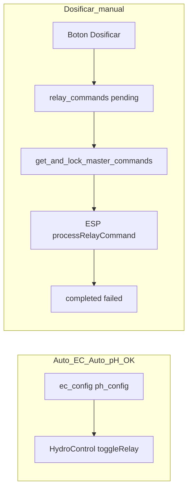

# Handoff — relay_commands manual (14 jun 2026)

**Fecha:** 14 jun 2026 · **Device ref:** `ESP32_HIDRO_269844`  
**Síntoma:** mapa muestra «Manual — Comando manual pendente» de forma perpetua; botón **Dosificar** crea comando pero no se completa.  
**Estado resumido:** RPC corregida en Supabase; frontend alineado; **pendiente** limpiar stuck `sent` y validar ciclo manual en bancada.

**Repos:**
- Frontend: `HIDROWAVE-main/`
- Firmware + bridge: `ESP-HIDROWAVE-main/`

---

## 1. Explicación simple

**Auto EC y Auto pH** → el ESP decide y enciende el relé **directamente** (`HydroControl::toggleRelay`), sin pasar por `relay_commands`.

**Dosificar manual** → el frontend guarda un pedido en `relay_commands` y el ESP debe **recogerlo** (MQTT o poll HTTPS), ejecutarlo y marcar `completed`.

Por eso el automático puede ir perfecto mientras el manual queda colgado: **son dos caminos distintos**.



| | Auto EC / Auto pH | Botón «Dosificar» manual |
|---|---|---|
| Quién decide | Firmware (`HydroControl`) | Usuario en `/automacao` |
| Tabla `relay_commands` | No (salvo reglas/decisiones) | Sí — INSERT `pending` |
| Cómo llega al ESP | Lógica interna + config poll 30s | Vía A: MQTT push · Vía B: poll HTTPS ~60s |
| Estado en el mapa | «Atribuído» (config) o «Em uso» (runtime) | «Manual pendente» mientras `pending`/`sent` |
| Caso 14/6 | Seguía funcionando | Quedaba stuck en `pending`/`sent` |

---

## 2. Diagnóstico confirmado (14/6)

| Evidencia | Qué significa |
|-----------|---------------|
| Serial: `Array recebido: 0 comandos` (antes del fix RPC) | ESP no recibía cola — RPC stub o tabla vieja |
| BD: IDs 97, 98, 99 en relés 0, 5, 6 | INSERT manual OK desde frontend |
| Tras fix RPC: status `sent` sin `completed` | RPC bloquea pero ESP no ejecutó/ACK (poll 60s, MQTT ausente, o firmware sin reflash ACK) |
| Mapa edad sube 5 min → 11 min | Frontend poll 5s **funciona**; el problema no es el mapa |
| `PCF8574 #2 não conectado` en serial | Hardware aparte — afecta Auto pH relé 2, no explica cola manual |

### IDs conocidos (14/6)

| id | relé | notas |
|----|------|-------|
| 79, 80, 81 | 0, 0, 3 | stuck históricos (~2 días) |
| 97 | 0 | manual antiguo |
| 98 | 6 | dosificación CAGE manual |
| 99 | 5 | dosificación nutriente 23 |

---

## 3. Causas raíz (orden cronológico)

1. **RPC `get_and_lock_master_commands`** apuntaba a `relay_commands_master` o stub vacío — no leía `relay_commands` prod.
2. **Script verificación** usaba columnas inexistentes (`triggered_by`) — corregido.
3. **Frontend** filtraba status `executing`/`queued` (no existen en prod) — alineado a `pending`/`sent`/`processing`.
4. **Comandos stuck** en `pending` o `sent` sin `completed` bloquean UI (claims manuales en `relay-allocation.ts`).

Schema prod real (`src/lib/db-schema.ts`):

```
id, device_id, relay_number, action, duration_seconds,
status, created_at, sent_at, completed_at, created_by,
error_message, target_device_id
```

Status prod: `pending | sent | completed | failed`

---

## 4. Fixes aplicados en repo (sesión 14/6)

### SQL / ops

| Archivo | Cambio |
|---------|--------|
| `scripts/PRODUCTION_RPC_GET_AND_LOCK_MASTER.sql` | RPC prod sobre `relay_commands`; `pending`→`sent`; fix `created_at` en subquery |
| `scripts/VERIFICAR_RELAY_COMMANDS_STUCK.sql` | Columnas + status prod |
| `scripts/LIMPAR_RELAY_COMMANDS_STUCK.sql` | Preview + cleanup IDs 79–81, 97–99 |
| `scripts/PRODUCTION_RPC_VERIFY.sql` | Checklist SQL |
| `scripts/verify-relay-rpc.js` | Verifica pending + RPC vía anon key |
| `scripts/cleanup-relay-stuck.js` | Marca `failed` por API |

### Frontend

| Archivo | Cambio |
|---------|--------|
| `src/lib/realtime/relay-commands.ts` | `PENDING_COMMAND_STATUS_LIST` |
| `src/lib/relay-allocation.ts` | Labels manual sent/pending + badges Livre/Atribuído/Em uso |
| `src/hooks/useRelayAllocation.ts` | Poll 5s si hay pendientes; fix `String(id)` |
| `src/components/DoserRelayMapPanel.tsx` | Nuance visual del mapa |

### Firmware (mencionar — reflash si aplica)

| Archivo | Nota |
|---------|------|
| `ESP-HIDROWAVE-main/src/SupabaseClient.cpp` | ACK en `relay_commands` (`markCommandSent/Completed/Failed`) |
| `ESP-HIDROWAVE-main/include/Config.h` | Poll HTTPS: 60s MQTT online, 10s MQTT down |

---

## 5. Estado actual en Supabase (verificado 14/6)

```
IDs 97, 98, 99 → status=sent (bloqueados por test RPC)
RPC get_and_lock_master_commands → responde OK; 0 filas si no hay pending
```

**Pendiente operativo:** limpiar stuck antes de nuevo teste manual.

---

## 6. Checklist para cerrar el problema

1. Ejecutar RPC en Supabase (si no hecho): `scripts/PRODUCTION_RPC_GET_AND_LOCK_MASTER.sql`
2. Limpiar stuck 97–99 (y 79–81 si siguen): `scripts/LIMPAR_RELAY_COMMANDS_STUCK.sql` opción A, o:
   ```powershell
   node scripts/cleanup-relay-stuck.js --ids=97,98,99
   ```
3. Reflash ESP32 si firmware ACK antiguo (PATCH en tabla equivocada)
4. Verificar cola vacía:
   ```powershell
   node scripts/verify-relay-rpc.js --dry-run
   ```
5. Dosificar manual en `/automacao`
6. Serial ESP debe mostrar:
   ```text
   [CMD https] id=… master R…
   🏠 [MASTER] Processando comando local
   ```
7. Mapa: «Manual pendente» desaparece en ~5s
8. BD: nuevo comando `pending` → `sent` → `completed`

---

## 7. Verificación rápida

```sql
SELECT id, relay_number, status, sent_at, completed_at, error_message
FROM relay_commands
WHERE device_id = 'ESP32_HIDRO_269844'
  AND status IN ('pending', 'sent')
ORDER BY created_at;
```

```sql
SELECT * FROM get_and_lock_master_commands('ESP32_HIDRO_269844', 5, 30);
-- Debe devolver filas solo si hay pending local (target_device_id vacío)
```

Consola browser: `[Realtime] relay_commands registry SUBSCRIBED`

---

## 8. Si sigue fallando tras limpieza

| Síntoma | Siguiente sospechoso |
|---------|---------------------|
| Sigue `sent` forever | ESP no hace poll o ACK PATCH falla — reflash + serial |
| RPC 0 con pending visible | RLS o `target_device_id` no vacío |
| Sin `[CMD mqtt]` | `MQTT_HOST` no configurado en Next.js — solo HTTPS ~60s |
| Relé no físico | PCF8574 desconectado para ese canal |

---

## 9. Flujo manual (referencia técnica)

```
AutomacaoPageClient → POST /api/esp-now/command
  → createRelayCommandProd (relay_commands INSERT pending)
  → notifyDeviceRelayCommand (MQTT opcional)
ESP poll → rpc/get_and_lock_master_commands (pending→sent)
  → processRelayCommand → executeLocalRelayCommand
  → markCommandCompleted
UI → useRelayAllocation (WSS + poll 5s) → quita claim manual
```

---

## 10. Documentos relacionados

| Doc | Uso |
|-----|-----|
| [HANDOFF_CHECKPOINT_JUN2026.md](HANDOFF_CHECKPOINT_JUN2026.md) §5 | Matriz Realtime + bug ACK firmware |
| [HANDOFF_ULTIMA_DOSAGEM_E2E.md](HANDOFF_ULTIMA_DOSAGEM_E2E.md) | Auto EC — sendero distinto |
| [HANDOFF_AUTO_PH_E2E.md](HANDOFF_AUTO_PH_E2E.md) | Auto pH — sendero distinto |
| `ESP-HIDROWAVE-main/docs/mqtt/HANDOFF_FASE3_COMANDOS_HIBRIDOS.md` | MQTT vs poll HTTPS |

---

## 11. Resumen en una frase

**Auto EC = el ESP cocina solo. Manual = el ESP debe leer la lista de pedidos (`relay_commands`); esa lista no se entregaba al ESP por un bug en Supabase (RPC), no por el mapa ni por el frontend.**

---

## 12. Follow-up: Dosificar na tabela EC (nutrientes)

O botão **Dosificar** na tabela de nutrientes Auto EC ([`AutomacaoPageClient.tsx`](../src/app/automacao/AutomacaoPageClient.tsx) ~L3241) **não** usa o mesmo caminho que Auto EC automático:

| | Auto EC automático | Botão Dosificar manual |
|---|---|---|
| Decisão | Firmware `HydroControl` | Utilizador na UI |
| `relay_commands` | Não | Sim — INSERT `pending` |
| Transporte | Lógica interna | MQTT push (se configurado) ou poll HTTPS ~60s |

Fluxo manual: `POST /api/esp-now/command` → `createRelayCommandProd` → ESP via `get_and_lock_master_commands` → `processRelayCommand` → `completed`.

### Bloqueio histórico (14/6)

- RPC `get_and_lock_master_commands` apontava a stub/tabela antiga → serial `0 comandos`
- Comandos stuck em `pending`/`sent` (IDs 97–99) → mapa «Manual pendente» perpetuo
- Fix RPC: [`scripts/PRODUCTION_RPC_GET_AND_LOCK_MASTER.sql`](../scripts/PRODUCTION_RPC_GET_AND_LOCK_MASTER.sql)

### Checklist ops pendente (bancada)

1. Limpar stuck: [`scripts/LIMPAR_RELAY_COMMANDS_STUCK.sql`](../scripts/LIMPAR_RELAY_COMMANDS_STUCK.sql) ou `node scripts/cleanup-relay-stuck.js --ids=97,98,99`
2. Reflash ESP32 se firmware ACK antigo (`SupabaseClient.cpp` → `relay_commands`)
3. Dosificar na tabela EC → serial `[CMD https]` + mapa sem «Manual pendente» em ~5s
4. Verificar: `node scripts/verify-relay-rpc.js --dry-run`

**Nota:** botão Dosificar na mini-tabela pH (Actuação) fica para fase posterior, após validar o ciclo `relay_commands` em bancada. Nomes pH já seguem padrão EC via `saveMasterLocalRelayName` (14/6).

### Bloqueio renomeação durante operação (14/06)

[`relay-naming-lock.ts`](../src/lib/relay-naming-lock.ts): tabela EC + modal bloqueiam troca de relé/nome durante Auto EC (dosagem + recirc), `isLoadingNutrients` e `relay_commands` pending por relé; pH bloqueia selects na mesma condição por relé (pending cross-domain).

### ACK `sent` → `completed` órfão (16/06)

Se mapa fica «Manual em trânsito» após dosagem: verificar serial `✅ [ACK] relay_commands id=N → completed` ou `❌ markCommandCompleted HTTP`. UI ignora `sent` após `duration_seconds + 30s` (`isRelayCommandOperationallyPending`). Limpar stuck: `LIMPAR_RELAY_COMMANDS_STUCK.sql`.
