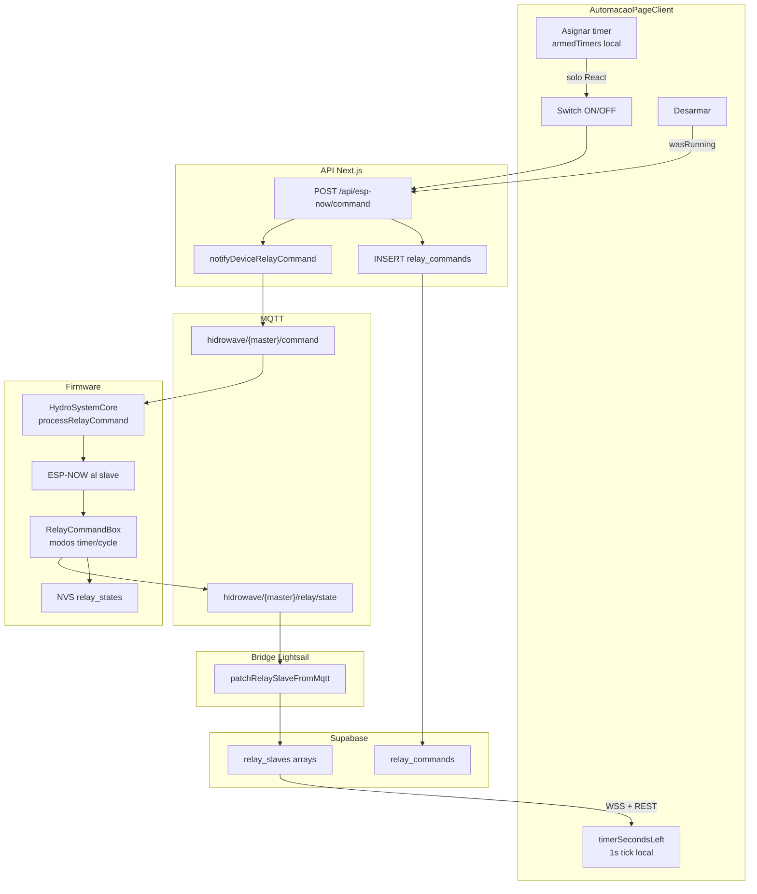

# Handoff — Relés com Timer (Agosto 2026)

**Fecha:** 28 ago 2026  
**Repos:**
- Frontend: `HIDROWAVE-main/`
- Firmware + bridge: `ESP-HIDROWAVE-main/`

---

## 1. Resumen ejecutivo

El sistema de timers tiene **dos capas de verdad**:

| Capa | Qué guarda | Sobrevive Ctrl+R |
|------|------------|------------------|
| **UI local** (`armedTimers`, `relayCycles`, `timerSecondsLeft`) | Timer *asignado* (reloj amarillo), config de ciclo, countdown visual | No |
| **Supabase `relay_slaves`** | `relay_has_timers[]`, `relay_remaining_times[]`, `relay_states[]` | Sí (snapshot) |
| **Firmware slave (NVS)** | ON permanente + timers lineales ON | Parcial (ciclos no) |

**Regla de UX acordada:** por defecto el relé opera en **ON/OFF convencional**. El timer es opt-in: primero **Asignar timer** (solo local), luego **ON** envía la duración al Atlas. **Desarmar** limpia la asignación local y, si el timer ya corre en hardware, manda cancelación.

---

## 2. Diagrama de flujo



---

## 3. Estados del timer en la UI

Implementación principal: `src/app/automacao/AutomacaoPageClient.tsx`

| Estado | Mapa React | Indicador visual | Comando enviado |
|--------|------------|------------------|-----------------|
| **Sin timer** | — | Switch normal | `mode: instant`, `duration_seconds: 0` |
| **Asignado (armed)** | `armedTimers` | Reloj amarillo + texto `Timer Ns` | Ninguno hasta pulsar ON |
| **Activo (running)** | `timerSecondsLeft` + Supabase | Reloj amarillo + `MM:SS` | Ya enviado; countdown local + sync WS |
| **Ciclo** | `relayCycles` (solo local) | Texto fase ON/OFF | `mode: cycle`, `duration_s` + `cycle_off_s` |

**Funciones clave:**

- `clearTimerAssignment(relayKey)` — limpia `armedTimers`, `relayTimers`, countdown UI
- `disarmSlaveTimer(...)` — llama `clearTimerAssignment`; si `remainingTime > 0`, envía cancelación al Atlas con `mode: instant`, `duration_seconds: 0`, manteniendo ON/OFF actual
- Switch ON con timer armed → usa `timerModes` (`timed_on` / `timed_off`) y `duration_seconds = armedSecs`

**DeviceControlPanel** no tiene UX de timer armed; solo ON/OFF vía `/api/relay-commands/slave`.

---

## 4. Comandos MQTT (contrato v1)

Parser firmware: `ESP-HIDROWAVE-main/src/MqttCommandParser.cpp`  
Builder frontend: `HIDROWAVE-main/src/lib/mqtt-relay-command-schema.ts`

**Comando relay (topic `hidrowave/{device_id}/command`):**

```json
{
  "v": 1,
  "id": 12345,
  "cmd": "relay",
  "relay_index": 0,
  "action": "on",
  "duration_s": 43200,
  "mode": "timed_on",
  "target_device_id": "ESP32_SLAVE_14_33_5C_38_BF_60",
  "slave_mac_address": "14:33:5C:38:BF:60"
}
```

| `mode` | Comportamiento en slave (`RelayCommandBox`) |
|--------|---------------------------------------------|
| `instant` (default) | `on` + `duration>0` → timer ON; `on` + `0` → ON permanente; `off` → apaga y cancela |
| `timed_on` | ON durante N segundos, luego OFF |
| `timed_off` | Programa apagado en N s (relé debe estar ON); no cambia el pin ahora |
| `cycle` | Alterna ON (`duration_s`) / OFF (`cycle_off_s`) indefinidamente |
| `cycle_stop` | Para ciclo, mantiene estado físico actual |

**No existe `desarm` en firmware** — equivalente: `off` (apaga todo) o `cycle_stop` (para ciclo).

**Estado publicado (topic `relay/state`):**

```json
{
  "relay_states": [0, 1, 0, ...],
  "relay_has_timers": [0, 1, 0, ...],
  "relay_remaining_times": [0, 300, 0, ...],
  "link_online": true
}
```

---

## 5. Firmware — comportamiento crítico

Archivos: `ESP-HIDROWAVE-main/src/RelayCommandBox.cpp`, `ESP-HIDROWAVE-main/src/HydroSystemCore.cpp`

- **Duración máxima:** 86400 s (24 h) via `DEFAULT_MAX_DURATION` en `RelayCommandBox.h`; clamp automático si excede
- **Master local (R0–R7):** solo timer simple ON→OFF; **no soporta** `cycle`, `timed_off`, `cycle_stop` vía MQTT
- **Boot / corte de energía:**
  - Slave: `loadPersistentStates()` restaura ON forever y timers lineales ON con tiempo restante
  - **Ciclos NO se restauran** — `cycleStates[]` es solo RAM
  - Master bombas (R0–R7): siempre OFF al boot (seguridad)
- **Cancelación interna:** cualquier `setRelay()` cancela timer y ciclo antes de aplicar nuevo estado

---

## 6. Supabase — qué se persiste

Tabla `relay_slaves` (arrays por índice 0–7):

| Columna | Significado |
|---------|-------------|
| `relay_states[]` | ON/OFF |
| `relay_has_timers[]` | Timer/ciclo activo en Atlas |
| `relay_remaining_times[]` | Segundos restantes (snapshot, no decrementa en DB) |
| `last_update` | Presencia online (~90 s) |

**No existen:** `timer_mode`, `timer_duration`, campos de ciclo. El modo solo va en el payload MQTT del comando (tabla `relay_commands` guarda `action` + `duration_seconds`, no `mode`).

Bridge: `ESP-HIDROWAVE-main/infra/mqtt/bridge/index.js` → `patchRelaySlaveFromMqtt()`  
- Heartbeats link-only **no actualizan** arrays de timer (solo `last_update`)
- Upsert completo solo cuando MQTT trae `relay_states[]`

Frontend aplica arrays: `HIDROWAVE-main/src/lib/realtime/relay-apply.ts` → `applySlaveRelayRow()`

---

## 7. Por qué aparecían 3600s tras Ctrl+R

**3600 no es default de UI** — era el **límite máximo anterior** (1 h). Causas del síntoma:

1. Snapshot estático: `relay_remaining_times` en Supabase no decrementa; al refrescar se muestra el último valor persistido
2. Heartbeats sin arrays no refrescan el countdown
3. Firmware antiguo clampaba a 3600 s
4. `armedTimers` y `relayCycles` se pierden al refrescar (solo memoria del browser)

**Fix aplicado:** límite subido a 86400 s en firmware + UI + schema MQTT (commit `relay-timers-24h`).

---

## 8. Gaps y trabajo pendiente

| Prioridad | Item | Estado |
|-----------|------|--------|
| Alta | Commit + deploy cambio 86400 | Hecho (frontend + firmware local) |
| Alta | Flash slave | Pendiente en bancada |
| Media | Fix React toast en render | Hecho (`settlePendingByRelayState` retorna settled) |
| Media | Conectar `timed_off` al envío | Hecho (switch ON + assign con relé ya ON) |
| Media | Persistir ciclo en NVS o Supabase | Evaluado — ver §12 |
| Baja | Alinear DeviceControlPanel | Pendiente |
| Baja | Decrementar `remaining_time` en bridge/firmware periódico | Pendiente |

---

## 9. Seguridad indoor / fotoperíodo

| Riesgo | Mitigación actual | Gap |
|--------|-------------------|-----|
| Corte de luz | NVS restaura ON forever y timers ON en slave | Ciclos se pierden — luz puede quedar ON u OFF fijo |
| Master bombas | R0–R7 siempre OFF al boot | OK para nutrientes |
| Comando erróneo largo | Clamp 86400 s | OK |
| UI muestra estado falso | Optimistic + rollback 20s ACK | OK |
| Timer corre con slave offline | Firmware local sigue; cloud desincronizado | Heartbeat + link_online |

**Recomendación futura:** para fotoperíodo crítico, usar `mode: cycle` con persistencia NVS de fase o schedule basado en RTC/NTP, no solo timer UI local.

---

## 10. Checklist de deploy

1. **Firmware master** — flash si cambió heartbeat/link_online
2. **Firmware slave(s)** — flash obligatorio para 86400 s y ciclos largos
3. **Bridge Lightsail** — subir `infra/mqtt/bridge/index.js` + restart `hidrowave-bridge`
4. **Frontend** — deploy cambios UI/schema
5. **Validar en bancada:**
   - Asignar timer → reloj amarillo, sin comando
   - ON → countdown + ACK
   - Desarmar con timer corriendo → cancela en Atlas
   - Ctrl+R → estado coherente (aceptar snapshot, no countdown perfecto)
   - Ciclo 12h/12h → verificar clamp y comportamiento post-reboot
   - `timed_off` con relé ya ON → assign envía comando inmediato

---

## 11. Referencias cruzadas

- Handoff relay commands manual: `docs/HANDOFF_RELAY_COMMANDS_MANUAL_14JUN2026.md`
- Payloads MQTT: `ESP-HIDROWAVE-main/docs/mqtt/04_MODELAGEM_TOPICOS_PAYLOADS.md`
- Slave online realtime: `ESP-HIDROWAVE-main/docs/handoffs/espnow/HANDOFF_SLAVE_LINK_REALTIME_23JUN2026.md`
- Upload bridge Lightsail: `ESP-HIDROWAVE-main/docs/mqtt/HANDOFF_UPLOAD_LIGHTSAIL.md`
- Evaluación persistencia ciclo: `docs/RELAY_CYCLE_PERSISTENCE_EVAL.md`

---

## 12. Evaluación: persistencia de ciclo (fotoperíodo)

Ver documento completo: [`RELAY_CYCLE_PERSISTENCE_EVAL.md`](./RELAY_CYCLE_PERSISTENCE_EVAL.md)

**Decisión recomendada:** NVS en slave (`RelayCommandBox`) con namespace separado `relay_cycles`, guardando `onSeconds`, `offSeconds`, `phaseOn` y `phaseRemainingSeconds` (relativo, no `millis()` absoluto).

**Por qué no Supabase como fuente de verdad:**
- La UI no debe depender de cloud para mantener fotoperíodo si WiFi cae
- `relay_slaves` no tiene columnas de ciclo hoy; añadirlas no restaura el hardware tras blackout
- El bridge solo recibe snapshots; no ejecuta ciclos

**Limitación actual de NVS timer:** `timerEndTime` usa `millis()` — tras blackout largo el tiempo restante no refleja horas apagadas. Para fotoperíodo estricto hace falta RTC/NTP en el slave.

**Próximo paso firmware:** implementar `saveCycleStates()` / `loadCycleStates()` en `RelayCommandBox.cpp` con `phaseRemainingSeconds` relativo (ver eval doc).
