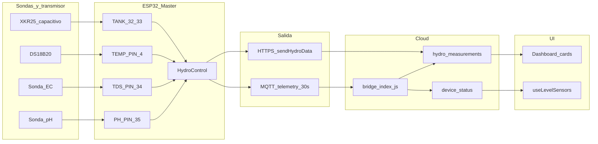
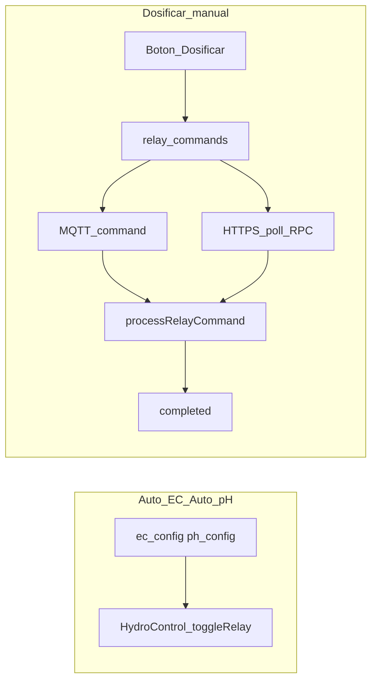

# Handoff — Sensor magistral + relés MQTT/fallback

**Fecha:** 16 jun 2026 · **Device ref:** `ESP32_HIDRO_269844`  
**Objetivo:** documento único operativo para integradores — qué lee el master, por qué canal llega a la UI, y qué ocurre si MQTT cae.

**Repos:**
- Frontend + bridge: `HIDROWAVE-main/`
- Firmware: `ESP-HIDROWAVE-main/`

**Docs relacionados (no sustituyen este handoff):**
- Pedagogía hardware: `/support/sensores` (pt-BR / en / es)
- Comandos híbridos Fase 3: [`mqtt/HANDOFF_FASE3_COMANDOS_HIBRIDOS.md`](mqtt/HANDOFF_FASE3_COMANDOS_HIBRIDOS.md)
- Manual vs Auto: [`HANDOFF_RELAY_COMMANDS_MANUAL_14JUN2026.md`](HANDOFF_RELAY_COMMANDS_MANUAL_14JUN2026.md)
- Checkpoint macro: [`HANDOFF_CHECKPOINT_JUN2026.md`](HANDOFF_CHECKPOINT_JUN2026.md)
- Tópicos MQTT: [`mqtt/04_MODELAGEM_TOPICOS_PAYLOADS.md`](../ESP-HIDROWAVE-main/docs/mqtt/04_MODELAGEM_TOPICOS_PAYLOADS.md)

---

## 1. Resumen ejecutivo

| Área | Estado | Evidencia |
|------|--------|-----------|
| Telemetría pH/EC/temp master | Código listo | `PH_PIN 35`, `TDS_PIN 34`, DS18B20 `TEMP_PIN 4` |
| Telemetría nivel L1–L4 + agregado | **OK bancada** | Bridge INSERT hydro + PATCH `device_status` |
| Bridge → `device_status` / `hydro_measurements` | **OK** 17/06 | `ph_raw`, whitelist INSERT, journalctl |
| UI nivel (`useLevelSensors`) | Código listo | Realtime WSS + poll 30s |
| HTTPS hydro cuando MQTT up | **Desactivado** | `HydroSystemCore` skip `sendSensorDataToSupabase()` |
| Comando relé MQTT + poll HTTPS | Fase 3 master validada en bancada | Ver Fase 3 handoff |
| Push MQTT desde Railway/UI prod | **Pendiente** | Env `MQTT_*` — ver [`RAILWAY_MQTT_ENV.md`](../../docs/RAILWAY_MQTT_ENV.md) |
| Migración SQL `level_1..4` | **Pendiente ejecutar en Supabase** | Ver § 8 G1 |
| Bancada E2E nivel + manual completo | **Pendiente reflash + checklist § 9** | — |

**Conclusión:** la arquitectura híbrida está implementada en código. El cierre operativo es **migración SQL + reflash + checklist de bancada**, no un feature nuevo.

---

## 2. Sensor magistral — cadena de señal



### Magnitudes y pines (firmware)

| Magnitud | Hardware | Pin / clase | Firmware |
|----------|----------|-------------|----------|
| pH | Transmisor AliExpress 0–5 V + sonda vidrio | `PH_PIN 35` (ADC) | `phSensor`, divisor `/6` |
| EC/TDS | Misma placa o sonda EC | `TDS_PIN 34` (ADC) | `TDSReaderSerial`, mediana 30 muestras |
| Temperatura agua | DS18B20 sumergido | `TEMP_PIN 4` (OneWire) | compensación TDS; **no** sustituye canal temp del transmisor si existe |
| Nivel agregado | XKR-25 sin contacto (NPN+PNP) | `TANK_LOW_PIN 32`, `TANK_HIGH_PIN 33` | `LevelSensor` → `CHEIO`/`MÉDIO`/`BAIXO`/`ERRO` |
| L1–L4 lógicos | Derivados de XKR-25 o `levelBank` futuro | — | `isLevelWet(1..4)`, `getWaterLevelAggregate()` |

**Warning de diseño:** con un solo XKR-25, `level_2` y `level_3` se derivan del estado agregado — no son cuatro sondas físicas. Ver `/support/sensores` → `four-vs-one`.

---

## 3. Tabla maestra — canal primario y fallback

| Dato / acción | Primario | Backup | Intervalo / notas |
|---------------|----------|--------|-------------------|
| **Telemetría pH/EC/temp/nivel** | MQTT `.../telemetry` → bridge | HTTPS `sendHydroData` si `MQTT_HYDRO_ONLY` y broker down | MQTT cada **30 s** (`MQTT_TELEMETRY_INTERVAL_MS`) |
| **Heartbeat / online** | MQTT `.../heartbeat` → bridge | HTTPS `device_status` cada 60 s | Bridge throttle `TELEMETRY_THROTTLE_MS` default 30 s |
| **Nivel en UI** | Realtime `device_status` UPDATE | Poll REST 30 s | `useLevelSensors.ts` |
| **Comando relé manual** | MQTT push `.../command` | HTTPS poll `relay_commands` | **60 s** MQTT OK / **10 s** MQTT down |
| **Auto EC / Auto pH** | Loop local `HydroControl` | NVS + config poll 30 s | **No** pasa por `relay_commands` |
| **ACK `relay_commands`** | HTTPS PATCH tras ejecutar | — | Tabla prod: `relay_commands` (no `relay_commands_master`) |
| **Estado relés UI** | Realtime `relay_master` | Poll 60 s + sync firmware 5 s | `useRelayAllocation` |
| **EC/pH operation badges** | Realtime + poll 5 s | — | `useEcOperationState`, `usePhOperationState` |
| **Dosages ISA-88** | MQTT `dose` / `ph_dose` → bridge | HTTPS INSERT fallback | Ver `HydroSystemCore` post-recirc K |

### Comportamiento si MQTT cae

1. ESP detecta desconexión → `resolveCommandPollIntervalMs()` devuelve `COMMAND_POLL_INTERVAL_MQTT_DOWN_MS` (**10 s**).
2. Con `MQTT_HYDRO_ONLY`, telemetría hidro pasa a HTTPS en el mismo ciclo de sensores (`SENSOR_SEND_INTERVAL`).
3. UI sigue recibiendo datos vía Supabase Realtime o poll REST — no depende del broker para lectura.
4. Comandos manuales: el `INSERT relay_commands` en Supabase **siempre** ocurre; el ESP los recoge por RPC aunque no haya push MQTT.

---

## 4. Relés — dos caminos (Auto vs manual)



| | Auto EC / Auto pH | Botón «Dosificar» |
|---|---|---|
| Tabla `relay_commands` | No (salvo reglas futuras) | Sí — `pending` → `completed` |
| Latencia típica | Inmediata (loop firmware) | &lt;2 s MQTT / hasta 10 s solo HTTPS |
| Mapa relés | «Atribuído» / «Em uso» | «Manual pendente» mientras `pending`/`sent` |

**Dedup MQTT:** mismo `id` de fila Supabase no se ejecuta dos veces (`MqttCommandDedup` NVS).

---

## 5. Payloads de referencia

### Telemetría v1 (ESP → `hidrowave/{device_id}/telemetry`)

Publicado por [`MqttClient.cpp`](../ESP-HIDROWAVE-main/src/MqttClient.cpp):

```json
{
  "v": 1,
  "device_id": "ESP32_HIDRO_269844",
  "ph": 6.2,
  "tds": 850,
  "temperature": 24.5,
  "water_level_ok": true,
  "level_1": true,
  "level_2": true,
  "level_3": false,
  "level_4": false,
  "water_level": "medio",
  "air_temp": 26.0,
  "humidity": 55.0
}
```

Bridge valida `water_level` ∈ `{vazio, baixo, medio, alto}` y parchea `device_status` + insert throttled en `hydro_measurements`.

### Comando relé v1 (UI → `hidrowave/{device_id}/command`)

Ver schema completo en [`mqtt-relay-command-schema.ts`](../src/lib/mqtt-relay-command-schema.ts) y [`HANDOFF_FASE3`](mqtt/HANDOFF_FASE3_COMANDOS_HIBRIDOS.md).

---

## 6. Qué ver en serial (líneas canónicas)

| Línea | Significado |
|-------|-------------|
| `[TELEMETRIA MQTT] EC: … uS/cm \| pH: … \| Temp agua: … \| Nivel: medio (L1-ON L4-OFF)` | Telemetría publicada; validar coherencia con tanque |
| `[MQTT] rx command topic=hidrowave/…/command` | Comando recibido por push |
| `[CMD mqtt] id=… master R…` | Parser OK; ver `via=mqtt` en `processRelayCommand` |
| `✅ [ACK] relay_commands id=… → completed` | Ciclo manual cerrado |
| `⚠️ MQTT client não conectou — continuando com HTTPS` | Fallback activo al boot |
| `📤 Status do dispositivo (HTTPS fallback — MQTT offline)` | Heartbeat/status por REST |
| `💾 [PH K] PATCH k_acid/k_base post-recirc` | K aprendido tras recirc (no en `ph_dose`) |
| Poll relay: intervalo 60s vs 10s | Depende de `mqttClient.isConnected()` |

---

## 7. Qué ver en UI

| Pantalla | Fuente | Fallback |
|----------|--------|----------|
| Dashboard — cards pH/EC/temp | `hydro_measurements` / Realtime | REST periódico |
| Dashboard / reglas — nivel | `device_status.level_*`, `water_level` | `useLevelSensors` poll 30s |
| Automação — mapa relés | `relay_master` + claims | `useRelayAllocation` poll 60s |
| «Manual pendente» en nutriente | `relay_commands` `pending`/`sent` | WSS + poll; ver stuck § 8 G3 |
| Badges Dosando / Recirculando | `ph_operation_*` / `ec_operation_*` | Poll 5s |

**Consola browser (sanity):** `[Realtime] relay_commands registry SUBSCRIBED`, updates en `device_status`.

---

## 8. Gaps conocidos y estado

| ID | Gap | Acción | Estado |
|----|-----|--------|--------|
| G1 | Columnas `level_1..4`, `water_level` en prod | Ejecutar [`scripts/ADD_LEVEL_SENSORS_COLUMNS.sql`](../scripts/ADD_LEVEL_SENSORS_COLUMNS.sql) en SQL Editor Supabase | **Pendiente operador** |
| G2 | Firmware con telemetría L1–L4 + ACK tabla `relay_commands` | Reflash ESP32 tras build | **Pendiente bancada** |
| G3 | Comandos manual stuck `pending`/`sent` | [`scripts/VERIFICAR_RELAY_COMMANDS_STUCK.sql`](../scripts/VERIFICAR_RELAY_COMMANDS_STUCK.sql) | Revisar tras reflash |
| G4 | Push MQTT Railway/UI | Verificar env `MQTT_BROKER`, `MQTT_USER`, `MQTT_PASS` en prod | Pendiente ops |
| G5 | E2E nivel MQTT → bridge → UI | Checklist § 9 | Pendiente bancada |
| G6 | Typo `const st` compile | `HydroSystemCore.cpp:883` — `const String& st` | **Corregido** en repo |

### G1 — Verificación post-migración SQL

Ejecutar en Supabase tras `ADD_LEVEL_SENSORS_COLUMNS.sql`:

```sql
SELECT column_name, data_type
FROM information_schema.columns
WHERE table_schema = 'public'
  AND table_name IN ('device_status', 'hydro_measurements')
  AND column_name IN ('level_1','level_2','level_3','level_4','water_level','water_level_ok')
ORDER BY table_name, column_name;
```

Resultado esperado: 6 filas en `device_status` (incl. `water_level_ok`); 5 en `hydro_measurements` (sin `water_level_ok`).

---

## 9. Checklist bancada (10 pasos)

Marcar en bancada física con `ESP32_HIDRO_269844`:

- [ ] **B1** — Ejecutar G1 SQL y verificar query § 8
- [ ] **B2** — `pio run -t upload` firmware actual; serial sin errores de compile
- [ ] **B3** — Boot: `✅ Sensor de nível iniciado (XKR-25)` y scan I2C si aplica
- [ ] **B4** — MQTT conectado: `[TELEMETRIA MQTT]` cada ~30 s con pH/EC/temp coherentes
- [ ] **B5** — `mosquitto_sub -t 'hidrowave/ESP32_HIDRO_269844/telemetry' -v` muestra `level_1..4` y `water_level`
- [ ] **B6** — Log bridge: `PATCH device_status … water_level=medio` (o estado real)
- [ ] **B7** — UI: hook nivel actualiza sin refrescar página (Realtime) o en &lt;30 s (poll)
- [ ] **B8** — Simular MQTT down (AP sin broker): hydro sigue por HTTPS; poll comandos ~10 s
- [ ] **B9** — Dosificar manual: `pending` → `completed` en &lt;2 min (MQTT) o &lt;10 min (solo HTTPS)
- [ ] **B10** — Auto EC/pH sigue funcionando sin filas stuck en `relay_commands` para esos relés

**Criterio de cierre:** B4–B7 y B9 OK en la misma sesión.

---

## 10. Enlaces cruzados

| Necesidad | Dónde |
|-----------|-------|
| Hardware transmisor + XKR-25 | `/support/sensores` |
| Arquitectura cloud ↔ ESP | `/support/arquitetura` |
| Loops EC/pH que consumen PV | `/support/controle` |
| Scripts tanque que usan `water_level` | `/support/hidraulica` |
| Calibración operacional | `/calibragem` |

---

*Última actualización: 16 jun 2026 — consolidación post-docs `/support/sensores` y Fase 3 MQTT.*
