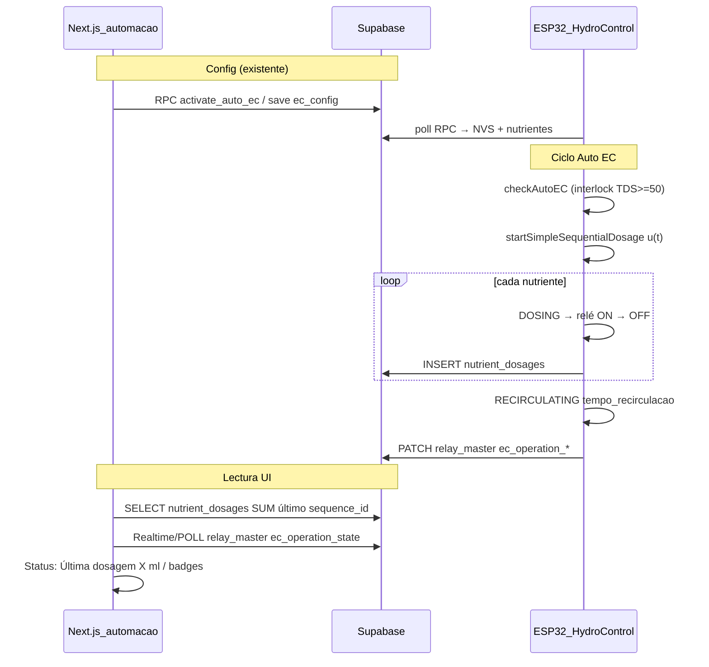

# Handoff — Última dosagem E2E (Auto EC · ISA-88 batch events)

**Fecha:** jun/2026 · **Device ref:** `ESP32_HIDRO_269844`  
**Estado código:** implementado en repo · **Estado prod:** pendiente SQL + flash + bancada

---

## 1. Objetivo industrial

Registrar cada actuación de dosagem como **evento inmutable** en Supabase y mostrar en UI solo **SUM(ml)** del último ciclo completado — sin simular estados en React.

| Capa | Responsabilidad |
|------|-----------------|
| **PV** | EC/TDS validado → `hydro_measurements` |
| **SP** | `ec_setpoint` → `ec_controller_config` / RPC `activate_auto_ec` |
| **CO** | u(t) ml → filas `nutrient_dosages` (una por nutriente) |
| **Estado máquina** | `relay_master.ec_operation_*` (dosing / recirculating / ec_check_pending) |
| **UI Status** | `useLastDosage` + `useEcOperationState` en `/automacao` |

---

## 2. Flujo procedural end-to-end (implementado)



### Archivos clave

| Pieza | Ruta |
|-------|------|
| SQL migración | [`scripts/CRIAR_TABELA_NUTRIENT_DOSAGES.sql`](../scripts/CRIAR_TABELA_NUTRIENT_DOSAGES.sql) |
| INSERT dosagem | [`ESP-HIDROWAVE-main/src/SupabaseClient.cpp`](../../ESP-HIDROWAVE-main/src/SupabaseClient.cpp) `insertNutrientDosage` |
| Hook fin nutriente | [`ESP-HIDROWAVE-main/src/HydroControl.cpp`](../../ESP-HIDROWAVE-main/src/HydroControl.cpp) `emitNutrientDoseEvent` |
| Estado EC op | [`ESP-HIDROWAVE-main/src/HydroSystemCore.cpp`](../../ESP-HIDROWAVE-main/src/HydroSystemCore.cpp) `syncEcOperationStateToSupabase` |
| Hook UI ml | [`src/hooks/useLastDosage.ts`](../src/hooks/useLastDosage.ts) |
| Realtime dosagens | [`src/lib/realtime/nutrient-dosages.ts`](../src/lib/realtime/nutrient-dosages.ts) |
| Hook UI badges | [`src/hooks/useEcOperationState.ts`](../src/hooks/useEcOperationState.ts) |
| Detalle designer | [`src/components/NutrientDosageDetail.tsx`](../src/components/NutrientDosageDetail.tsx) |
| QC EC | [`src/lib/realtime/hydro-ec.ts`](../src/lib/realtime/hydro-ec.ts) `resolveEcPlausible` |

---

## 3. Contrato Supabase

### Tabla `nutrient_dosages`

```sql
device_id, sequence_id, nutrient_name, relay_number,
dosage_ml, dosage_time_seconds, ec_before, ec_setpoint,
source ('auto_ec'|'manual'|'web'), created_at
```

- **UI Status:** `SUM(dosage_ml) GROUP BY sequence_id` del último `created_at`.
- **Detalle colapsable:** filas del mismo `sequence_id` (componente designer).

### Columnas `relay_master` (nuevas)

| Columna | Valores / uso |
|---------|----------------|
| `ec_operation_state` | `idle`, `dosing`, `recirculating`, `ec_check_pending` (+ `waiting_nutrient` legado en CHECK) |
| `ec_operation_remaining_sec` | Countdown recirc (sync ~10s + Realtime) |
| `ec_next_check_in_sec` | Countdown hasta próximo `checkAutoEC` |

**Nota UI:** pausa ~3s entre nutrientes (`WAITING` interno) se publica como **`dosing`** — no badge ámbar.

### RLS

- **SELECT** `nutrient_dosages`: authenticated, device del usuario vía `device_status`.
- **INSERT** `nutrient_dosages`: `anon` + `authenticated` (ESP con anon key).

---

## 4. Checklist sendero prod (orden obligatorio)

### Fase A — Supabase (operaciones)

- [ ] Ejecutar [`CRIAR_TABELA_NUTRIENT_DOSAGES.sql`](../scripts/CRIAR_TABELA_NUTRIENT_DOSAGES.sql) en SQL Editor prod (fix PL/pgSQL aplicado)
- [ ] Verificar con [`VERIFICAR_NUTRIENT_DOSAGES_E2E.sql`](../scripts/VERIFICAR_NUTRIENT_DOSAGES_E2E.sql)

```sql
SELECT COUNT(*) FROM information_schema.tables
WHERE table_name = 'nutrient_dosages';

SELECT column_name FROM information_schema.columns
WHERE table_name = 'relay_master' AND column_name LIKE 'ec_operation%';
```

- [ ] Añadir `nutrient_dosages` a Realtime (script incluye bloque; o [`ENABLE_REALTIME_REPLICATION.sql`](../scripts/ENABLE_REALTIME_REPLICATION.sql))
- [ ] Test INSERT manual anon (opcional):

```sql
INSERT INTO nutrient_dosages (device_id, sequence_id, nutrient_name, relay_number, dosage_ml, dosage_time_seconds, source)
VALUES ('ESP32_HIDRO_269844', 'test-001', '22CCC', 3, 144.4, 863.0, 'auto_ec');
```

### Fase B — Firmware

- [ ] Flash build con `insertNutrientDosage` + `RECIRCULATING` + interlock TDS
- [ ] Serial esperado tras cada nutriente:

```
💾 [DOSAGEM] INSERT nutrient_dosages: 22CCC 144.40 ml relé 4
```

- [ ] Tras secuencia:

```
✅ SEQUÊNCIA COMPLETA
⏳ [RECIRC] Aguardando 60 s (tempo_recirculacao)...
```

- [ ] Con EC=0 / TDS bajo: `⚠️ [AUTO EC] Sensor EC/TDS inválido — dosagem bloqueada`

### Fase C — Frontend (Railway / local)

- [ ] Deploy HIDROWAVE con hooks nuevos
- [ ] `/automacao` → Status do Controle:
  - `Última dosagem: -- ml` antes del primer ciclo
  - Tras ciclo: `336.59 ml` ≈ serial `u(t)=336.592`
  - Badges: Dosando · Aguardando recirculação · Próxima verificação EC
- [ ] Expandir **Detalhe da última dosagem** → 22CCC / 23 por relé

### Fase D — KPI bancada (cierre)

| KPI | Criterio |
|-----|----------|
| Latencia INSERT | < 5s tras OFF relé (HTTPS, heap OK) |
| SUM UI vs serial | \|UI − u(t)\| < 0.05 ml |
| Recirc badge | Visible ~`tempo_recirculacao` s post-secuencia |
| Interlock | Sin dosagem absurda con sensor desconectado |

---

## 5. Transporte MQTT (implementado — opcional en prod)

ESP publica por MQTT cuando el broker está conectado; si falla → HTTPS directo (sin doble escritura).

| Tópico | QoS | Bridge → Supabase |
|--------|-----|-------------------|
| `hidrowave/{id}/ec_operation` | 0 | `PATCH relay_master.ec_operation_*` |
| `hidrowave/{id}/dose` | 1 | `INSERT nutrient_dosages` |

**Archivos:** `ESP-HIDROWAVE-main/infra/mqtt/bridge/index.js`, `MqttClient.cpp`, `HydroSystemCore.cpp` (`syncEcOperationStateToSupabase`, `handleNutrientDoseEvent`).

**Deploy bridge:** actualizar ACL (`ec_operation`, `dose`), `systemctl restart hidrowave-bridge`, test `npm run test:pub:ec-dose`.

**UI:** sin cambios — sigue leyendo Supabase Realtime.

### Fix countdown recirc (jun/2026)

- `useEcOperationState`: ignora `remaining_sec` obsoleto cuando `relay_master` sync (~10s) dispara Realtime sin actualizar EC op.
- `ecDeviceActive` ya no depende de `autoEnabled` — pulsar Auto EC no desmonta el hook.
- Firmware: heartbeat `ec_operation` cada 12s durante dosing/recirc.
- Bridge: throttle `ec_operation` solo si mismo state + remaining ±2s.

---

## 6. Pendiente opcional (post-MVP)

| Item | Motivo |
|------|--------|
| ~~Realtime en `useLastDosage`~~ | ✅ Implementado (`nutrient-dosages.ts`) |
| ~~MQTT `ec_operation` + `dose` + bridge~~ | ✅ Implementado — activar en Lightsail |
| Tabla `ec_controller_metrics` | Gráficos históricos EC vs dosagem |
| ~~`source='web'` en `executeWebDosage`~~ | ✅ Firmware distingue `auto_ec` / `web` |
| Dashboard global | Mostrar última dosagem fuera de `/automacao` |
| RPC `get_last_dosage(device_id)` | Una query en lugar de 2 SELECT en hook |

---

## 7. Qué NO usar para Última dosagem

| Fuente | Por qué |
|--------|---------|
| `useState(0)` local | Eliminado — nunca reflejaba bancada |
| Simulación React flancos relé | Eliminada — reemplazada por `ec_operation_*` |
| `relay_commands_master` | Auto EC local no crea relay_commands |
| `analytics.ts` inferido por duración | Aproximación; no es evento batch real |

---

## 8. Integración sendero maestro (Sprints)

| Sprint | Relación |
|--------|----------|
| **Auto EC / RPC prod** | Prerequisito — config y `auto_enabled` |
| **Fase 3 MQTT comandos** | Ortogonal — dosagem Auto EC usa MQTT dose/ec_operation o HTTPS fallback |
| **Sprint D crop_tasks** | Calendario humano — **no** mezclar con `nutrient_dosages` ingeniería |
| **Nivel 3 prod** | RLS audit + Realtime completo + soak 24h |

---

## 9. KPI bancada (MQTT + HTTPS)

| KPI | Criterio | Cómo validar |
|-----|----------|--------------|
| Latencia badge | UI "Dosando" &lt; 2 s tras inicio secuencia | Serial `[MQTT] ec_operation dosing` + badge UI |
| Latencia ml | `useLastDosage` &lt; 3 s tras OFF relé | Serial `[MQTT] dose` + Realtime |
| Fallback dose | Sin broker → `INSERT nutrient_dosages (HTTPS fallback)` | Parar Mosquitto, dosar una vez |
| Fallback ec_op | Sin broker → PATCH HTTPS en serial | `⚠️ [EC OP] MQTT publish falhou` |
| Sin duplicados | 1 nutriente = 1 fila | `COUNT(*)` por `sequence_id` + nutriente |
| Recirc | Badge ~`tempo_recirculacao` s | `ec_operation_state=recirculating` |

---

## 10. Troubleshooting

| Síntoma | Causa probable | Acción |
|---------|----------------|--------|
| UI siempre `-- ml` | SQL no ejecutado o INSERT falla RLS | Ver Fase A + serial `💾 [DOSAGEM]` |
| Badge recirc nunca | Firmware viejo o `ec_operation_*` ausente | Flash + verificar columnas relay_master |
| EC `6.14e-29` | Filas corruptas hydro_measurements | QC UI muestra `--`; limpiar sensor/firmware |
| SQL error EXCEPTION | Script viejo sin sub-bloque BEGIN | Usar script actualizado en repo |
| Dosagem 336 ml con EC=0 | Interlock no flasheado | Flash + desactivar auto en bancada sin sensor |

---

**Próximo paso inmediato:** ejecutar SQL prod → flash ESP → una dosagem de prueba con sensor válido → confirmar KPI SUM.
