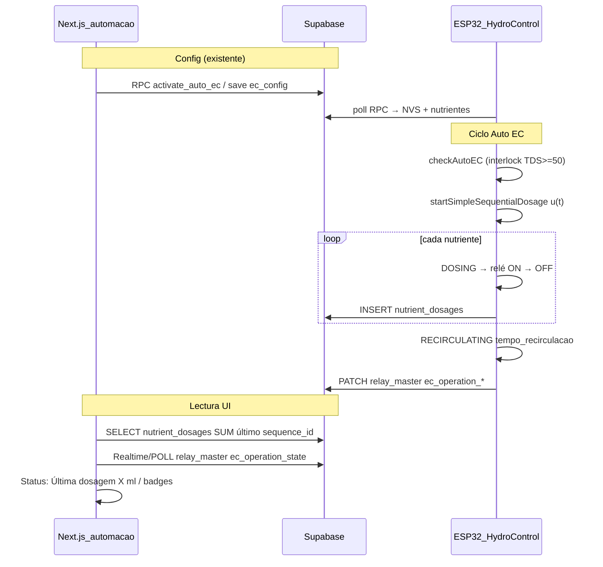

# Handoff — Última dosagem E2E (Auto EC · ISA-88 batch events)

**Fecha:** jun/2026 · **Device ref:** `ESP32_HIDRO_269844`  
**Estado código:** implementado en repo · **Estado prod:** sendero **Auto EC → MQTT → bridge → Supabase** cerrado (16 jun 2026)

---

## 1. Objetivo industrial

Registrar cada actuación de dosagem como **evento inmutable** en Supabase y mostrar en UI solo **SUM(ml)** del último ciclo completado — sin simular estados en React.

| Capa | Responsabilidad |
|------|-----------------|
| **PV** | EC/TDS validado → `hydro_measurements` |
| **SP** | `ec_setpoint` → `ec_controller_config` / RPC `activate_auto_ec` |
| **CO** | u(t) ml → filas `nutrient_dosages` (una por nutriente) |
| **Estado máquina** | `relay_master.ec_operation_*` (dosing / recirculating / ec_check_pending) |
| **UI Status** | `useLastDosage` + `useEcOperationState` en `/automacao` |

---

## 2. Flujo procedural end-to-end (implementado)



### Archivos clave

| Pieza | Ruta |
|-------|------|
| SQL migración | [`scripts/CRIAR_TABELA_NUTRIENT_DOSAGES.sql`](../scripts/CRIAR_TABELA_NUTRIENT_DOSAGES.sql) |
| INSERT dosagem | [`ESP-HIDROWAVE-main/src/SupabaseClient.cpp`](../../ESP-HIDROWAVE-main/src/SupabaseClient.cpp) `insertNutrientDosage` |
| Hook fin nutriente | [`ESP-HIDROWAVE-main/src/HydroControl.cpp`](../../ESP-HIDROWAVE-main/src/HydroControl.cpp) `emitNutrientDoseEvent` |
| Estado EC op | [`ESP-HIDROWAVE-main/src/HydroSystemCore.cpp`](../../ESP-HIDROWAVE-main/src/HydroSystemCore.cpp) `syncEcOperationStateToSupabase` |
| Hook UI ml | [`src/hooks/useLastDosage.ts`](../src/hooks/useLastDosage.ts) |
| Realtime dosagens | [`src/lib/realtime/nutrient-dosages.ts`](../src/lib/realtime/nutrient-dosages.ts) |
| Hook UI badges | [`src/hooks/useEcOperationState.ts`](../src/hooks/useEcOperationState.ts) |
| Detalle designer | [`src/components/NutrientDosageDetail.tsx`](../src/components/NutrientDosageDetail.tsx) |
| QC EC | [`src/lib/realtime/hydro-ec.ts`](../src/lib/realtime/hydro-ec.ts) `resolveEcPlausible` |

---

## 3. Contrato Supabase

### Tabla `nutrient_dosages`

```sql
device_id, sequence_id, nutrient_name, relay_number,
dosage_ml, dosage_time_seconds, ec_before, ec_setpoint,
source ('auto_ec'|'manual'|'web'), created_at
```

- **UI Status:** `SUM(dosage_ml) GROUP BY sequence_id` del último `created_at`.
- **Detalle colapsable:** filas del mismo `sequence_id` (componente designer).

### Columnas `relay_master` (nuevas)

| Columna | Valores / uso |
|---------|----------------|
| `ec_operation_state` | `idle`, `dosing`, `recirculating`, `ec_check_pending` (+ `waiting_nutrient` legado en CHECK) |
| `ec_operation_remaining_sec` | Countdown recirc (sync ~10s + Realtime) |
| `ec_next_check_in_sec` | Countdown hasta próximo `checkAutoEC` |

**Nota UI:** pausa ~3s entre nutrientes (`WAITING` interno) se publica como **`dosing`** — no badge ámbar.

### RLS

- **SELECT** `nutrient_dosages`: authenticated, device del usuario vía `device_status`.
- **INSERT** `nutrient_dosages`: `anon` + `authenticated` (ESP con anon key).

---

## 4. Checklist sendero prod (orden obligatorio)

### Fase A — Supabase (operaciones)

- [x] Ejecutar [`CRIAR_TABELA_NUTRIENT_DOSAGES.sql`](../scripts/CRIAR_TABELA_NUTRIENT_DOSAGES.sql) en SQL Editor prod (fix PL/pgSQL aplicado)
- [x] Verificar con [`VERIFICAR_NUTRIENT_DOSAGES_E2E.sql`](../scripts/VERIFICAR_NUTRIENT_DOSAGES_E2E.sql)

```sql
SELECT COUNT(*) FROM information_schema.tables
WHERE table_name = 'nutrient_dosages';

SELECT column_name FROM information_schema.columns
WHERE table_name = 'relay_master' AND column_name LIKE 'ec_operation%';
```

- [x] Añadir `nutrient_dosages` a Realtime (script incluye bloque; o [`ENABLE_REALTIME_REPLICATION.sql`](../scripts/ENABLE_REALTIME_REPLICATION.sql))
- [x] Índice dedup [`NUTRIENT_DOSAGES_DEDUP_INDEX.sql`](../scripts/NUTRIENT_DOSAGES_DEDUP_INDEX.sql) — upsert bridge sin duplicados MQTT+HTTPS
- [ ] Test INSERT manual anon (opcional):

```sql
INSERT INTO nutrient_dosages (device_id, sequence_id, nutrient_name, relay_number, dosage_ml, dosage_time_seconds, source)
VALUES ('ESP32_HIDRO_269844', 'test-001', '22CCC', 3, 144.4, 863.0, 'auto_ec');
```

### Fase B — Firmware

- [x] Flash build con `insertNutrientDosage` + MQTT `dose`/`ec_operation` + interlock TDS
- [x] Serial esperado tras cada nutriente (MQTT primario; HTTPS solo si broker caído):

```
[MQTT] dose 23 0.93 ml relé 5
```

- [x] Tras secuencia:

```
✅ SEQUÊNCIA COMPLETA
⏳ [RECIRC] Aguardando 60 s (tempo_recirculacao)...
```

- [x] Con EC=0 / TDS bajo: interlock activo — `auto_enabled=false` o dosagem bloqueada

### Fase C — Frontend (Railway / local)

- [x] Deploy HIDROWAVE con hooks nuevos (`useLastDosage`, `useEcOperationState`, Realtime)
- [x] `/automacao` → Status do Controle:
  - `Última dosagem: -- ml` antes del primer ciclo
  - Tras ciclo: SUM último `sequence_id` (ej. `4.28 ml` seq `116020`) ≈ serial u(t)
  - Badges: Dosando · Aguardando recirculação · Próxima verificação EC
- [x] Expandir **Detalhe da última dosagem** → 23 / CAGE / DDSF por relé

### Fase D — KPI bancada (cierre)

| KPI | Criterio | 16/jun |
|-----|----------|--------|
| Latencia INSERT | < 5s tras OFF relé (MQTT + Realtime) | ✅ |
| SUM UI vs serial | \|UI − u(t)\| < 0.05 ml | ✅ 4.277 ml |
| Recirc badge | Visible ~`tempo_recirculacao` s post-secuencia | ✅ |
| Interlock | Sin dosagem absurda con sensor desconectado | ✅ |

---

## 5. Transporte MQTT (cerrado en prod — jun/2026)

ESP publica por MQTT cuando el broker está conectado; si falla → HTTPS directo (sin doble escritura). **Verificado en bancada:** filas en `nutrient_dosages`, badges `ec_operation_*` y SUM UI alineados con serial.

| Tópico | QoS | Bridge → Supabase |
|--------|-----|-------------------|
| `hidrowave/{id}/ec_operation` | 0 | `PATCH relay_master.ec_operation_*` |
| `hidrowave/{id}/dose` | 1 | `INSERT nutrient_dosages` |

**Archivos:** `ESP-HIDROWAVE-main/infra/mqtt/bridge/index.js`, `MqttClient.cpp`, `HydroSystemCore.cpp` (`syncEcOperationStateToSupabase`, `handleNutrientDoseEvent`).

**Deploy bridge:** ACL (`ec_operation`, `dose`) activa; `hidrowave-bridge` en Lightsail. Test local: `npm run test:pub:ec-dose`.

**UI:** sin cambios — sigue leyendo Supabase Realtime (no consume MQTT directamente).

### Fix countdown recirc (jun/2026)

- `useEcOperationState`: ignora `remaining_sec` obsoleto cuando `relay_master` sync (~10s) dispara Realtime sin actualizar EC op.
- `ecDeviceActive` ya no depende de `autoEnabled` — pulsar Auto EC no desmonta el hook.
- Firmware: heartbeat `ec_operation` cada 12s durante dosing/recirc.
- Bridge: throttle `ec_operation` solo si mismo state + remaining ±2s.

---

## 6. Pendiente opcional (post-MVP)

| Item | Motivo |
|------|--------|
| ~~Realtime en `useLastDosage`~~ | ✅ Implementado (`nutrient-dosages.ts`) |
| ~~MQTT `ec_operation` + `dose` + bridge~~ | ✅ Implementado — activar en Lightsail |
| Tabla `ec_controller_metrics` | ✅ firmware MQTT `ec_metric` + bridge + dashboard |
| Tabla `ph_controller_metrics` | ✅ firmware MQTT `ph_metric` + bridge + dashboard |
| ~~`source='web'` en `executeWebDosage`~~ | ✅ Firmware distingue `auto_ec` / `web` |
| Dashboard global | Mostrar última dosagem fuera de `/automacao` |
| RPC `get_last_dosage(device_id)` | Una query en lugar de 2 SELECT en hook |

---

## 7. Qué NO usar para Última dosagem

| Fuente | Por qué |
|--------|---------|
| `useState(0)` local | Eliminado — nunca reflejaba bancada |
| Simulación React flancos relé | Eliminada — reemplazada por `ec_operation_*` |
| `relay_commands_master` | Auto EC local no crea relay_commands |
| `analytics.ts` inferido por duración | Aproximación; no es evento batch real |

---

## 8. Integración sendero maestro (Sprints)

| Sprint | Relación |
|--------|----------|
| **Auto EC / RPC prod** | Prerequisito — config y `auto_enabled` |
| **Fase 3 MQTT comandos** | Ortogonal — dosagem Auto EC usa MQTT dose/ec_operation o HTTPS fallback |
| **Sprint D crop_tasks** | Calendario humano — **no** mezclar con `nutrient_dosages` ingeniería |
| **Nivel 3 prod** | RLS audit + Realtime completo + soak 24h |

---

## 9. KPI bancada (MQTT + HTTPS)

| KPI | Criterio | Cómo validar |
|-----|----------|--------------|
| Latencia badge | UI "Dosando" &lt; 2 s tras inicio secuencia | Serial `[MQTT] ec_operation dosing` + badge UI |
| Latencia ml | `useLastDosage` &lt; 3 s tras OFF relé | Serial `[MQTT] dose` + Realtime |
| Fallback dose | Sin broker → `INSERT nutrient_dosages (HTTPS fallback)` | Parar Mosquitto, dosar una vez |
| Fallback ec_op | Sin broker → PATCH HTTPS en serial | `⚠️ [EC OP] MQTT publish falhou` |
| Sin duplicados | 1 nutriente = 1 fila | `COUNT(*)` por `sequence_id` + nutriente |
| Recirc | Badge ~`tempo_recirculacao` s | `ec_operation_state=recirculating` |

---

## 10. Troubleshooting

| Síntoma | Causa probable | Acción |
|---------|----------------|--------|
| UI siempre `-- ml` | SQL no ejecutado o INSERT falla RLS | Ver Fase A + serial `💾 [DOSAGEM]` |
| Badge recirc nunca | Firmware viejo o `ec_operation_*` ausente | Flash + verificar columnas relay_master |
| EC `6.14e-29` | Filas corruptas hydro_measurements | QC UI muestra `--`; limpiar sensor/firmware |
| SQL error EXCEPTION | Script viejo sin sub-bloque BEGIN | Usar script actualizado en repo |
| Dosagem 336 ml con EC=0 | Interlock no flasheado | Flash + desactivar auto en bancada sin sensor |

---

## 11. Evidencia de cierre MQTT E2E (16 jun 2026)

### Cadena verificada

```text
ESP32 checkAutoEC → emitNutrientDoseEvent → [MQTT] dose
  → Mosquitto → bridge insertDose (upsert dedup)
  → nutrient_dosages → Realtime → useLastDosage / NutrientDosageDetail
```

Paralelo: `syncEcOperationStateToSupabase` → `[MQTT] ec_operation` → bridge `PATCH relay_master`.

### Evidencia Supabase (prod)

Script: `node scripts/verify-nutrient-dosages-e2e.js` → **E2E nutrient_dosages OK** (16 jun 2026).

| Check | Resultado |
|-------|-----------|
| Tabla legible (anon) | OK |
| Últimas filas `ESP32_HIDRO_269844` | 10+ filas `source=auto_ec` |
| SUM último `sequence_id` | `116020` → **4.277 ml** (3 nutrientes: 23, CAGE, DDSF) |
| `relay_master.ec_operation_state` | `idle` post-ciclo |

Último ciclo en DB (ejemplo):

| Nutriente | ml | Relé |
|-----------|-----|------|
| 23 | 0.93 | 5 |
| CAGE | 0.93 | 6 |
| DDSF | 2.417 | 7 |

### Cómo verificar en UI

1. Abrir `/automacao` → panel **Status do Controle** (Control Nutricional).
2. Tras un ciclo Auto EC:
   - **Última dosagem:** debe mostrar SUM del último `sequence_id` (ej. `4.28 ml`), no `--`.
   - Badges: `Dosando` → `Aguardando recirculação` → idle (según `tempo_recirculacao`).
3. Expandir **Detalhe da última dosagem** → una fila por nutriente del mismo `sequence_id`.
4. Latencia esperada: &lt; 3 s tras `[MQTT] dose` (Realtime INSERT).

### Cómo verificar en DB

**SQL Editor** — ejecutar [`VERIFICAR_NUTRIENT_DOSAGES_E2E.sql`](../scripts/VERIFICAR_NUTRIENT_DOSAGES_E2E.sql) (secciones 6–8).

**Node (misma lógica que UI):**

```bash
cd HIDROWAVE-main
node scripts/verify-nutrient-dosages-e2e.js
```

**Bridge (Lightsail):**

```bash
sudo journalctl -u hidrowave-bridge -f
# Esperado por nutriente:
# [bridge] INSERT nutrient_dosages ESP32_HIDRO_269844 23 0.93ml seq=116020
```

**Serial ESP:**

```text
[MQTT] dose 23 0.93 ml relé 5
[MQTT] ec_operation dosing rem=...s next=...s
✅ SEQUÊNCIA COMPLETA
⏳ [RECIRC] Aguardando 60 s (tempo_recirculacao)...
```

### KPI bancada — resultado

| KPI | Criterio | Estado 16/jun |
|-----|----------|---------------|
| 1 nutriente = 1 fila | dedup `idx_nutrient_dosages_dedup` | ✅ |
| SUM UI ≈ serial u(t) | \|Δ\| &lt; 0.05 ml | ✅ (4.277 ml) |
| Badge recirc | `ec_operation_state=recirculating` | ✅ |
| Interlock EC/TDS bajo | sin dosagem absurda con sensor off | ✅ (auto desactivado si EC inválido) |
| Fallback HTTPS | sin broker → INSERT directo | ⏳ no re-testado en esta sesión |

---

## 12. Problemas secundarios en logs (ortogonales al sendero dose)

El sendero **dose + ec_operation** está cerrado. Siguen ruidos en telemetría/ambiente que **no bloquean** `nutrient_dosages` pero ensucian serial, `hydro_measurements` y `environment_data`.

| Síntoma en serial / bridge | Causa | Impacto en Auto EC dose | Acción |
|----------------------------|-------|-------------------------|--------|
| `pH: -8.48e27`, `Temp agua/ar: -890316288` | Sensores pH/temp desconectados o bus I²C basura | Interlock bloquea dosagem si TDS/EC inválido; MQTT dose OK cuando sensor válido | Bancada: cableado + calibragem; ver [`HANDOFF_SENSOR_MAGISTRAL_MQTT_FALLBACK.md`](HANDOFF_SENSOR_MAGISTRAL_MQTT_FALLBACK.md) |
| `[TELEMETRIA MQTT] EC: 0` / `-0` | Sonda EC off o solución vacía | `auto_enabled=false` o interlock — no dosifica | Conectar sonda antes de activar Auto EC |
| Bridge `environment_data insert failed` / `envSkip` | `air_temp` fuera de [0,50] o `humidity` fuera de [0,100] | Ninguno en dose | Bridge ya omite INSERT inválido; firmware filtra en HTTPS (`SupabaseClient::sendEnvironmentData`) |
| `hydro_measurements_*_check` violado | Misma telemetría basura en payload MQTT | Cards dashboard `--`; no afecta SUM dosagem | QC UI `resolveEcPlausible`; limpiar filas corruptas si existen |
| `[MQTT] heartbeat reboot=122` | Contador NVS de reinicios acumulado | Ninguno en dose | Monitorear soak 24h; investigar brownout/WDT si sube en sesión |
| `WebServerTask nullptr`, `masterManager nullptr` | Orden init / modo sin slaves | No bloquea MQTT dose | Refactor init documentado en checkpoint |
| Heap 31% → 45% tras SSL | Fragmentación normal ESP32 | Vigilar en soak | Ya monitorizado en heartbeat |

**Regla operativa:** con sensores desconectados, mantener `auto_enabled=false` en frontend hasta PV plausible (EC/TDS ≥ 50 µS/cm, pH finito 4–9 en prod).

---

**Próximo paso inmediato:** ejecutar SQL métricas en prod → flash ESP → deploy bridge con `ec_metric`/`ph_metric` ACL → `npm run verify:controller-metrics`.

---

## 13. Métricas de ciclo (`ec_controller_metrics` / `ph_controller_metrics`)

Registra **cada evaluación** `checkAutoEC` / `checkAutoPH` (con PV válido), con o sin dosagem.

### Flujo

```text
checkAutoEC/checkAutoPH → emit*ControllerMetric
  → MQTT hidrowave/{id}/ec_metric | ph_metric
  → bridge INSERT
  → dashboard ControllerMetricsChart (poll 60s)
```

### SQL (orden)

1. [`CRIAR_TABELA_EC_CONTROLLER_METRICS.sql`](../scripts/CRIAR_TABELA_EC_CONTROLLER_METRICS.sql)
2. [`CRIAR_TABELA_PH_CONTROLLER_METRICS.sql`](../scripts/CRIAR_TABELA_PH_CONTROLLER_METRICS.sql)
3. [`VERIFICAR_CONTROLLER_METRICS_E2E.sql`](../scripts/VERIFICAR_CONTROLLER_METRICS_E2E.sql)

### Verificación

```bash
npm run verify:controller-metrics
```

Serial: `[MQTT] ec_metric err=... u(t)=...ml`

**Relacionado:** handoff Auto pH en [`handoffs/ph/00_INDICE_SERIAL.md`](handoffs/ph/00_INDICE_SERIAL.md) (paridad MQTT `ph_operation` + `ph_dose`). Índice EC: [`handoffs/ec/S01_NUTRIENT_DOSAGES_E2E.md`](handoffs/ec/S01_NUTRIENT_DOSAGES_E2E.md).
