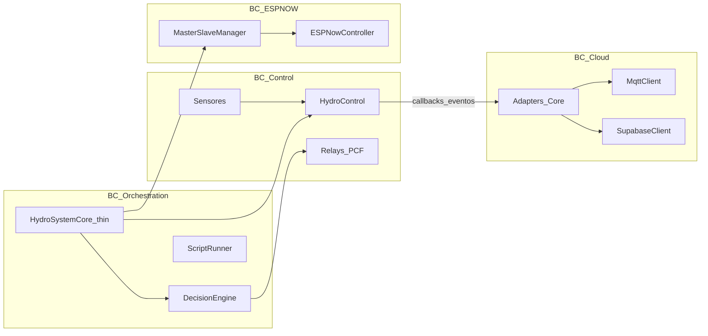

# 03 — Firmware: bounded contexts (plan de desacople)

**Objetivo:** reducir P6 (acoplamiento) sin big-bang rewrite. Un solo binario Master; límites claros entre control, cloud y ESP-NOW.

## 1. Situación actual (dolor)

| Unidad | LOC aprox. | Mezcla hoy |
|--------|------------|------------|
| `HydroSystemCore` | ~3.1k | sensores + MQTT/HTTPS + comandos + DecisionEngine wiring |
| `HydroControl` | ~2.5k | lazo EC/pH/dilución/nivel + callbacks cloud |
| `main.cpp` | ~3k | boot, tasks FreeRTOS, WiFi, master/slave |

Cualquier feature “pequeña” toca el núcleo → HH altas y riesgo de regresión (P3).

## 2. Contextos objetivo (aunque sigan en un `.bin`)

| Bounded context | Responsabilidad | Archivos ancla | Puede depender de |
|-----------------|-----------------|----------------|-------------------|
| **BC_Control** | Lazo cerrado, dosificación, dilución, timers relé locales | `HydroControl.*`, sensores, `Controller`, `AdaptivePH*`, `EcDilution*` | Hardware / NVS |
| **BC_ESPNOW** | Peers, relay remoto, ACK mesh | `ESPNow*`, `MasterSlaveManager.*` | Tipos mensajes; **no** Supabase |
| **BC_Cloud** | MQTT publish/subscribe, HTTPS, bridge payloads | `MqttClient.*`, `MqttCommandParser.*`, `SupabaseClient.*`, `HydroSupaManager.*` | Contrato v1 |
| **BC_Orchestration** | Wiring, colas, DecisionEngine, ScriptRunner | `HydroSystemCore` (adelgazar), `DecisionEngine*`, `ScriptRunner.*`, `RelayCoordinator.*` | Los tres BCs vía interfaces |

## 3. Reglas de dependencia (enforcement en review)

1. **BC_Control no incluye** `#include` de MQTT/Supabase — solo callbacks ya existentes (`NutrientDoseCallback`, `EcOperationSyncCallback`, etc.).
2. **BC_ESPNOW no llama** HTTPS/Supabase directo.
3. **BC_Cloud no ejecuta** lógica de setpoint EC/pH — solo transporta.
4. **HydroSystemCore** solo: registrar callbacks, encolar, dedup comandos, invocar módulos.
5. Nuevo código de feature → carpeta/módulo del BC correcto; **prohibido** crecer `HydroSystemCore.cpp` / `HydroControl.cpp` sin justificación en PR.

## 4. Fases de desacople (incremental)

### Fase F0 — Congelar superficie (0–1 sprint)

- Checklist PR: ¿toca Core+Control juntos? Si sí → justificar o partir.
- Budget: máx. **40 HH/sprint** en esos dos archivos sin plan de extracción.
- Documentar callbacks actuales como “puerto” cloud (tabla abajo).

### Fase F1 — Extraer adapters cloud (1–2 sprints)

- Mover de `HydroSystemCore` a unidad `CloudTelemetryAdapter` / `CloudCommandAdapter` (nombres flexibles):
  - publish telemetry / heartbeat
  - handle MQTT command → `processRelayCommand`
  - sync EC/pH operation + dose events
- Core queda como wiring + `loop()` ordenado: control tick → mesh → cloud flush.

### Fase F2 — Colas entre control y cloud (performance + P3)

- Eventos de dosagem/operation → cola ring buffer (ya hay patrones `RelayCommandBox` / pools).
- Cloud task o tramo de loop solo drena cola (no bloquear lazo en HTTPS largo).
- Meta: P1 estable bajo carga MQTT; P4 heap sin picos por JSON grande en control.

### Fase F3 — Separar archivos físicos si F1/F2 estabilizan P

- Partir `.cpp` solo cuando compilación y bancada lo permitan.
- No renombrar APIs públicas de `HydroControl` sin necesidad.

## 5. Puertos ya existentes (reusar, no reinventar)

| Callback / API | De | Hacia | Uso |
|----------------|----|-------|-----|
| `NutrientDoseCallback` | Control | Core/Cloud | dose MQTT/HTTPS |
| `EcOperationSyncCallback` | Control | Core/Cloud | ec_operation |
| `PhDoseCallback` / `PhOperationSyncCallback` | Control | Core/Cloud | pH |
| `EcDilutionCallback` | Control | Core | dilución |
| `DilutionSlaveRelayCallback` | Control | ESP-NOW | drain/fill slave |
| `processRelayCommand(...)` | Core | Control/mesh | comando unificado |
| `RelayCoordinator` | Orch | Relays | arbitraje |

## 6. Definition of progress

| Señal | Verde |
|-------|-------|
| P6 | &lt; 30% PRs firmware tocan Core+Control juntos |
| LOC Core | estable o bajando trimestre a trimestre |
| Nueva feature lazo | 0 líneas MQTT dentro de `HydroControl.cpp` |
| Bancada | P3 = 0 crash/24h tras cada fase |

## 7. Fuera de alcance (ahora)

- Reescribir PlatformIO / FreeRTOS task map completo.
- Microservicios en el ESP.
- Separar Master/Slave en repos distintos sin necesidad de producto.
