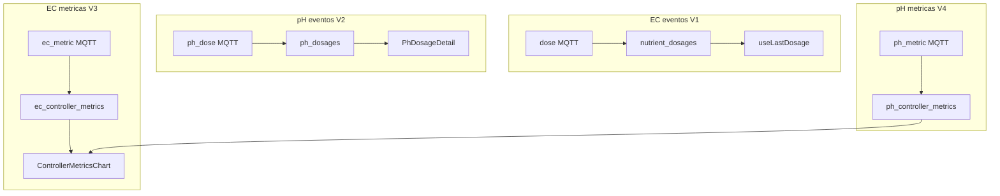

# Guía maestra — Dosing vs métricas (EC + pH)

**Punto de entrada único** para validar y debuggear los cuatro senderos Supabase de Auto EC/pH.

**Device ref:** `ESP32_HIDRO_269844` · **Jun/2026**

---

## A. Las 4 cosas en una página

Hay **dos capas** por dominio (EC y pH). No mezclarlas.

| | **Eventos (dosagem real)** | **Métricas de ciclo (control)** |
|---|---|---|
| **Qué registra** | Material bombeado cuando el relé **apaga** | Cada evaluación `checkAutoEC` / `checkAutoPH` con PV válido |
| **Con o sin dosar** | Solo si hubo actuación | **Siempre** (incluso si `adjustment_applied=false`) |
| **Analogía ISA-88** | CO — batch event inmutable | Registro ingeniería: SP, PV, error, u(t), flags |
| **EC — tabla** | `nutrient_dosages` | `ec_controller_metrics` |
| **pH — tabla** | `ph_dosages` | `ph_controller_metrics` |
| **MQTT topic** | `dose` / `ph_dose` (QoS 1) | `ec_metric` / `ph_metric` (QoS 0) |
| **UI** | `/automacao` — Última dosagem, detalle | `/dashboard` — card Métricas de ciclo 24h |
| **Handoff** | [ec/S01](ec/S01_NUTRIENT_DOSAGES_E2E.md) · [ph/S01](ph/S01_PH_DOSAGES_E2E.md) | [ec/S02](ec/S02_EC_CONTROLLER_METRICS.md) · [ph/S02](ph/S02_PH_CONTROLLER_METRICS.md) |

**Regla de oro:** eventos = **relé OFF**; métricas = **cada tick** del bucle Auto (intervalo `intervalo_auto_ec` / `intervalo_auto_ph`).

---

## B. Diagrama de senderos



Estado prod referencia (jun/2026):

| Gate | Tabla | Prod |
|------|-------|------|
| V1 | `nutrient_dosages` | OK — cientos de filas |
| V2 | `ph_dosages` | OK — cientos de filas |
| V3 | `ec_controller_metrics` | Tabla OK; filas tras flash — **cerrado bancada** 17/06 |
| V4 | `ph_controller_metrics` | Tabla OK; filas tras flash — **cerrado bancada** 17/06 |
| — | `hydro_measurements` (`ph_raw`) | Realtime cards/charts — **cerrado** 17/06 |

---

## C. Orden de validación (V1 → V4)

Ejecutar en orden. No saltar V3/V4 si V1/V2 fallan — comparten bridge y firmware.

| Gate | Qué validar | Comando / doc |
|------|-------------|---------------|
| **V1** | EC eventos | `npm run verify:nutrient-dosages` → [ec/S01](ec/S01_NUTRIENT_DOSAGES_E2E.md) |
| **V2** | pH eventos | `npm run verify:ph-dosages` → [ph/S01](ph/S01_PH_DOSAGES_E2E.md) |
| **V3** | EC métricas | `npm run verify:controller-metrics` → [ec/S02](ec/S02_EC_CONTROLLER_METRICS.md) |
| **V4** | pH métricas | mismo verify + [ph/S02](ph/S02_PH_CONTROLLER_METRICS.md) |
| **Hydro** | Telemetría → cards/charts | `npm run verify:hydro-raw` + [HANDOFF_DEV_RELAX_SENSORS_17JUN2026.md](../HANDOFF_DEV_RELAX_SENSORS_17JUN2026.md) |

Validación global schema:

```bash
cd HIDROWAVE-main
npm run verify:e2e-schema
```

---

## D. Debug por capa (matriz rápida)

### Capa 1 — Supabase SQL

| Síntoma | Tabla probable | Acción |
|---------|----------------|--------|
| `42P01 relation does not exist` | Métricas | Ejecutar [`RUN_CONTROLLER_METRICS_MIGRATIONS.sql`](../../scripts/RUN_CONTROLLER_METRICS_MIGRATIONS.sql) **antes** de Realtime |
| `verify:nutrient-dosages` FAIL | Eventos EC | [`CRIAR_TABELA_NUTRIENT_DOSAGES.sql`](../../scripts/CRIAR_TABELA_NUTRIENT_DOSAGES.sql) |
| Realtime UI no actualiza | Cualquiera | [`ENABLE_REALTIME_REPLICATION.sql`](../../scripts/ENABLE_REALTIME_REPLICATION.sql) (omite tablas inexistentes) |
| 0 filas métricas, tablas OK | — | Normal post-SQL; ver capa 2–3 |

### Capa 2 — Firmware (serial monitor)

| Síntoma | Causa | Acción |
|---------|-------|--------|
| Sin `[MQTT] dose` | MQTT caído o no dosó | Ver broker; activar Auto EC; EC/TDS ≥ 50 |
| Sin `[MQTT] ec_metric` | Firmware viejo o EC inválido | Flash actual; conectar sonda EC |
| `auto_enabled = false` | Config Supabase | Activar en `/automacao` |
| pH `-8e27` en telemetría | Sensor off | No activar Auto; arreglar hardware |
| Solo `[MQTT] dose`, nunca `ec_metric` | Build sin métricas | Reflashear firmware con `emitEcControllerMetric` |

### Capa 3 — Bridge (Lightsail)

```bash
ssh ubuntu@99.79.36.220
sudo journalctl -u hidrowave-bridge -f
```

| Log | Significado |
|-----|-------------|
| `INSERT nutrient_dosages` | V1 OK |
| `INSERT ph_dosages` | V2 OK |
| `INSERT ec_controller_metrics` | V3 OK |
| `INSERT ph_controller_metrics` | V4 OK |
| `INSERT hydro_measurements … ph_raw=` | Telemetría → Realtime cards/charts |
| `Supabase insert failed … 'ec' column` | Bridge viejo — redeploy; whitelist sin `ec` |
| `null value in column "temperature"` | Bridge sin defaults legacy — redeploy `applyLegacyHydroNotNullDefaults` |
| `Rejected … ec_metric` | Payload inválido — ver serial |
| Subscribe con `ec_metric` pero sin INSERT | Bridge sin handlers — redeploy [`S03_BRIDGE_METRICS.md`](ec/S03_BRIDGE_METRICS.md) |
| Subscribe sin `ec_metric` | Bridge desactualizado — redeploy + ACL |

ACL mínimo `bridge_internal` read: `dose`, `ph_dose`, `ec_metric`, `ph_metric`, `ec_operation`, `ph_operation`.

Patch idempotente: [`patch-acl-metric-topics.sh`](../../ESP-HIDROWAVE-main/infra/mqtt/mosquitto/patch-acl-metric-topics.sh)

### Capa 4 — UI

| Síntoma | Mirar |
|---------|-------|
| Última dosagem `-- ml` | V1 — `nutrient_dosages` + Realtime |
| PhDosageDetail vacío | V2 — `ph_dosages` |
| Dashboard sin gráfico métricas | V3/V4 — tablas con filas + Realtime/poll |
| Cards pH sin actualizar | `hydro_measurements` INSERT + Realtime; `ph_raw` NOT NULL |
| Badges stuck | `relay_master.ec_operation_*` / `ph_operation_*` |

**Actuadores vs métricas:** Auto EC/pH publican **métricas** (`ec_controller_metrics`, `ph_controller_metrics`) y **estado operacional** (`ec_operation_*`, `ph_operation_*`). La bomba de circulación slave es **capa I/O** — la coordina `RelayCoordinator` en firmware master (Fase 5 S01); el espejo cloud es `relay_slaves`, no tablas de dosagem.

---

## E. Diagnóstico en 2 minutos

**Caso:** `nutrient_dosages` tiene filas; `ec_controller_metrics` tiene 0.

1. ¿Serial muestra `ec_metric` en boot topics? → No = flash firmware.
2. ¿Serial muestra `[MQTT] ec_metric` cada N s? → No = `auto_enabled=false` o EC inválido → en banco ver [HANDOFF_DEV_RELAX_SENSORS_17JUN2026.md](../HANDOFF_DEV_RELAX_SENSORS_17JUN2026.md) (`HIDRO_DEV_RELAX_SENSORS=1`).
3. ¿Bridge log `INSERT ec_controller_metrics`? → No = ACL, bridge sin handlers, o bridge viejo → [S03](ec/S03_BRIDGE_METRICS.md).
4. ¿`verify:controller-metrics` OK tablas? → Sí = solo falta pipeline datos.

**Caso:** UI `-- ml` pero SQL tiene filas recientes.

1. Realtime `nutrient_dosages` en publication.
2. Device_id correcto en UI.
3. `useLastDosage` — SUM último `sequence_id`.

---

## F. Índices y handoffs

| Dominio | Índice serial | Eventos | Métricas |
|---------|---------------|---------|----------|
| EC | [ec/00_INDICE_SERIAL.md](ec/00_INDICE_SERIAL.md) | [S01](ec/S01_NUTRIENT_DOSAGES_E2E.md) | [S02](ec/S02_EC_CONTROLLER_METRICS.md) |
| pH | [ph/00_INDICE_SERIAL.md](ph/00_INDICE_SERIAL.md) | [S01](ph/S01_PH_DOSAGES_E2E.md) | [S02](ph/S02_PH_CONTROLLER_METRICS.md) |
| Procesos tanque | [processes/00_INDICE_SERIAL.md](processes/00_INDICE_SERIAL.md) | — | — |

### Procesos de tanque (P1 — Fill / Drain / Changeout)

Los bucles Auto EC/pH (P2/P3) **no** se activan desde `decision_rules`. Los scripts P1 de tanque (fill, drain, changeout) y schedules P4 conviven con Auto EC/pH según prioridad documentada.

| Doc | Uso |
|-----|-----|
| [processes/S01_GROW_CYCLE_RULES_17JUN2026.md](processes/S01_GROW_CYCLE_RULES_17JUN2026.md) | Mapeo Aurora → HIDROWAVE, JSON ejemplos, roadmap, checklist bancada (17/jun/2026) |
| [ph/S09_EC_PH_COORDINACAO.md](ph/S09_EC_PH_COORDINACAO.md) | Post-fill: cuándo activar Auto EC/pH; poll vs dosaje |

Relacionado:

- [HANDOFF_ULTIMA_DOSAGEM_E2E.md](../HANDOFF_ULTIMA_DOSAGEM_E2E.md) — histórico EC + evidencia bancada
- [HANDOFF_AUTO_PH_E2E.md](../HANDOFF_AUTO_PH_E2E.md) — resumen pH
- [HANDOFF_CHECKPOINT_JUN2026.md](../HANDOFF_CHECKPOINT_JUN2026.md) — checkpoint macro

---

## G. Scripts npm (desde `HIDROWAVE-main/`)

```bash
npm run verify:nutrient-dosages    # V1
npm run verify:ph-dosages          # V2
npm run verify:controller-metrics  # V3 + V4 tablas
npm run verify:hydro-raw           # hydro_measurements ph_raw reciente
npm run verify:e2e-schema          # schema global
```
