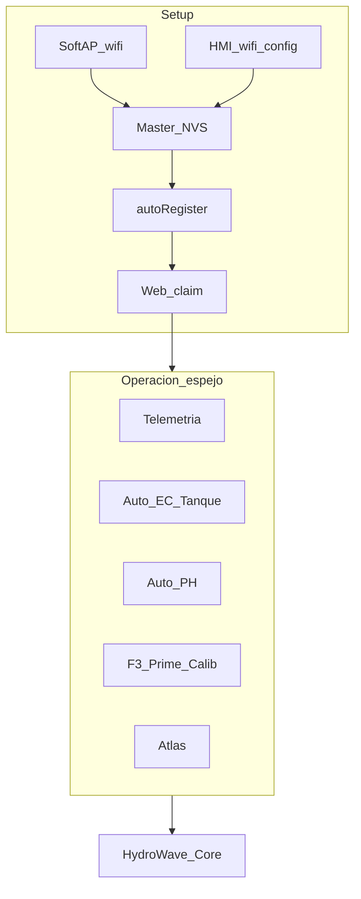

# HMI ↔ Web ↔ Master — Paridad F0 (canónico)

**Estado:** congelado · **2026-08-12**  
**Repos:** HIDROWAVE-main (producto web) + HMI-INTERFACE-main (display) + ESP-HIDROWAVE-main (Core)  
**DoD de capa:** mismo efecto en Master (comando/estado), no solo “se ve en UI”.

Contrato de construcción acordado para englobar la experiencia del display en la interfaz web **sin exigir display**, manteniendo SoftAP/HMI como caminos de provisionamiento WiFi.

---

## 1. Principios

| Principio | Detalle |
|-----------|---------|
| Completo sin display | Prime, calib bomba, dose manual, Auto EC/pH, Atlas deben funcionar solo con Core + web |
| HMI = UI local | Configura y manda UART; el Master ejecuta |
| Rules / Decision Engine / Processos | **Solo web**; **no** incrementar el display en este momento |
| ORP / DO | Fuera de producto web/Master ahora |
| System UART panel en web | **No** necesario |
| i18n | Wizards **separados** por plataforma; web: preferencia en Configuração (`LanguageContext` pt-BR / es / en) — paneles Auto EC aún mayormente hardcoded PT (cablear al implementar) |
| Guía operador unificada | Baja prioridad; no bloquea F1–F5 |
| Cadeado web | Lock con password **dejar como está** (≈ cortina HMI) |



---

## 2. Setup / onboarding

### Roles

| Actor | Hace | No hace |
|-------|------|---------|
| Master | SoftAP / NVS WiFi → STA → `autoRegisterDevice` / `register_device_with_email` | Claim / `owner_id` |
| HMI | Mismos campos WiFi vía UART `wifi_config` (+ wizard local) | Cliente Supabase / claim |
| Web | Auth → `claim_device` → ownership; wizard de **cuenta** | Scan WiFi remoto del Core |

### Wizard web (cuenta — una vez)

```
Idioma → TZ → Nota WiFi (toast/tarjeta informativa) → Perfil / claim → Listo
```

- **Sin Reservorio** en wizard web (un usuario puede tener varios Masters; 1 HMI por Master).
- WiFi = nota de cómo conectar (SoftAP o HMI), no teclado de red en la nube.
- `onboarding_complete` vive en perfil Auth (cuenta).

### Claim (por dispositivo)

- Se repite al agregar otro Core (`device_id`).
- Wizard de cuenta ≠ claim: cuenta 1×; claim N×.

### Wizard HMI (por display)

Ver [`ONBOARDING.md`](../../../HMI-INTERFACE-main/docs/ONBOARDING.md) y [`CLOUD_REGISTER.md`](../../../HMI-INTERFACE-main/docs/CLOUD_REGISTER.md):

```
Idioma → Reservorio → TZ → WiFi (4/5) → Dispositivo (5/5) → Listo
```

`setup_done` (NVS HMI) **≠** claim cloud.

### Dual path WiFi

SoftAP webserver del Master **o** HMI `wifi_config` → mismas variables NVS/STA. Last write wins. Detalle: [`WIFI_SETUP.md`](../../../HMI-INTERFACE-main/docs/WIFI_SETUP.md).

---

## 3. Flags cloud / identidad

| Flag | Quién escribe | Dónde | Uso |
|------|---------------|-------|-----|
| `provisioned_wifi` | Master (tras SoftAP o UART) | NVS Master (+ opcional columna Supabase) | Red lista |
| `registered` | Master `autoRegisterDevice` | Fila `device_status` | Aparece en cloud |
| `claimed` | Web Auth `claim_device` | `owner_id` / ownership | Dueño de cuenta |
| `onboarding_complete` | Web | Perfil usuario | Saltar wizard de cuenta |

Híbrido: embarcado no hace claim; web lee registered/claimed para UI.

---

## 4. Automação — UI y Armado de producto

### Enable = Armado (web)

En HMI: `autoEc = dosingArmed && autoEcEnabled` ([`HMI_UART.md`](../../../HMI-INTERFACE-main/docs/HMI_UART.md)).

En web (decisión F0): **`auto_enabled` EC/pH = armed de producto**. Sin botón Armado aparte. Con Auto ON → bloquear Prime/Dose manual (misma regla de seguridad HMI).

Lock password existente = cortina de edición (no renombrar a Armado).

### 4º card (solo lectura)

Ubicación: fila superior de Automação junto a Regra vigente / Motor de decisão / Estatísticas.

| Estado | Criterio |
|--------|----------|
| **ATIVO** | `ec_config_view.auto_enabled` **o** `ph_config_view.auto_enabled` |
| **INATIVO** | Ambos false |
| Badge secundario | `relay_master.ec_operation_state` / `ph_operation_state` (`idle`, `dosing`, `recirculating`, dilución, …) |

No toggle al tocar el card. ATIVO no parpadea entre ciclos (enable = lazo armado; operación = badge).

### Layout Auto EC (orden)

```
Controle Automático de EC
  ├─ Info colapsable
  ├─ Tanque / Reservório     ← volumen + Batch|Recirc (gated) ANTES de nutrientes
  ├─ Vazão calibrada + Calibrar bombas
  ├─ Tabela de Nutrição
  ├─ Base de dose (ya existe; puede subir junto a Tanque)
  ├─ Auto EC ON (exige volume > 0 + nutrientes ml/L > 0)
  ├─ Agressividade EC % + Consumo EC 24 h (mesmo GET que auto_enabled)
  └─ Dilución Atlas (avanzado web — intacto)
```

Código ancla: [`AutoEcControllerPanel.tsx`](../../src/components/AutoEcControllerPanel.tsx), [`AutomacaoPageClient.tsx`](../../src/app/automacao/AutomacaoPageClient.tsx).

### Validación

- `volume > 0` obligatorio para activar Auto EC (igual que nutrientes con ml/L > 0).

---

## 5. Tanque / Batch|Recirc

| Campo | HMI (`loop_control`) | Web hoy | Master | Decisión F0 |
|-------|----------------------|---------|--------|-------------|
| `volumeL` / `volume` | Reservorio | Sí | OK | Espejo |
| `homoSec`, `dosingDelaySec` | Sí | No como HMI | PARCIAL | Plan en Auto EC |
| `dosingMode` batch\|recirc | Sí | No | PARCIAL | UI **gated** |
| `nutrientGapSec`, `pulseMl`, `pulseGapSec` | Sí | No | PARCIAL | Gated; Batch oculta pulsos |
| `tempo_recirculacao` + dilución Atlas | No igual | Sí | Otro camino | Web avanzado OK |

**Gated** = UI visible, deshabilitada, copy “requiere firmware”, hasta que Master aplique `dosingMode`/gaps. Evita UI mentirosa.

| Modo | Campos |
|------|--------|
| **Batch** | volumen, homo, dose delay, (gap nutrientes si aplica); **sin** ml/pulso ni gap pulsos |
| **Recirc** | Batch + `pulseMl` + `pulseGapSec` |

Reservorio **no** va en wizard web; sí en HMI wizard y en Controle HMI; en web = bloque Tanque por `device_id` en Auto EC.

---

## 6. Schema / UART deltas

Camino cloud (el mismo que `auto_enabled`):

```text
Web  →  PATCH  ec_config_view | ph_config_view
ESP   →  HTTPS GET  /rest/v1/ec_config_view?device_id=eq.{id}&select=*
ESP   →  HTTPS GET  /rest/v1/ph_config_view?device_id=eq.{id}&select=*
      →  HydroControl aplica flags
```

Dos tablas, dos GET. **No** meter pH en `ec_config_view`.

Migración: [`scripts/ADD_EC_PH_AGGRESSIVENESS_CONSUMO_24H.sql`](../../scripts/ADD_EC_PH_AGGRESSIVENESS_CONSUMO_24H.sql)

| Columna | Tabla | Default | Significado |
|---------|--------|---------|-------------|
| `aggressiveness` | `ec_config_view` | 0.5 (0.05–1.0) | Tope de paso Auto EC (`maxStepEc`). No duplica `kp`. |
| `consumo_24h` | `ec_config_view` | false | Consumo EC 24 h (`consumoDiario` UART) |
| `aggressiveness` | `ph_config_view` | 0.5 (ya existía) | A del lazo pH |
| `consumo_24h` | `ph_config_view` | false | Consumo pH 24 h (`consumoPh24h` UART) |

| Capa | Valor agresividad EC |
|------|----------------------|
| UI | 5–100 % (pasos 10) |
| Supabase | 0.05–1.0 |
| UART HMI | `maxStepEc` 0…1 |
| Firmware | `setMaxStepEcFraction` — multiplica u(t) del ciclo |

Consumo 24 h: flanco OFF→ON guarda t0; a las 24 h compara Δ (EC: hambre/dilución; pH: Up/Down). No cambia `intervalo_auto_*`. Default OFF.

### Base de dose HMI

| Sitio | Campo |
|-------|--------|
| Web | `ec_config_view.base_dose` (ya) |
| HMI UI | Controle → Auto — “Base de dose (EC µS/cm)” (**añadir**) |
| UART | `baseDoseUs` en `loop_control` (**nuevo**; no reutilizar a ciegas `dosingConstEc`, hoy siempre 0) |

### Factory reset (HMI → Master)

| Acción | Qué hace | Claim cloud |
|--------|----------|-------------|
| Reboot web (`increment_reboot_count`) | Restart; **conserva** NVS | Intacta |
| Factory HMI (hoy) | Wipe NVS display | Intacta |
| Factory HMI→Master (diseñar) | UART `factory_reset` → Master `nvs_flash_erase()` + restart | **No** borrar fila Supabase |
| Factory desde web | **HUECO** a propósito (presencial) | — |

**No** borrar firmware/app partition (brick). Solo partición NVS.

---

## 7. F3 — Dosificación / cebar (experiencia setup)

| Regla | Detalle |
|-------|---------|
| Separación | EC y pH en secciones/colores distintos |
| Bombas | 4 EC + 2 pH |
| DoD v1 | Por bomba: **Prime hold+stop** (web: manter/soltar MQTT) + **calib vazão** + **dose prueba ml** |
| v2 | Time Dose / Quantity |
| pH química | Calib ml/unid pH (antes/después) — base UX ya más completa; no confundir con vazão |
| Bloqueo | Si Auto enable (ATIVO) → bloquear manual como HMI |

Anclas: [`calibragem/page.tsx`](../../src/app/calibragem/page.tsx), [`EcPumpCalibrationSection.tsx`](../../src/components/EcPumpCalibrationSection.tsx), [`PumpPrimeHoldControl.tsx`](../../src/components/PumpPrimeHoldControl.tsx).

- **Web EC:** una card por nutriente (Automação). Cebar hold MQTT + calib + teste. Guarda `ec_config_view.nutrients[].flowRate` (ml/s). Sem calib → coluna `flow_rate` (fallback).
- **Master:** `tempo = ml ÷ flowRateDaBomba` (`HydroControl::nutrientFlowRateMlPerSec`). NVS `nut_i_q`.
- **HMI:** já era por bomba (`pf_0…pf_5` ml/min no display). Cloud não espelha UART ainda.
- **pH:** continua `flow_rate_ph_up` / `flow_rate_ph_down`.
- Auto EC/pH ATIVO bloqueia hold. Poll HTTPS se MQTT cair: **20 s**.

---

## 8. Matriz de paridad (resumen)

Leyenda: **OK** / **PARCIAL** / **HUECO** / **N/A** / **SOLO-WEB** / **SOLO-HMI** / **GATED**

### Setup

| Concepto | HMI | Web | Master |
|----------|-----|-----|--------|
| Idioma / TZ | OK | Wizard cuenta (plan) | N/A / NTP |
| WiFi | OK UART | Nota SoftAP | NVS OK |
| Reservorio en wizard | OK | **N/A** (por diseño) | — |
| Claim Auth | N/A | OK (solo web) | autoRegister |
| Factory NVS Master vía UART | Plan | HUECO | Plan |
| Reboot | — | OK | OK |
| Rules | N/A | SOLO-WEB después | — |

### Controle / malha

| Concepto | HMI | Web | Master |
|----------|-----|-----|--------|
| Telemetría pH/EC/temp | OK | Dashboard | OK |
| ORP/DO | UI posible | N/A producto | N/A |
| Setpoint + banda | Alvo | Paneles | EC OK; pH parcial handoff |
| Auto EC enable | OK | OK + auditar rastro | Verificar E2E |
| Auto pH enable | OK | OK + agresividad | Runtime PARCIAL handoff |
| Armado separado | OK (`dosingArmed`) | = `auto_enabled` | Mapear en cloud path |
| Agresividad EC % | OK | **OK** (`aggressiveness`) | `setMaxStepEcFraction` |
| Consumo 24h | OK | **OK** (`consumo_24h` en cada view) | ventana 24 h HydroControl |
| volume | OK | OK | OK |
| Batch\|Recirc + gaps | OK | **GATED** | PARCIAL |
| Base de dose | HUECO UI | OK | Sync con `baseDoseUs` |
| Dilución Atlas | N/A | OK | OK |

### Dosificación / Atlas

| Concepto | HMI | Web | Master |
|----------|-----|-----|--------|
| Nutrientes ml/L | OK | OK | OK |
| pH Up/Down | OK | Bastante OK | PARCIAL relays handoff |
| Prime / calib / dose | OK por bomba | Card EC `nutrients[].flowRate` + pH up/down | tempo ÷ q da bomba |
| Atlas nombre/ON/OFF/Ciclo/Timer | OK | OK Automação | Verificar unidades h vs s |

Detalle Master←Display: [`IMPLEMENTACAO_REAL_MASTERLINK_ESPHIDROWAVE.md`](../../../HMI-INTERFACE-main/docs/IMPLEMENTACAO_REAL_MASTERLINK_ESPHIDROWAVE.md).

---

## 9. Fases F0–F5

| Fase | Alcance | DoD |
|------|---------|-----|
| **F0** | Este documento + índices | Contrato congelado |
| **F1** | Wizard cuenta + claim unificado + flags | SoftAP y HMI WiFi → registered → claim web |
| **F2** | Tanque gated, agresividad EC, volume>0, 4º card, auditoría botones Auto EC/pH | UI → Supabase/RPC → Master efecto real |
| **F3** | Prime + calib vazão + dose prueba (EC/pH) | Misma seguridad que HMI si Auto ON |
| **F4** | Atlas paridad unidades/estado | Mismo efecto `relay_slave` |
| **F5** | Show/hide readings; pulido conflictos last-write | Sin calib sensor remota fingida |
| **Después** | Rules / Processos / guía unificada | — |

### Orden de implementación post-doc

1. Base de dose HMI + UART `baseDoseUs`
2. ~~`ec_config_view.aggressiveness` SQL + UI % + sync Master~~ **hecho** (también `consumo_24h` EC/pH)
3. `volume > 0` gate + 4º card ATIVO/INATIVO
4. Bloque Tanque gated (Batch|Recirc)
5. F3 Prime UX (cebar) alineado a calibragem
6. Factory UART `factory_reset` → Master NVS erase

---

## 10. Mapa mental pantallas (sin renombrar URLs)

| Mapa HMI | Web hoy |
|----------|---------|
| Central | Dashboard / Dispositivos |
| Controle | Automação (EC/pH) |
| Dosificación Manual | Calibragem (+ huecos F3) |
| Atlas | Automação / DeviceControl Atlas |
| Ajuste TZ/idioma | Configuração / wizard cuenta |
| Rules | Automação / Processos (**después**) |

---

## 11. Fuentes

| Doc / código | Uso |
|--------------|-----|
| [`HMI-INTERFACE-main/docs/HANDOFF.md`](../../../HMI-INTERFACE-main/docs/HANDOFF.md) | Matriz HMI↔Master |
| [`HMI_UART.md`](../../../HMI-INTERFACE-main/docs/HMI_UART.md) | JSON `loop_control` |
| [`ONBOARDING.md`](../../../HMI-INTERFACE-main/docs/ONBOARDING.md) · [`CLOUD_REGISTER.md`](../../../HMI-INTERFACE-main/docs/CLOUD_REGISTER.md) | Wizard / claim |
| [`HMI_NAV_MAP.md`](../../../HMI-INTERFACE-main/docs/HMI_NAV_MAP.md) | Árbol pantallas |
| [`AutoEcControllerPanel.tsx`](../../src/components/AutoEcControllerPanel.tsx) | Auto EC web |
| [`PhControllerPanel.tsx`](../../src/components/PhControllerPanel.tsx) | Auto pH + aggressiveness |
| [`calibragem/page.tsx`](../../src/app/calibragem/page.tsx) | Vazão / prime guía |
| [`api/device/reboot/route.ts`](../../src/app/api/device/reboot/route.ts) | Reboot ≠ factory |

---

## 12. Prompt al retomar

> Continúa desde `HIDROWAVE-main/docs/handoffs/HMI_WEB_PARITY_F0.md`. F0 congelado. Agresividad EC + Consumo 24 h: mismo GET `ec_config_view` / `ph_config_view` que `auto_enabled` (script `ADD_EC_PH_AGGRESSIVENESS_CONSUMO_24H.sql`). Siguiente: (1) Base dose HMI+UART (3) volume>0 + 4º card. No abrir Rules. DoD = efecto Master real. Batch|Recirc gated hasta firmware.
