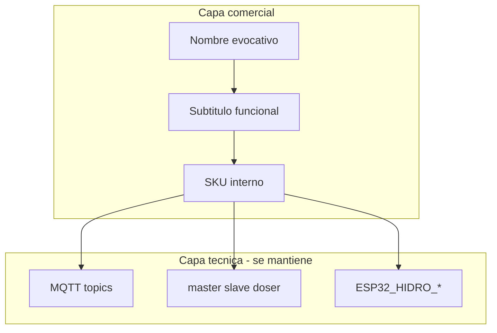

# HydroWave — Línea de producto: naming comercial

**Versión:** 1.2 · **11/jul/2026**  
**Estado:** **Línea comercial congelada** — Core · Atlas · Pulse (UI/docs fase 2 pendiente)  
**Alcance:** Módulos hardware (master, nodo carga, dosador) + capas de proceso P1–P4

---

## 0. Línea definitiva — Core · Atlas · Pulse

| Caja | Nombre comercial | Subtítulo funcional | ID técnico | MQTT (sin cambio) |
|------|------------------|---------------------|------------|-------------------|
| ESP central | **HydroWave Core** | Controlador central | `master` | `master` |
| Nodo de carga | **HydroWave Atlas** | Nodo de carga · relés e válvulas | `relay_node` | `slave` |
| Dosador | **HydroWave Pulse** | Módulo dosador pH/EC | `doser` | `doser` |

### Roles y gatillos mentales

| Nombre | Rol | Metáfora | Gatillo |
|--------|-----|----------|---------|
| **Core** | Cerebro — sensores magistrales, MQTT, reglas, ESP-NOW | Núcleo del sistema | Autoridad, estabilidad |
| **Atlas** | Carga — relés, válvulas, bombas, dreno en campo | Titán que sostiene la carga física (*load-bearing*) | Fuerza, confianza |
| **Pulse** | Dosaje — bombas peristálticas EC/pH | Latido rítmico del nutriente | Precisión viva |

**Regla:** el nombre **atrae**; el **subtítulo explica**. Nunca *master* / *slave* en UI comercial.

### SKU

| SKU | Módulo |
|-----|--------|
| `HW-CORE-01` | ESP master |
| `HW-ATLAS-01` | ESP nodo carga (campo) |
| `HW-PULSE-01` | Módulo dosador |

### Jerarquía de producto

```
HydroWave (marca)
├── Core      [Master — controlador central]
├── Atlas     [Carga — relés e válvulas]
└── Pulse     [Doser — dosagem pH/EC]
```

### Copy oficial

**pt-BR**

> **HydroWave Core** — O cérebro do tanque. Sensores, regras e rede em uma caixa.  
> **HydroWave Atlas** — Sustenta a carga do campo. Válvulas, bombas e relés sob comando.  
> **HydroWave Pulse** — O pulso do nutriente. pH e EC na proporção certa.

**es**

> **HydroWave Core** — El cerebro del tanque. Sensores, reglas y red en una caja.  
> **HydroWave Atlas** — Soporta la carga de campo. Válvulas, bombas y relés bajo control.  
> **HydroWave Pulse** — El pulso del nutriente. pH y EC en la proporción exacta.

**en**

> **HydroWave Core** — The brain of your tank. Sensors, rules, and network in one box.  
> **HydroWave Atlas** — Carries the field load. Valves, pumps, and relays on command.  
> **HydroWave Pulse** — The pulse of nutrients. pH and EC in exact proportion.

### Notas

- **Atlas** siempre con prefijo **HydroWave** (evitar colisión con MongoDB Atlas u otras marcas).
- **Carga** en inglés técnico = *load* / *load-bearing*; no hace falta la palabra “Load” en el nombre comercial.
- Catálogos alternativos (WaveSets A–E, helénico, LINK) en secciones 3–4 — **solo referencia histórica**.

---

## 1. Principios y benchmarks

### 1.1 Por qué importa el naming

Hoy el proyecto mezcla capas de identidad:

| Capa | Ejemplos actuales | Audiencia |
|------|-------------------|-----------|
| Marca UI | **HydroWave** | Operador, marketing |
| Repo / firmware | **HIDROWAVE**, `ESP32_HIDRO_*` | Ingeniería |
| MQTT / código | `master`, `slave`, `doser`, `esp-now-slaves` | Backend, firmware |
| Procesos | P1–P4 (tanque, EC, pH, schedule) | Docs técnicos |

**Problemas detectados:**

- *Master/slave* suena a jerga de ingeniería — inaceptable en packaging, UI y material comercial.
- *P1–P4* (capas de proceso) choca con *P0/P1* (versiones UI de schedules en timeline).
- Nuravine ya ocupa nombres fuertes (Aurora, Elixir, Flux) — copiar genera confusión y riesgo de marca.

### 1.2 Patrones de mercado premium

#### Nuravine — evocativo de una palabra

| Nombre | Rol | Técnica de naming |
|--------|-----|-------------------|
| **Aurora** | Cerebro / orquestación | Metáfora luminosa — “despierta” el sistema |
| **Elixir** | Dosificación multi-bomba | Metáfora alquímica — precisión + magia |
| **Flux** | Válvulas, sensores, lógica I/O | Flujo, movimiento, continuidad |

**Lección:** Una palabra memorable + subtítulo funcional en ficha de producto.

#### Growlink LINKS — ecosistema modular

| Nombre | Rol |
|--------|-----|
| **HUB** (8-Port Device HUB) | Central de comunicación |
| **relayLINK** | Relés HVAC, ventiladores |
| **nutriLINK** | Dosificación 8 canales + sensores |
| **valveLINK** | Válvulas de riego |
| **batch tankLINK** | Tanque batch pH/EC/nivel |

**Lección:** Sufijo `LINK` unifica catálogo; el prefijo describe la función. Escala bien con nuevos módulos.

#### Bluelab — compuesto descriptivo + “Intelli”

| Nombre | Rol |
|--------|-----|
| **IntelliDose** | Dosador automático pH/EC |
| **IntelliLink** | Puente cloud (Edenic app) |
| **Edenic** | Plataforma software |

**Lección:** Comunica inteligencia + función sin misterio. Ideal para B2B que valora claridad.

#### Meter (B2B SaaS) — doble capa obligatoria

| Capa | Uso |
|------|-----|
| **Nombre interno** | Código, API, SKU, MQTT |
| **Nombre externo** | UI, packaging, docs de operador |

**Lección:** Nunca exponer al cliente términos como *slave*, *RPC*, *P1* sin traducción comercial.

### 1.3 Principios transversales HydroWave

1. **Dual layer:** nombre comercial + `technicalId` — no renombrar MQTT/firmware en fase 1.
2. **MECE:** cada caja = un rol claro (cerebro, nodo I/O, dosador).
3. **Sin master/slave** en UI, packaging ni docs de operador.
4. **Coherencia agua/onda:** anclar en HydroWave sin copiar Nuravine.
5. **i18n-ready:** nombre corto fijo + subtítulo traducible (pt-BR / es / en).
6. **Escalable:** el esquema debe admitir futuros módulos (sensor hub, recirc dedicado).



---

## 2. Glosario técnico actual → comercial

### 2.1 Módulos hardware

| ID técnico | Nombre comercial | Rol | Función | Evitar en UI |
|------------|------------------|-----|---------|--------------|
| `master` | **Core** | Cerebro | MQTT, sensores magistrales, orquestación ESP-NOW, ScriptRunner | “Master”, “ESP master” |
| `slave` / `relay_node` | **Atlas** | Nodo de carga | Relés, válvulas, bombas vía ESP-NOW | “Slave”, “ESP slave”, “Relay” solo |
| `doser` | **Pulse** | Dosador | Bombas peristálticas EC/pH multi-canal | “Doser module” sin subtítulo |

### 2.2 Capas de proceso (P1–P4)

| ID interno | Dominio | Ejemplos | Conflicto conocido |
|------------|---------|----------|-------------------|
| **P1** | Tanque | Fill, drain, changeout, level_1–4 | No confundir con schedule UI P0 |
| **P2** | EC | Auto EC, add-back, nutrient_dosages | — |
| **P3** | pH | Auto pH dominio H | — |
| **P4** | Tiempo | Schedules, circulación, mantenimiento | No confundir con schedule UI P1 |

**Recomendación:** En material comercial usar nombres de dominio (*Tanque*, *Nutrientes*, *Balance*, *Ritmo*) y reservar P1–P4 solo para docs de ingeniería.

### 2.3 Estado actual en el codebase

| Ubicación | Términos usados |
|-----------|-----------------|
| `src/lib/esp-now-slaves.ts` | `ESPNowSlave`, `getESPNOWSlaves` |
| `src/app/automacao/AutomacaoPageClient.tsx` | `masterDeviceId`, `espnowSlaves`, `slave_mac_address` |
| `src/lib/translations/processos/pt-BR.ts` | “HydroWave”, stack P1–P4, referencia Nuravine |
| `docs/handoffs/processes/00_INDICE_SERIAL.md` | `ESP32_HIDRO_269844` |
| Firmware `ESP-HIDROWAVE-main` | `ESP32_HIDRO_*`, roles MQTT |

---

## 3. Catálogo por estilo

Cada entrada incluye: **nombre comercial**, **subtítulo funcional**, **SKU sugerido**, **nota de marketing**.

Convención SKU: `HW-{MODULO}-{VARIANTE}` (ej. `HW-CREST-01`).

---

### 3.1 Estilo A — Evocativo (estilo Nuravine)

Una palabra fuerte. Ideal para packaging premium y storytelling.

#### Master (cerebro) — 12 propuestas

| # | Nombre | Subtítulo funcional | SKU | Nota |
|---|--------|---------------------|-----|------|
| A-M01 | **Crest** | Controlador central del tanque | HW-CREST-01 | Pico de ola — autoridad, punto más alto |
| A-M02 | **Current** | Orquestador de sensores y red | HW-CURRENT-01 | Corriente de agua + “corriente” del sistema |
| A-M03 | **Nexus** | Cerebro HydroWave | HW-NEXUS-01 | Conexión central — muy B2B |
| A-M04 | **Helm** | Timón del cultivo | HW-HELM-01 | Control con mano firme |
| A-M05 | **Tide** | Controlador de ciclos y niveles | HW-TIDE-01 | Ciclos naturales — fill/drain |
| A-M06 | **Axiom** | Unidad de decisión | HW-AXIOM-01 | Verdad medida — ScriptRunner |
| A-M07 | **Meridian** | Hub de campo | HW-MERIDIAN-01 | Línea de referencia — precisión |
| A-M08 | **Source** | Origen de datos y comandos | HW-SOURCE-01 | Fuente única de verdad |
| A-M09 | **Anchor** | Base del ecosistema | HW-ANCHOR-01 | Estabilidad, punto fijo |
| A-M10 | **Conductor** | Director de actuadores | HW-CONDUCTOR-01 | Orquesta sin confusión con música |
| A-M11 | **Lighthouse** | Guía del sistema | HW-LIGHTHOUSE-01 | Visibilidad, alertas |
| A-M12 | **Depth** | Control profundo del tanque | HW-DEPTH-01 | Sensores de nivel, profundidad |

#### Nodo relay (ex-slave) — 12 propuestas

| # | Nombre | Subtítulo funcional | SKU | Nota |
|---|--------|---------------------|-----|------|
| A-R01 | **Ripple** | Nodo de relés y válvulas | HW-RIPPLE-01 | Extensión de la ola desde Crest |
| A-R02 | **Pulse** | Nodo de campo | HW-PULSE-01 | Latido del sistema — on/off |
| A-R03 | **Reach** | Expansión de I/O remoto | HW-REACH-01 | Llega donde el cerebro no está |
| A-R04 | **Echo** | Repetidor de actuación | HW-ECHO-01 | Responde al cerebro |
| A-R05 | **Strand** | Rama de relés | HW-STRAND-01 | Hilo conductor del cultivo |
| A-R06 | **Beacon** | Nodo de señal y salidas | HW-BEACON-01 | Visible en cuadro eléctrico |
| A-R07 | **Span** | Puente de actuadores | HW-SPAN-01 | Conecta zonas |
| A-R08 | **Outlet** | Salidas de potencia | HW-OUTLET-01 | Claro para electricista |
| A-R09 | **Limb** | Extremidad del sistema | HW-LIMB-01 | Metáfora orgánica |
| A-R10 | **Tributary** | Afluente de relés | HW-TRIBUTARY-01 | Fluye hacia el tanque |
| A-R11 | **Drift** | Nodo periférico | HW-DRIFT-01 | Movimiento controlado |
| A-R12 | **Harbor** | Puerto de bombas y válvulas | HW-HARBOR-01 | Donde atracan los actuadores |

#### Dosador — 12 propuestas

| # | Nombre | Subtítulo funcional | SKU | Nota |
|---|--------|---------------------|-----|------|
| A-D01 | **Stream** | Módulo de dosaje multi-canal | HW-STREAM-01 | Flujo continuo de nutrientes |
| A-D02 | **Blend** | Mezclador preciso pH/EC | HW-BLEND-01 | Proporción exacta |
| A-D03 | **Infuse** | Inyector de soluciones | HW-INFUSE-01 | Nutrientes “infundidos” |
| A-D04 | **Essence** | Estación de nutrientes | HW-ESSENCE-01 | Concentrado del cultivo |
| A-D05 | **Serum** | Dosador de precisión | HW-SERUM-01 | Laboratorio, confianza |
| A-D06 | **Drip** | Micro-dosaje peristáltico | HW-DRIP-01 | Evocativo; puede sonar “pequeño” |
| A-D07 | **Channel** | Multicanal de bombeo | HW-CHANNEL-01 | Hasta N bombas |
| A-D08 | **Measure** | Dosaje medido | HW-MEASURE-01 | Ciencia, no magia |
| A-D09 | **Alchemy** | Transformación pH/EC | HW-ALCHEMY-01 | Fuerte; cuidado con exceso “místico” |
| A-D10 | **Ratio** | Control de proporciones | HW-RATIO-01 | ISA-88, add-back |
| A-D11 | **Fluxion** | Flujo dosificado | HW-FLUXION-01 | Alternativa a Flux (Nuravine) |
| A-D12 | **Tincture** | Extracto dosificado | HW-TINCTURE-01 | Premium, nicho |

---

### 3.2 Estilo B — Funcional premium (estilo Meter / Bluelab)

Nombre descriptivo + subtítulo. Ideal para distribuidores, datasheets y soporte técnico.

#### Master — 12 propuestas

| # | Nombre | Subtítulo funcional | SKU | Nota |
|---|--------|---------------------|-----|------|
| B-M01 | **HydroWave Core** | Controlador central | HW-CORE-01 | Ancla de marca — recomendado |
| B-M02 | **Control Hub** | Hub de orquestación | HW-CTRLHUB-01 | Claro, internacional |
| B-M03 | **Tank Controller** | Gestión de tanque y red | HW-TANKCTRL-01 | Operador entiende al instante |
| B-M04 | **Grow Brain** | Cerebro del cultivo | HW-GROWBRAIN-01 | Mercado cannabis-friendly |
| B-M05 | **Central Node** | Nodo central ESP-NOW | HW-CENTRAL-01 | Técnico pero limpio |
| B-M06 | **Orchestrator** | Unidad de orquestación | HW-ORCH-01 | ScriptRunner, reglas |
| B-M07 | **Command Unit** | Centro de comando | HW-CMD-01 | Industrial |
| B-M08 | **System Hub** | Hub del ecosistema | HW-SYSHUB-01 | Escala a N módulos |
| B-M09 | **Reservoir Command** | Comando de reservorio | HW-RES-CMD-01 | RDWC específico |
| B-M10 | **Farm Brain** | Controlador de sala | HW-FARMBRAIN-01 | Comercial, multi-tanque futuro |
| B-M11 | **IntelliGrow Hub** | Hub inteligente | HW-INTELLIHUB-01 | Paralelo Bluelab Intelli* |
| B-M12 | **Master Controller** | Controlador maestro | HW-MASTCTRL-01 | Solo docs internas — evitar “Master” en UI |

#### Nodo relay — 12 propuestas

| # | Nombre | Subtítulo funcional | SKU | Nota |
|---|--------|---------------------|-----|------|
| B-R01 | **Relay Node** | Nodo de relés ESP-NOW | HW-RELAYNODE-01 | Estándar industria |
| B-R02 | **I/O Module** | Módulo de entradas/salidas | HW-IOMOD-01 | Genérico, escalable |
| B-R03 | **Valve Controller** | Controlador de válvulas | HW-VALVECTRL-01 | Si el nodo es 90% riego |
| B-R04 | **Actuator Box** | Caja de actuadores | HW-ACTBOX-01 | Packaging físico |
| B-R05 | **Field Node** | Nodo de campo | HW-FIELDNODE-01 | Instalación lejos del tanque |
| B-R06 | **Expansion Relay** | Expansión de relés | HW-EXPRELAY-01 | Deja claro que extiende Core |
| B-R07 | **Remote I/O** | I/O remoto | HW-REMIO-01 | SCADA-friendly |
| B-R08 | **Pump & Valve Unit** | Unidad bombas y válvulas | HW-PVU-01 | Hidráulica explícita |
| B-R09 | **Zone Controller** | Controlador de zona | HW-ZONECTRL-01 | Multi-zona futuro |
| B-R10 | **Output Module** | Módulo de salidas | HW-OUTMOD-01 | Minimalista |
| B-R11 | **Peripheral Node** | Nodo periférico | HW-PERIPH-01 | Reemplazo limpio de “slave” |
| B-R12 | **Relay Expansion** | Expansión de relés 8ch | HW-RELAYEXP-01 | Similar Growlink relayLINK |

#### Dosador — 12 propuestas

| # | Nombre | Subtítulo funcional | SKU | Nota |
|---|--------|---------------------|-----|------|
| B-D01 | **Dose Module** | Módulo de dosaje | HW-DOSEMOD-01 | Base neutral |
| B-D02 | **Nutrient Doser** | Dosador de nutrientes | HW-NUTDOSE-01 | EC / fertigation |
| B-D03 | **pH/EC Doser** | Dosador pH y conductividad | HW-PHECDOSE-01 | Dual dominio |
| B-D04 | **Multi-Pump Doser** | Dosador multi-bomba | HW-MULTIPUMP-01 | Hasta N peristálticas |
| B-D05 | **Fertigation Module** | Módulo de fertirriego | HW-FERTI-01 | Mercado agrícola |
| B-D06 | **Blend Controller** | Controlador de mezclas | HW-BLENDCTRL-01 | Multi-part |
| B-D07 | **Peristaltic Hub** | Hub de bombas peristálticas | HW-PERIHUB-01 | Hardware explícito |
| B-D08 | **Nutrient Station** | Estación de nutrientes | HW-NUTSTATION-01 | Suena a producto terminado |
| B-D09 | **Dosing Station** | Estación de dosaje | HW-DOSESTATION-01 | Internacional |
| B-D10 | **Precision Doser** | Dosador de precisión | HW-PRECDOSE-01 | Premium técnico |
| B-D11 | **Auto-Dose Unit** | Unidad de dosaje automático | HW-AUTODOSE-01 | Paralelo Auto EC/pH |
| B-D12 | **IntelliDose Module** | Módulo IntelliDose | HW-INTELLIDOSE-01 | Cuidado: Bluelab usa IntelliDose |

---

### 3.3 Estilo C — Ecosistema LINK (estilo Growlink)

Prefijo funcional + sufijo `LINK`. El HUB central vende el ecosistema completo.

#### Master / HUB — 12 propuestas

| # | Nombre | Subtítulo funcional | SKU | Nota |
|---|--------|---------------------|-----|------|
| C-M01 | **coreLINK** | Hub central HydroWave | HW-CORELINK-01 | Recomendado estilo C |
| C-M02 | **hubLINK** | Hub de comunicación 8-port | HW-HUBLINK-01 | Paralelo Growlink HUB |
| C-M03 | **brainLINK** | Cerebro de la red LINK | HW-BRAINLINK-01 | Evocativo + modular |
| C-M04 | **tankLINK** | Control de tanque | HW-TANKLINK-01 | RDWC |
| C-M05 | **waveLINK** | Hub onda HydroWave | HW-WAVELINK-01 | Coherencia marca |
| C-M06 | **nexusLINK** | Nexo del ecosistema | HW-NEXUSLINK-01 | — |
| C-M07 | **commandLINK** | Centro de comando | HW-CMDLINK-01 | — |
| C-M08 | **growLINK** | Hub de cultivo | HW-GROWLINK-01 | Cuidado: marca Growlink existe |
| C-M09 | **centralLINK** | Controlador central | HW-CENTRALLINK-01 | — |
| C-M10 | **orchestratorLINK** | Orquestador LINK | HW-ORCHLINK-01 | Largo pero único |
| C-M11 | **systemLINK** | Sistema central | HW-SYSLINK-01 | — |
| C-M12 | **masterLINK** | Hub maestro | HW-MASTERLINK-01 | Solo SKU interno |

#### Nodo relay — 12 propuestas

| # | Nombre | Subtítulo funcional | SKU | Nota |
|---|--------|---------------------|-----|------|
| C-R01 | **relayLINK** | 8 relés independientes | HW-RELAYLINK-01 | Paralelo directo Growlink |
| C-R02 | **valveLINK** | Control de válvulas | HW-VALVELINK-01 | Riego |
| C-R03 | **pumpLINK** | Control de bombas | HW-PUMPLINK-01 | — |
| C-R04 | **nodeLINK** | Nodo de campo genérico | HW-NODELINK-01 | Escalable |
| C-R05 | **fieldLINK** | I/O de campo | HW-FIELDLINK-01 | — |
| C-R06 | **zoneLINK** | Control por zona | HW-ZONELINK-01 | Multi-sala |
| C-R07 | **outputLINK** | Salidas digitales | HW-OUTPUTLINK-01 | — |
| C-R08 | **actuatorLINK** | Actuadores | HW-ACTUATORLINK-01 | — |
| C-R09 | **ioLINK** | Entradas y salidas | HW-IOLINK-01 | — |
| C-R10 | **expandLINK** | Expansión de relés | HW-EXPANDLINK-01 | — |
| C-R11 | **remoteLINK** | Nodo remoto | HW-REMOTELINK-01 | — |
| C-R12 | **peripheralLINK** | Periférico LINK | HW-PERIPHLINK-01 | Reemplazo de slave |

#### Dosador — 12 propuestas

| # | Nombre | Subtítulo funcional | SKU | Nota |
|---|--------|---------------------|-----|------|
| C-D01 | **doseLINK** | Dosaje automático | HW-DOSELINK-01 | Base |
| C-D02 | **nutriLINK** | Nutrientes multi-canal | HW-NUTRILINK-01 | Paralelo Growlink |
| C-D03 | **blendLINK** | Mezclas y proporciones | HW-BLENDLINK-01 | — |
| C-D04 | **phLINK** | Dosaje ácido/base | HW-PHLINK-01 | Dominio pH |
| C-D05 | **ecLINK** | Dosaje conductividad | HW-ECLINK-01 | Dominio EC |
| C-D06 | **streamLINK** | Flujo dosificado | HW-STREAMLINK-01 | — |
| C-D07 | **infuseLINK** | Inyección de soluciones | HW-INFUSELINK-01 | — |
| C-D08 | **ratioLINK** | Proporciones ISA-88 | HW-RATIOLINK-01 | — |
| C-D09 | **pumpDoseLINK** | Bombas dosadoras | HW-PUMPDOSELINK-01 | — |
| C-D10 | **fertiLINK** | Fertirriego LINK | HW-FERTILINK-01 | — |
| C-D11 | **channelLINK** | Multicanal dosaje | HW-CHANNELLINK-01 | — |
| C-D12 | **elixirLINK** | Estación Elixir | HW-ELIXIRLINK-01 | Evitar en mercado US — Nuravine |

---

### 3.4 Capas de proceso P1–P4 — nombres alternativos

Para docs de operador y timeline — **no** usar P0/P1 de schedule UI en la misma frase.

| Capa | ID técnico | Evocativo | Funcional | LINK-style | pt-BR (operador) |
|------|------------|-----------|-----------|------------|------------------|
| Tanque | P1 | **Vessel** | **Tank Process** | **tankProcessLINK** | Processo Tanque |
| EC | P2 | **Nutrient** | **EC Loop** | **ecLoopLINK** | Processo EC |
| pH | P3 | **Balance** | **pH Domain** | **phDomainLINK** | Processo pH |
| Tiempo | P4 | **Rhythm** | **Schedule Layer** | **rhythmLINK** | Agendamentos |

**Alias recomendado en UI (fase 2):** en lugar de “P1” mostrar “Tanque · Fill/Drain” con badge de prioridad numérica solo en modo avanzado.

---

## 4. Sets híbridos — histórico + definitivo

### 4.0 WaveSet definitivo (congelado)

| Módulo | Nombre | Subtítulo |
|--------|--------|-----------|
| Master | **Core** | Controlador central |
| Nodo carga | **Atlas** | Nodo de carga · relés e válvulas |
| Dosador | **Pulse** | Módulo dosador pH/EC |

Ver sección **0** para copy, SKU y mapeo técnico.

---

### 4.1 Sets alternativos (referencia — no usar en packaging)

Combinación curada de estilos previos — solo archivo histórico.

| Set | Master | Nodo relay | Dosador | Tono | Fortaleza |
|-----|--------|------------|---------|------|-----------|
| **WaveSet A** | Crest · Controlador central | Ripple · Nodo de relés | Stream · Módulo de dosaje | Agua/onda, evocativo | Packaging premium, storytelling |
| **WaveSet B** | HydroWave Core | Relay Node | Dose Module | Claro B2B, Meter-style | Soporte, distribuidores, datasheets |
| **WaveSet C** | coreLINK Hub | relayLINK | nutriLINK | Ecosistema modular | Catálogo escalable, cross-sell |
| **WaveSet D** | Nexus · Cerebro del tanque | Pulse · Nodo de campo | Blend · Dosador multi-canal | Premium técnico | Equilibrio evocativo + función |
| **WaveSet E** | Helm · Orquestrador | Reach · Expansão I/O | Infuse · Estação de nutrientes | Operador + elegancia | Fuerte en pt-BR / es |

### 4.1 Copy de ejemplo (WaveSet A)

> **HydroWave Crest** — El cerebro de tu tanque. Sensores, reglas y red en una sola caja.  
> **HydroWave Ripple** — Lleva válvulas y bombas donde las necesitas. Se sincroniza con Crest al instante.  
> **HydroWave Stream** — Dosaje multi-canal para EC y pH. Precisión de laboratorio, cero manos en el tanque.

### 4.2 Jerarquía de producto sugerida

```
HydroWave (marca)
├── Crest          [Core]
├── Ripple         [Field]
└── Stream         [Dose]
```

O con estilo LINK:

```
HydroWave LINK ecosystem
├── coreLINK       [Hub]
├── relayLINK      [Actuation]
└── nutriLINK      [Dosing]
```

---

## 5. Matriz de decisión

Usar para elegir el set final. Puntuar 1–5 por criterio.

| Criterio | Peso | WaveSet A | WaveSet B | WaveSet C | WaveSet D | WaveSet E |
|----------|------|-----------|-----------|-----------|-----------|-----------|
| Memorabilidad (1 palabra) | 20% | 5 | 3 | 4 | 4 | 4 |
| Claridad sin manual | 20% | 3 | 5 | 4 | 4 | 4 |
| Diferenciación vs Nuravine | 15% | 4 | 4 | 3 | 4 | 4 |
| Diferenciación vs Growlink | 15% | 5 | 4 | 2 | 4 | 4 |
| Escalabilidad de catálogo | 15% | 3 | 4 | 5 | 3 | 3 |
| i18n pt-BR / es / en | 10% | 4 | 5 | 4 | 4 | 5 |
| Coherencia marca HydroWave | 5% | 5 | 5 | 4 | 4 | 4 |
| **Total ponderado** | 100% | **3.95** | **4.15** | **3.70** | **3.90** | **4.05** |

*Nota: puntuaciones orientativas para debate interno — ajustar tras workshop.*

### Checklist antes de congelar nombres

- [x] Elegir set comercial — **Core · Atlas · Pulse** (11/jul/2026)
- [ ] Verificar disponibilidad de marca / dominio (fuera de scope técnico)
- [ ] Validar con 2–3 operadores que entienden el rol sin explicación
- [ ] Confirmar que ningún nombre colisiona con Nuravine, Growlink, Bluelab en mercado objetivo
- [ ] Aprobar tabla de mapeo técnico (sección 6) con firmware
- [x] Packaging: nombre evocativo + subtítulo funcional

---

## 6. Mapeo técnico (fase 2 — referencia)

**No implementar sin migración planificada.** Renombrar solo strings de UI y docs de operador; mantener IDs en API/MQTT.

### 6.1 Línea definitiva Core · Atlas · Pulse

| displayName (UI) | technicalId | mqttRole (actual) | firmware env |
|------------------|-------------|-------------------|--------------|
| Core | `master` | `master` | `ESP32_HIDRO_MASTER` |
| Atlas | `relay_node` | `slave` | `ESP32_HIDRO_SLAVE` |
| Pulse | `doser` | `doser` | `ESP32_HIDRO_DOSER` |

### 6.2 WaveSet A (ejemplo histórico)

| displayName (UI) | technicalId | mqttRole (actual) | firmware env |
|------------------|-------------|-------------------|--------------|
| Crest | `master` | `master` | `ESP32_HIDRO_MASTER` |
| Ripple | `relay_node` | `slave` | `ESP32_HIDRO_SLAVE` |
| Stream | `doser` | `doser` | `ESP32_HIDRO_DOSER` |

### 6.3 Archivos candidatos para fase 2

| Área | Archivo | Cambio |
|------|---------|--------|
| i18n | `src/lib/translations/app/{pt-BR,es,en}.ts` | Claves `modules.core`, `modules.atlas`, `modules.pulse` |
| UI | `AutomacaoPageClient.tsx` | Labels Core / Atlas / Pulse vs master/slave |
| Docs | `docs/MQTT_COMANDOS_RAPIDOS_SLAVES.md` | Alias comercial Atlas en título |
| API | Mantener `slave_mac_address` en JSON | Alias opcional `atlas_mac` / `relay_node_mac` en v2 |

### 6.4 Capas P1–P4 en UI

| Antes | Después (operador) | ID técnico (código) |
|-------|-------------------|---------------------|
| P1 | Tanque | `process_layer: 1` |
| P2 | Nutrientes / EC | `process_layer: 2` |
| P3 | Balance / pH | `process_layer: 3` |
| P4 | Ritmo / Agendamentos | `process_layer: 4` |

---

## 7. Anti-patterns (qué evitar)

| Anti-pattern | Por qué | Alternativa |
|--------------|---------|-------------|
| “Slave” en UI o packaging | Jerga ofensiva / técnica | **Atlas** |
| “Master” en material comercial | Jerarquía confusa para operador | **Core** |
| **Atlas** sin prefijo HydroWave | Colisión MongoDB Atlas, fitness | **HydroWave Atlas** |
| Copiar Aurora / Elixir / Flux | Marca Nuravine registrada | Crest, Stream, Fluxion |
| Usar “P1” frente al cliente | Choca con schedule UI P0/P1 | “Tanque”, “Capa Tanque” |
| Renombrar MQTT sin alias | Rompe dispositivos en campo | Capa `displayName` sobre `technicalId` |
| Solo “Controller” o “Module” | Genérico, no vende | Siempre par nombre + subtítulo |
| growLINK como marca principal | Colisión Growlink | waveLINK, coreLINK |
| IntelliDose como nombre propio | Colisión Bluelab | Precision Doser, Dose Module |
| Mezclar HIDROWAVE y HydroWave sin regla | Inconsistencia de marca | HydroWave = comercial; HIDROWAVE = repo/firmware |

---

## 8. Próximos pasos

1. ~~Elegir set comercial~~ — **Core · Atlas · Pulse** congelado.
2. ~~Inventario UI/docs~~ — [CORE_ATLAS_PULSE_UI_MAPPING.md](./CORE_ATLAS_PULSE_UI_MAPPING.md) (checklist fase 2).
3. **Congelar glosario** en `src/lib/product-line-names.ts` (fase 2).
4. **Actualizar UI** con Core / Atlas / Pulse — sin tocar MQTT.
5. **Revisar packaging** con SKU `HW-CORE-01`, `HW-ATLAS-01`, `HW-PULSE-01`.

---

## Referencias

- Nuravine: Aurora, Elixir, Flux — [nuravine.com](https://nuravine.com)
- Growlink LINKS: relayLINK, nutriLINK, valveLINK — [growlink.com/links](https://www.growlink.com/links.html)
- Bluelab: IntelliDose, IntelliLink, Edenic — [bluelab.com](https://bluelab.com)
- Docs internos: [processos/pt-BR.ts](../../src/lib/translations/processos/pt-BR.ts), [00_INDICE_SERIAL.md](processes/00_INDICE_SERIAL.md)
- Schedule UI P0/P1 (no confundir con P1–P4): [GROW_CYCLE_SCHEDULE_DESIGN_P0_P1.md](processes/GROW_CYCLE_SCHEDULE_DESIGN_P0_P1.md)
