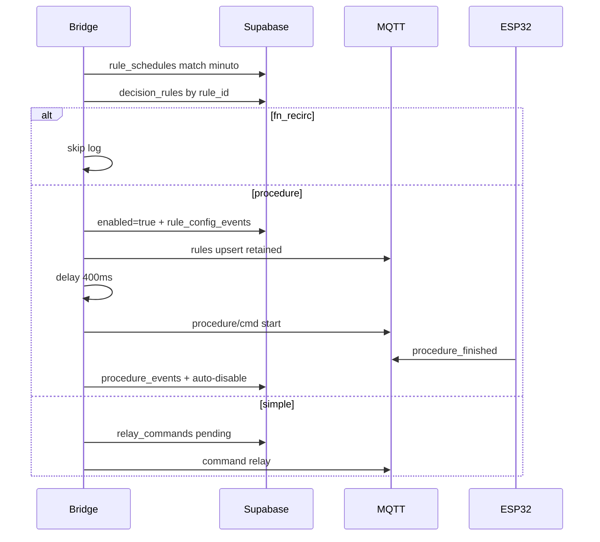

# Plan — Schedule = alarma que pulsa Ativar (re-plan verificado)

> **Estado 2026-09-12:** implementado en repo + bridge Lightsail `active`.  
> Handoff: [HANDOFF_SCHEDULE_ATIVAR_PARITY.md](./HANDOFF_SCHEDULE_ATIVAR_PARITY.md)

> Copia visible del plan Cursor (`~/.cursor/plans/schedule_ativar_real_68d90a71.plan.md`)  
> para abrirlo desde el repo HIDROWAVE.

## Overview

Schedule = Ativar real (procedure), relay (simple), skip `fn_*`.  
Cierra huecos vs sync UI (upsert + delay + start, `rule_config_events`, sort priority, ACL/deploy, publish MQTT en bridge).

## Todos

- [ ] schedule-evaluator: classify + upsert MQTT + delay + procedure/cmd; skip fn_*; sort priority
- [ ] Bridge helpers publish rules upsert + procedure/cmd (cred MQTT_PUBLISH_*)
- [ ] Picker/API excluyen fn_*; timezone desde settings; grow-publish no crea fn_*
- [ ] rule_config_events enabled created_by=scheduler#… al disparar procedure
- [ ] Deploy bridge Lightsail + handoff + checklist verificación

## Qué faltaba (cerrado)

| Hueco | Decisión |
|-------|----------|
| Ativar UI = upsert + ~400 ms + procedure/cmd start | Bridge replica esa secuencia |
| Bridge solo disable slim | Helpers upsert + procedure/cmd |
| Registrar disparó | INSERT rule_config_events enabled, created_by=scheduler#rule_id |
| Priority | Ordenar matches del minuto por priority DESC |
| Rematerialize | v1: rule_json tal cual en DB |
| Already running | Publicar start; Core puede ignored |
| Password admin UI | Schedule no pide password |
| Deploy | Lightsail + restart |
| grow-cycle-publish fn_* | No crear schedules a fn_* (fn = tipagem/Motor, no alarma) |
| ACL | rules/# + procedure/cmd |

## Decisiones de producto

| Tema | Decisión |
|------|----------|
| Reloj | Bridge Lightsail + timezone de la fila |
| TZ al crear | Settings usuario → fila; fallback America/Sao_Paulo |
| Robustez v1 | 1 Bridge; backup después |
| fn_recirc | No schedule |
| Procedure | Ativar real (puede partir enabled=false) |
| Simple | relay_commands + MQTT command |
| UX | Ciclo (ScheduleEditor / WeekDetailPanel) |

## Arquitectura

## Cambios por capa

### A) Bridge MQTT helpers

Patrón de `publishRuleDisableMqtt` en `ESP-HIDROWAVE-main/infra/mqtt/bridge/index.js`:

- `publishRuleUpsertMqtt` — retain true
- `publishProcedureCmdMqtt` — start, no retain
- Creds: MQTT_PUBLISH_* 

### B) schedule-evaluator.js

1. Match hora/tipo/dedup  
2. Candidatos + priority DESC  
3. Classify procedure / simple / skip fn_*  
4. Procedure: enable → config event → upsert → 400ms → start → last_triggered_at  
5. Simple: fireScheduledCommand  

### C) UI / API

- ScheduleEditor + WeekDetailPanel: excluir fn_*; hint procedure = Ativar  
- schedules/route.ts: rechazar fn_*; timezone del client  
- sync-grow-schedules.ts: no materializar fn_*  

### D) Docs + deploy

- Handoff `HANDOFF_SCHEDULE_ATIVAR_PARITY.md`  
- Deploy a `/opt/hidrowave-bridge`

## Fuera de alcance

- HA / segundo Bridge  
- timezone en device_status  
- CRUD schedules en Automação  
- Rematerialize en bridge  
- Retained Ativar RULE_*  

## Verificación

1. Procedure inactiva + schedule → Running → Sucesso + auto-disable  
2. Simple relay → ON  
3. fn_recirc → rechazo  
4. TZ Manaus → 08:00 Manaus  
5. Circ no se pausa  
6. Mismo minuto → mayor priority primero  
7. Log bridge + serial Core procedure/cmd start  
