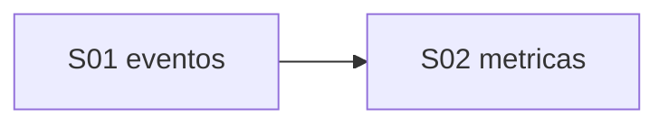

# Auto EC — Índice serial de handoffs

**Punto de entrada:** [00_GUIA_DOSING_VS_METRICAS.md](../00_GUIA_DOSING_VS_METRICAS.md)

**Device ref:** `ESP32_HIDRO_269844` · **Jun/2026**

---

## Mapa serial (dosing + métricas)

| Paso | Documento | Capa | Gate | Estado prod |
|------|-----------|------|------|-------------|
| S01 | [S01_NUTRIENT_DOSAGES_E2E.md](S01_NUTRIENT_DOSAGES_E2E.md) | Eventos `nutrient_dosages` | **V1** | Cerrado |
| S02 | [S02_EC_CONTROLLER_METRICS.md](S02_EC_CONTROLLER_METRICS.md) | Métricas `ec_controller_metrics` | **V3** | SQL OK; bridge + flash |
| S03 | [S03_BRIDGE_METRICS.md](S03_BRIDGE_METRICS.md) | Bridge + ACL métricas | R1–V4 | Deploy Lightsail |
| — | [HANDOFF_DEV_RELAX_SENSORS_17JUN2026.md](../../HANDOFF_DEV_RELAX_SENSORS_17JUN2026.md) | Firmware banco + V3 | **V3 cerrado** 17/06 | Bridge telemetry deploy pendiente |

S01 no bloquea S02 en SQL, pero comparten bridge y firmware — validar V1 antes de debug V3.

---

## Gates

| Gate | Comando | Cuándo |
|------|---------|--------|
| V1 | `npm run verify:nutrient-dosages` | Tras SQL nutrient_dosages |
| V3 | `npm run verify:controller-metrics` | Tras `RUN_CONTROLLER_METRICS_MIGRATIONS.sql` |
| Global | `npm run verify:e2e-schema` | Smoke schema |

---

## Relacionado pH

| Doc | Uso |
|-----|-----|
| [ph/00_INDICE_SERIAL.md](../ph/00_INDICE_SERIAL.md) | Sendero pH completo S01–S08 |
| [ph/S01_PH_DOSAGES_E2E.md](../ph/S01_PH_DOSAGES_E2E.md) | Eventos pH (V2) |
| [ph/S02_PH_CONTROLLER_METRICS.md](../ph/S02_PH_CONTROLLER_METRICS.md) | Métricas pH (V4) |
| [HANDOFF_ULTIMA_DOSAGEM_E2E.md](../../HANDOFF_ULTIMA_DOSAGEM_E2E.md) | Histórico + evidencia EC |
