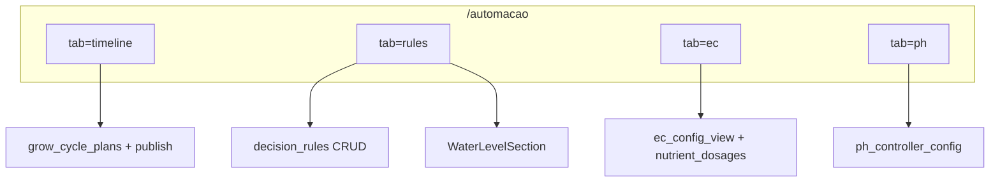

# Auto EC — Sessão UI em `/automacao` (abas)

**Fecha:** 10/jul/2026 · **Device ref:** `ESP32_HIDRO_269844`

**Índice EC:** [00_INDICE_SERIAL.md](00_INDICE_SERIAL.md) · **Índice procesos:** [../processes/00_INDICE_SERIAL.md](../processes/00_INDICE_SERIAL.md)

---

## 1. Resumo

A página `/automacao` foi reorganizada em **cinco abas** com deep-link `?tab=`:

| Aba | Query | Camada ISA-88 | Componente |
|-----|-------|---------------|------------|
| Ciclo de Cultivo | `?tab=timeline` | Receita P1–P4 | `GrowCycleTimelinePanel` |
| Procedimentos | `?tab=procedures` | P1 builder | `ProceduresTabPanel` |
| Regras e Motor | `?tab=rules` (default) | P4 + P1 contexto | `AutomacaoPageClient` (inline) |
| Auto EC | `?tab=ec` | **P2** | `AutoEcControllerPanel` |
| Auto pH | `?tab=ph` | **P3** | `PhControllerPanel` |

**Arquivos principais:**

- `src/components/automacao/AutomacaoTabs.tsx` — shell de abas + hook `useAutomacaoTab`
- `src/components/AutoEcControllerPanel.tsx` — painel P2 extraído (~1966 linhas)
- `src/app/automacao/AutomacaoPageClient.tsx` — orquestrador (~2536 linhas)
- `src/lib/automacao/admin-lock.tsx` — `showLockUnlockToast` compartilhado (EC, pH, Decision Engine)

---

## 2. Mapa abas ↔ camadas P1–P4

| O que | Aba | Fora da aba |
|-------|-----|-------------|
| Motor de Decisão, CRUD regras | Regras | — |
| WaterLevelSection (níveis tanque) | Regras | Não em Auto EC |
| Nutrientes, setpoint, tolerância, malha fechada | Auto EC | — |
| Diluição / EcMalhaFechadaConfig | Auto EC | — |
| Auto pH, K acid/base | Auto pH | — |
| Timeline cultivo / publish plano | Ciclo de Cultivo (`?tab=timeline`) | `/processos/timeline-cultivo` (alias) |
| Calibragem bombas | — | `/calibragem` |

---

## 3. Fluxo operador recomendado

1. **Ciclo de Cultivo** (`/automacao?tab=timeline`) — desenhar plano S0…Sn e publicar P1+P4.
2. **Regras e Motor** — configurar níveis (`WaterLevelSection`), verificar regras publicadas.
3. **Auto EC** (`/automacao?tab=ec`) — plano nutricional → Salvar Parâmetros → Ativar Auto EC.
4. **Auto pH** (`/automacao?tab=ph`) — após EC estabilizar; respeitar interlock G5.

Tutorial em `/processos/ciclos-automaticos` actualizado para referir **Automação → aba Auto EC**.

---

## 4. Conteúdo da sessão Auto EC (checklist P2)

Tudo abaixo vive em `AutoEcControllerPanel`:

- [x] `OperationStateBadges` + banners EC
- [x] Accordion "Como usar o Auto EC"
- [x] Tabela nutricional + modal nutriente
- [x] Parâmetros: setpoint, tolerância, base dose, flow rate, volume, intervalo, recirculação
- [x] Cards métricas EC + `NutrientDosageDetail`
- [x] Equação proporcional u(t)
- [x] `ControllerMetricsPanel` (`focus="ec"`)
- [x] `EcMalhaFechadaConfig` (malha fechada / diluição)
- [x] Botões: Salvar parâmetros, Ativar/Desativar Auto EC, Reset emergencial
- [x] Candado admin (`ecControllerLocked`)
- [x] Modal debug JSON (`showECConfigPreview`)

**Estado interno ao painel:** `useRelayAllocation`, `useEcOperationState`, `useHydroEcReading` (só EC), `saveECControllerConfig`, `loadECControllerConfig`, `activate_auto_ec` RPC.

**Props:** `deviceId`, `espnowSlaves` — relay allocation é interno ao painel (paridade com padrão PhControllerPanel).

---

## 5. Paridade visual Auto EC ↔ Auto pH

| Elemento | PhControllerPanel | AutoEcControllerPanel |
|----------|-------------------|------------------------|
| Isolamento UI | Aba `?tab=ph` | Aba `?tab=ec` |
| OperationStateBadges | Sim | Sim |
| Candado admin | Sim | Sim |
| Metrics panel | `focus="ph"` | `focus="ec"` |
| Dosage detail | PhDosageDetail | NutrientDosageDetail |
| Save + Activate | Sim | Sim |
| Malha fechada | N/A | EcMalhaFechadaConfig |

**Dashboard:** cards Auto EC/pH no Dashboard continuam a espelhar os mesmos hooks (`useEcOperationState`, etc.) — paridade com as abas respectivas após `auto_enabled` carregar da config.

---

## 6. Checklist de regressão (bancada)

| # | Passo | Esperado |
|---|-------|----------|
| 1 | `/automacao?tab=ec` deep-link | Aba Auto EC activa |
| 2 | Adicionar nutriente + Salvar | POST `/api/ec-controller/config` OK |
| 3 | Ativar Auto EC | RPC `activate_auto_ec`; badge dosagem/recirc |
| 4 | Malha fechada / diluição | `EcMalhaFechadaConfig` sem conflito relé pH |
| 5 | Candado admin EC | Bloqueia inputs; senha `admin` |
| 6 | Aba Regras | WaterLevel + Decision Engine intactos |
| 7 | Aba Auto pH | Sem regressão funcional |
| 8 | `npm run build` | Compila sem erros TS |

---

## 7. Fora de scope (esta sessão)

- Rota separada `/automacao/ec` (user escolheu tabs)
- Unificar hooks EC+pH num único provider
- Mover Decision Engine para `/processos`

---

## 8. Relacionado

| Doc | Uso |
|-----|-----|
| [S01_NUTRIENT_DOSAGES_E2E.md](S01_NUTRIENT_DOSAGES_E2E.md) | Eventos nutrient_dosages |
| [S02_EC_CONTROLLER_METRICS.md](S02_EC_CONTROLLER_METRICS.md) | Métricas ec_controller_metrics |
| [ph/S09_EC_PH_COORDENACAO.md](../ph/S09_EC_PH_COORDENACAO.md) | Interlock G5 EC↔pH |
| [HANDOFF_ULTIMA_DOSAGEM_E2E.md](../../HANDOFF_ULTIMA_DOSAGEM_E2E.md) | Pipeline pós-fill |
