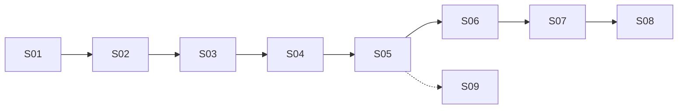

# Auto pH — Índice serial de handoffs

**Punto de entrada único.** Ejecutar S01 → S08 en orden. No avanzar sin pasar el **gate** de cada paso.

**Device ref:** `ESP32_HIDRO_269844` · **Jun/2026**

**Resumen E2E (1 pantalla):** [`HANDOFF_AUTO_PH_E2E.md`](../../HANDOFF_AUTO_PH_E2E.md)

**Paralelo (no bloquea pH):** [`HANDOFF_DEVICE_ONLINE_STABILITY.md`](../../HANDOFF_DEVICE_ONLINE_STABILITY.md)

---

## Mapa serial

| Paso | Documento | Capa | Duración est. |
|------|-----------|------|---------------|
| S01 | [S01_SUPABASE_SCHEMA.md](S01_SUPABASE_SCHEMA.md) · [S01_PH_DOSAGES_E2E.md](S01_PH_DOSAGES_E2E.md) | Supabase SQL + verify ph_dosages | 15–30 min |
| S02 | [S02_FIRMWARE_NVS_BOOT.md](S02_FIRMWARE_NVS_BOOT.md) | Firmware NVS boot | 20 min + flash |
| S03 | [S03_CONTROL_DOMINIO_H.md](S03_CONTROL_DOMINIO_H.md) | Ingeniería control (lectura) | 15 min |
| S04 | [S04_FLUJO_POLL_CONFIG.md](S04_FLUJO_POLL_CONFIG.md) | Firmware poll config | 10 min |
| S05 | [S05_FLUJO_CICLO_ADAPTATIVO.md](S05_FLUJO_CICLO_ADAPTATIVO.md) | Firmware ciclo + transporte | 15 min |
| S09 | [S09_EC_PH_COORDENACAO.md](S09_EC_PH_COORDENACAO.md) | EC↔pH coordinación (anexo) | 10 min |
| S06 | [S06_CALIBRATION_UI.md](S06_CALIBRATION_UI.md) | UI `/calibragem` | 10 min |
| S07 | [S07_BRIDGE_MQTT.md](S07_BRIDGE_MQTT.md) | Lightsail bridge | 20–30 min |
| S08 | [S08_BANCADA_KPI.md](S08_BANCADA_KPI.md) | Bancada cierre | 30–60 min |

**S09** es anexo cross-cutting (EC↔pH): leer tras S05; no bloquea S06–S08.

---

## Gates globales

| Gate | Cuándo |
|------|--------|
| `SCHEMA OK` | Tras S01 — `node scripts/verify-e2e-schema.js` |
| Serial `PH_CONFIG carregado` | Tras S02 flash — boot sin WiFi opcional |
| Calibragem en Supabase | Tras S06 — `ml_per_ph_unit_acid/base` |
| `test:pub:ph-dose` OK | Tras S07 |
| KPI bancada | Tras S08 — badges + dosagem UI |

---

## Relacionado EC

[`HANDOFF_ULTIMA_DOSAGEM_E2E.md`](../../HANDOFF_ULTIMA_DOSAGEM_E2E.md) — Auto EC (sendero independiente; futuro índice serial EC).
