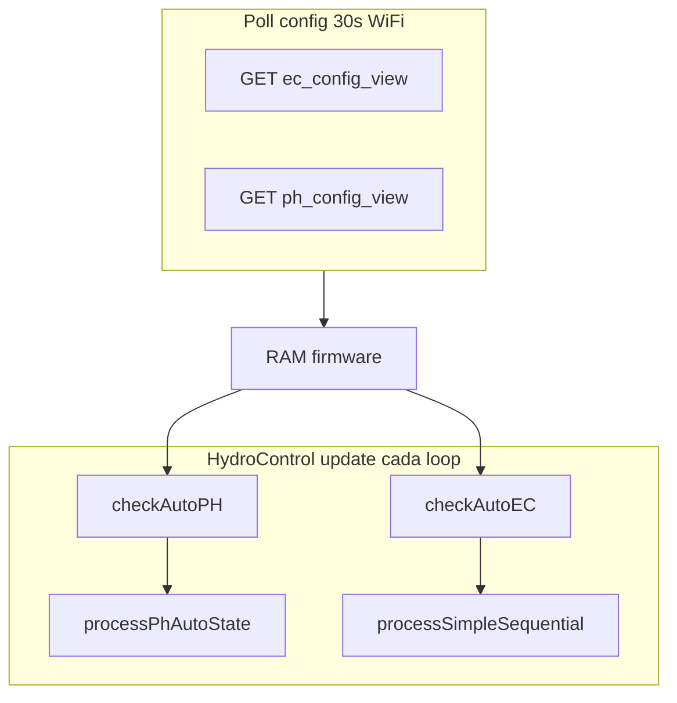

# S09 — Coordinación EC ↔ pH

**Prerequisito:** [S04](S04_FLUJO_POLL_CONFIG.md) y [S05](S05_FLUJO_CICLO_ADAPTATIVO.md) leídos  
**Duración estimada:** 10 min  
**Tipo:** anexo cross-cutting — **no bloquea** S06–S08 si solo se consulta para bancada  
**Siguiente (sendero serial):** [S06_CALIBRATION_UI.md](S06_CALIBRATION_UI.md)

**Relacionado EC:** [`HANDOFF_ULTIMA_DOSAGEM_E2E.md`](../../HANDOFF_ULTIMA_DOSAGEM_E2E.md)

---

## Pregunta frecuente

> ¿`ph_config_view` llega al ESP32 solo después de que Auto EC termine la recirculación?

**No.** Son dos capas distintas:

| Capa | Trigger | Código | Depende de EC? |
|------|---------|--------|----------------|
| **Config remota** | Poll **30 s** fijo (WiFi) | `HydroSystemCore::loop` | **No** |
| **Ciclo dosificador** | Cada `loop()` | `checkAutoEC` / `checkAutoPH` | Solo interlock G5 (producción) |

`intervalo_auto_ph` controla **cuándo re-evalúa** `checkAutoPH`, **no** el poll GET de config.

---

## Flujo en firmware



### Poll config (independiente)

Código: `ESP-HIDROWAVE-main/src/HydroSystemCore.cpp` ~397–404.

```cpp
static const unsigned long PH_CONFIG_POLL_MS = 30000UL;
if (now - lastPHConfigCheck >= PH_CONFIG_POLL_MS) {
    Serial.println("⏰ [PH CONFIG] Poll 30s — GET ph_config_view");
    checkPHConfigFromSupabase();
}
```

Paridad EC: `EC_CONFIG_POLL_MS = 30000UL` en el mismo bloque.

### Orden en `HydroControl::update()`

1. `processPhAutoState` — avanza máquina pH (dosing/recirc)
2. `checkAutoEC` — evalúa/inicia ciclo EC
3. `checkAutoPH` — evalúa/inicia ciclo pH
4. `processSimpleSequential` — avanza máquina EC secuencial

---

## Matriz de escenarios

| Auto EC | Auto pH | `PH_PROTOTYPE_RELAX_GUARDS` | Comportamiento |
|---------|---------|-------------------------------|----------------|
| OFF | ON | 1 (default repo) | pH dosifica solo; `currentState` suele IDLE |
| ON, ciclo activo | ON | **1** | pH **puede** dosar en paralelo (G5 relajado) |
| ON, ciclo activo | ON | **0** | pH **bloqueado** hasta `currentState == IDLE` |
| ON/OFF | OFF | cualquiera | Poll aplica config; `checkAutoPH` no dosifica |

Flag: `ESP-HIDROWAVE-main/include/Config.h` — `#define PH_PROTOTYPE_RELAX_GUARDS 1` (prototipo) vs `0` (producción).

### Interlock producción (G5)

`checkAutoPH` — `ESP-HIDROWAVE-main/src/HydroControl.cpp`:

```cpp
void HydroControl::checkAutoPH() {
    if (!autoPHEnabled) return;
    if (phAutoState != PH_IDLE) return;
#if !PH_PROTOTYPE_RELAX_GUARDS
    if (currentState != IDLE) return;
#endif
```

`startPhAutoDosage` (mismo flag): serial `⚠️ [AUTO PH] EC sequencial ativo — adiando dosagem pH`.

### Auto EC desactivado

- `checkAutoEC()` sale al inicio si `!autoECEnabled` — no inicia secuencial nutrientes.
- `currentState` permanece `IDLE` salvo dosaje manual/secuencial externo.
- pH sigue su propio `auto_enabled` en `ph_config_view` (aplicado en cada poll 30 s).

---

## Máquinas de estado (hoy vs futuro)

### Hoy — dos máquinas independientes

**EC** (`processSimpleSequential`):

```
IDLE → DOSING → WAITING → RECIRCULATING → IDLE
```

**pH** (`processPhAutoState`):

```
PH_IDLE → PH_DOSING → PH_RECIRCULATING → PH_IDLE
```

No hay enlace automático “EC recirc terminó → ahora pH”. La próxima evaluación `checkAutoPH` ocurre tras recirc pH + intervalo `intervalo_auto_ph`.

### Futuro — no implementado

Orquestador batch **EC → pH → recirc única** cuando ambos necesitan corrección. Requiere revertir relax G5 e implementar matriz de eventos coordinada (ver plan firmware G5).

---

## Cómo identificar

### Serial — strings clave

| String | Significado |
|--------|-------------|
| `⏰ [PH CONFIG] Poll 30s — GET ph_config_view` | Config pH aplicada (SP, relés, auto) |
| `⏰ [EC CONFIG] Poll 30s — GET ec_config_view` | Config EC aplicada |
| `🤖 === CONTROLE AUTOMÁTICO EC ===` | Inicio evaluación/dosaje EC |
| `✅ [RECIRC] Tempo de recirculação concluído` | EC vuelve IDLE |
| `⚠️ [AUTO PH] EC sequencial ativo — adiando dosagem pH` | G5 prod — pH esperando EC |
| `🧪 === CONTROLE ADAPTATIVO pH (domínio H) ===` | pH va a dosar |
| `⏳ [AUTO PH] Recirculando N s` | Recirc pH en curso |
| `✅ [AUTO PH] Recirculação concluída` | pH vuelve PH_IDLE |

### UI `/automacao`

- Badges EC: `relay_master.ec_operation_*` — `useEcOperationState`
- Badges pH: `relay_master.ph_operation_*` — `usePhOperationState`
- Son **independientes**: EC dosando + pH idle (o viceversa) es posible según escenario de la matriz.

Valores `ph_operation_state`: `idle` | `dosing` | `recirculating` | `ph_check_pending`

### Supabase — quick check

```sql
SELECT auto_enabled FROM ec_config_view WHERE device_id = 'ESP32_HIDRO_269844';

SELECT auto_enabled, ph_operation_state, ph_operation_remaining_sec
FROM relay_master WHERE device_id = 'ESP32_HIDRO_269844';
```

---

## Verificar (gate S09)

- [ ] Cambiar SP pH en UI → serial poll ≤ **30 s** (sin esperar ciclo EC)
- [ ] Con Auto EC **OFF** + Auto pH **ON** → dosaje pH posible
- [ ] Con `PH_PROTOTYPE_RELAX_GUARDS=0` + EC dosando → serial adiamento pH; badge pH idle o `ph_check_pending`
- [ ] Con `PH_PROTOTYPE_RELAX_GUARDS=1` (default) + EC dosando → pH **puede** dosar en paralelo (comportamiento prototipo, no producción)

---

## Si falla

| Síntoma | Acción |
|---------|--------|
| Config pH no llega | WiFi/Supabase — ver S04 |
| pH nunca dosifica con EC OFF | `auto_enabled` pH, tolerancia, calibragem (S06) |
| pH bloqueado con EC idle | `phAutoState != PH_IDLE` — esperar recirc pH |
| Operador espera batch EC→pH | Comportamiento futuro — hoy son ciclos separados |

---

## Siguiente

Sendero serial: [S06 — Calibragem UI](S06_CALIBRATION_UI.md)  
Referencia cruzada: [`HANDOFF_AUTO_PH_E2E.md`](../../HANDOFF_AUTO_PH_E2E.md) — sección Coordinación EC
