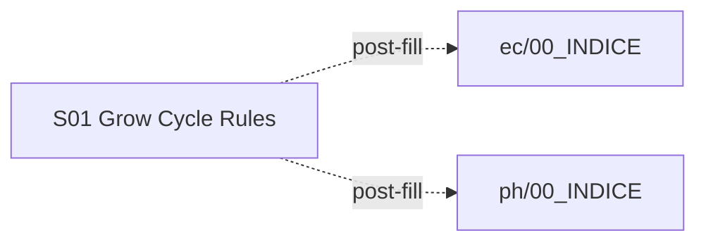

# Procesos de tanque — Índice serial de handoffs

**Punto de entrada dosing/métricas:** [00_GUIA_DOSING_VS_METRICAS.md](../00_GUIA_DOSING_VS_METRICAS.md)

**Sendero serial:** S01 es autónomo (documentación de arquitectura + operación). No bloquea los senderos EC/pH.

**Device ref:** `ESP32_HIDRO_269844` · **17/jun/2026**

**Docs UI (operador):** `/processos` — stack P1–P4 en `src/lib/translations/processos/`

---

## Mapa serial

| Paso | Documento | Capa | Duración est. |
|------|-----------|------|---------------|
| S01 | [S01_GROW_CYCLE_RULES_17JUN2026.md](S01_GROW_CYCLE_RULES_17JUN2026.md) | Schedules + Rules P1 + convivencia Auto EC/pH | 30–45 min lectura |

**S01** documenta el ciclo de cultivo (Fill, Drain, Changeout, Schedule) y su mapeo desde guías tipo Aurora/Nuravine al modelo HIDROWAVE. Leer **antes** de armar scripts P1 en bancada; validar coordinación con [ph/S09_EC_PH_COORDENACAO.md](../ph/S09_EC_PH_COORDINACAO.md) tras el primer changeout. **Roadmap:** Fase 2 interlocks ✅; Fase 3 RPC opcional; Fase 4 recirc física ✅; **Fase 5** RelayCoordinator (Actuator Arbiter) ✅.

---

## Relacionado EC

| Doc | Uso |
|-----|-----|
| [ec/00_INDICE_SERIAL.md](../ec/00_INDICE_SERIAL.md) | Sendero EC S01–S02 (eventos + métricas) |
| [HANDOFF_ULTIMA_DOSAGEM_E2E.md](../../HANDOFF_ULTIMA_DOSAGEM_E2E.md) | Pipeline Auto EC post-fill |

---

## Relacionado pH

| Doc | Uso |
|-----|-----|
| [ph/00_INDICE_SERIAL.md](../ph/00_INDICE_SERIAL.md) | Sendero pH S01–S08 |
| [ph/S09_EC_PH_COORDINACAO.md](../ph/S09_EC_PH_COORDINACAO.md) | Poll vs dosaje; interlock G5 |
| [HANDOFF_AUTO_PH_E2E.md](../../HANDOFF_AUTO_PH_E2E.md) | Resumen Auto pH |

---

## Relacionado Decision Engine

| Doc | Uso |
|-----|-----|
| [HANDOFF_CHECKPOINT_JUN2026.md](../../HANDOFF_CHECKPOINT_JUN2026.md) | Macro Decision Engine ~35% |
| [ARQUITETURA_DECISION_RULES_COMPLETA.md](../../../ARQUITETURA_DECISION_RULES_COMPLETA.md) | Schema `decision_rules` + `rule_json` |
| [FLUXO_PANORAMICO_DECISION_RULES.md](../../../FLUXO_PANORAMICO_DECISION_RULES.md) | Flujo UI → Supabase → ESP32 |

---

## Gates globales (procesos P1)

| Gate | Cuándo |
|------|--------|
| `SCRIPT_PERSISTED` | Regla guardada en `decision_rules` con `priority` ≥ 80 |
| `BENCH_P1` | Checklist §10 de S01 — drain/changeout sin carrera con Auto EC/pH |
| `DECISION_ENGINE` | Executor secuencial ESP32 validado en dispositivo (no solo UI) |
