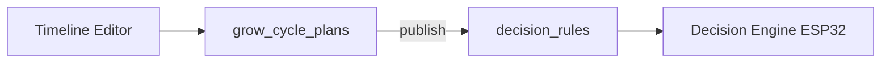

# Grow Cycle Timeline — implementação (Fase 0 → F3)

**Data:** jun 2026  
**Relacionado:** [S01_GROW_CYCLE_RULES_17JUN2026.md](./S01_GROW_CYCLE_RULES_17JUN2026.md)  
**Preview UI:** `/processos/timeline-cultivo` (dados fictícios, simulação)

---

## 1. Objetivo

Designer visual de **timeline de cultivo** (semanas 0–14): setpoints EC/pH por semana, eventos P1 (tanque), faixas P2/P3 (Auto EC/pH) e P4 (TIME), com **modo simulação** que não envia comandos ao ESP32.

### Diferença vs componentes existentes

| Componente | Eixo temporal | Uso |
|------------|---------------|-----|
| `CropCalendar` | Dias civis (mês/semana Dom–Sáb) | Tarefas manuais, notas |
| Automação / `decision_rules` | Sem trigger de “semana N” | Regras individuais |
| **Grow Cycle Timeline** | **Semana de ciclo S0…Sn** | Plano completo RDWC / DWC |

---

## 2. Referência industrial

Padrões comuns (Aurora/Nuravine, Priva-style, RDWC comercial):

- **S0:** Initial Fill + ativação Auto EC/pH pós-mix
- **S1…Sn−1:** Changeout semanal (dreno parcial + reposição) + manutenção P2/P3
- **Sn:** Flush + Drain total (fim de ciclo)
- **Setpoints:** rampa EC em veg, degrau no flip, plateau em flower
- **P4:** circulação contínua ou pulso (independente de `tempo_recirculacao` post-dose)

---

## 3. Modelo de dados proposto

```typescript
type GrowPhase = 'establishment' | 'vegetative' | 'flip' | 'flower' | 'flush';

interface GrowWeekProfile {
  weekIndex: number;       // 0..totalWeeks
  phase: GrowPhase;
  ecSetpointUsCm: number;
  phSetpoint: number;
  label?: string;
}

type TankEventKind = 'initial_fill' | 'changeout' | 'drain_full';

interface TankEvent {
  kind: TankEventKind;
  weekIndex: number;
  triggerTime: string;     // "08:00"
  ruleIdSuggested: string; // ex. CHANGEOUT_W03_W04
  priority: number;        // P1: 85–95
}

interface ScheduleBlock {
  weekIndex: number;
  ruleId: string;          // ex. SCHEDULE_circulation
  layer: 'P4';
  label: string;
  cadence: string;         // "every 2h"
}

interface GrowCyclePlan {
  id: string;
  name: string;
  totalWeeks: number;      // 1–14 (semana 0 + N semanas operacionais)
  weeks: GrowWeekProfile[];
  tankEvents: TankEvent[];
  schedules: ScheduleBlock[];
  autoEcPhEnabled: boolean;
}
```

---

## 4. Mapeamento HIDROWAVE (stack atual)

| Timeline UI | Backend / firmware |
|-------------|------------------|
| EC bar por semana | `ec_config_view.ec_setpoint` (ajuste manual hoje; F2: script por semana) |
| pH bar | `ph_config_view.ph_setpoint` |
| Initial Fill S0 | `INITIAL_FILL_*` (P1, priority ~90) |
| Changeout Sn | `CHANGEOUT_W{n}_W{n+1}` (P1, ~85) |
| Drain final | `DRAIN_FULL` (P1, ~95) |
| Auto EC/pH faixa | `auto_enabled` + bucles P2/P3 |
| Circulação | `SCHEDULE_*` → relé slave ESP-NOW (P4) |
| Diluição overshoot | Relés slave (`dilution_*_slave_mac`) — independente da timeline |

---

## 5. Roadmap

| Fase | Entrega | Persistência |
|------|---------|--------------|
| **F0** | Doc + `/processos/timeline-cultivo` mock | Nenhuma |
| **F1** | Tabela `grow_cycle_plans` + CRUD API | Supabase |
| **F2** | “Publicar plano” → gera/atualiza `decision_rules` | Transacional |
| **F3** | Master aplica setpoints semanais via poll/RPC | Firmware |

### F1 — schema sugerido (futuro)

```sql
-- grow_cycle_plans (device_id, name, total_weeks, plan_json jsonb, updated_at)
-- plan_json serializa GrowCyclePlan
```

### F2 — geração de regras



---

## 6. Regras de simulação (F0)

Implementadas em `src/lib/grow-cycle-timeline/simulation-engine.ts`:

1. **P1 hold:** durante changeout simulado, log `[SIM INTERLOCK] Auto EC/pH pausados (P1 priority >= 80)`.
2. **Changeout semanal:** toda semana S1+ dispara evento P1 às 08:00 (config mock).
3. **Setpoints:** leitura de `GrowWeekProfile`; sem escrita em `ec_config_view`.
4. **Log:** formato estilo serial firmware; prefixo `[SIM]`.
5. **Avançar semana:** botão incrementa playhead e append eventos da semana no log.

---

## 7. Wireframe ASCII

```
┌─ PREVIEW — dados fictícios ─────────────────────────────────────┐
│ Semanas: [====12====]  Playhead: S5 ▼                           │
├──────────────────────────────────────────────────────────────────┤
│ Fase │ Estab │ Veg │ Veg │ Veg │ Flip│ Flor│ ... │ Flush        │
├──────┼───────┴─────┴─────┴─────┴─────┴─────┴─────┴──────────────┤
│ EC   │ ▓▓800 ▓▓900 ▓▓1000 ...              ▓▓1800    ▓▓400      │
│ pH   │ ▓5.8  ▓5.8  ▓5.8  ...              ▓6.2     ▓5.5         │
│ P1   │ [FILL] [CO] [CO] [CO] ...          [CO]     [DRAIN]      │
│ P4   │ ─── circ 2h ───────────────────────────────────────────  │
└──────────────────────────────────────────────────────────────────┘
```

---

## 8. Arquivos F0

| Path | Descrição |
|------|-----------|
| `src/lib/grow-cycle-timeline/types.ts` | Tipos |
| `src/lib/grow-cycle-timeline/mock-rdwc-12w.ts` | Ciclo demo |
| `src/lib/grow-cycle-timeline/simulation-engine.ts` | Simulação pura |
| `src/components/grow-cycle/*` | UI chart + painéis |
| `src/app/processos/timeline-cultivo/*` | Página mock |

---

## 9. Checklist bancada (pós-F2/F3)

- [ ] Publicar plano 12 semanas gera `CHANGEOUT_W01_W02` … em `decision_rules`
- [ ] Setpoint EC semana 5 reflete em `ec_config_view` após “aplicar semana”
- [ ] Simulação F0 continua disponível sem hardware
