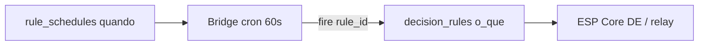

# Handoff — Schedules no ciclo + configs posibles (lote / recirc)

**Fecha:** 2025-09-05  
**Ámbito:** UI Ciclo de Cultivo + tabla `rule_schedules` + bridge scheduler  
**Relacionado:**  
- [GROW_CYCLE_SCHEDULE_DESIGN_P0_P1.md](./GROW_CYCLE_SCHEDULE_DESIGN_P0_P1.md) (UI chips P0/P1)  
- [GROW_CYCLE_TIMELINE_IMPLEMENTATION.md](./GROW_CYCLE_TIMELINE_IMPLEMENTATION.md)  
- [S01_GROW_CYCLE_RULES_17JUN2026.md](./S01_GROW_CYCLE_RULES_17JUN2026.md)  
- Migration: `scripts/migrations/CREATE_RULE_SCHEDULES.sql`

**No es modo producto “lote = bomba descanso”.** Aquí “lote” = cultivo por tanda / semana de ciclo con horarios repetibles (recirc, luces, UC), compatible con recirculação contínua tipada + Auto EC/pH.

---

## 1. Estado actual (já na UI)

No detalhe da semana (`WeekDetailPanel`):

| Camada | Badge | Fonte | Persistência |
|--------|-------|--------|--------------|
| Agendamentos do plano | `plan` | `plan.schedules` (mock / recipe) | Só no JSON do plano |
| Schedules desta semana | `live` | `rule_schedules` filtrado `grow_week` + `grow_week_index` | Supabase |

**Modelo demo vs live (arrancar):**

| Modo | Timeline P1/P4 | Fonte |
|------|----------------|--------|
| **Demo local** | Receita completa (FILL, CO, Circ·2h, UC) | `buildRecipePlan` / mock RDWC |
| **Ciclo live** (após Iniciar) | Carril **vazio** | `buildLiveEmptyDisplayPlan` — EC/pH setpoints mantêm-se |
| **Iniciar ciclo publish** | Não materializa schedules do plano | `buildStartCyclePublishPlan` (`schedules: []`) |

Scroll horizontal: com ≥6 semanas o slot não esmaga o viewport — arrastar / role a barra da timeline.

**Ações live (MVP feito):**

- `+ Novo schedule` → form (regra, `time_start`, `time_end` opcional)  
- Tipo **fixo** `grow_week` + semana da UI  
- `created_by: grow-cycle-ui`  
- Toast tipo Crop: `Schedule criado com sucesso!` / erro  
- Delete com toast  

**Iniciar ciclo** continua a materializar schedules do plano com `created_by: grow-cycle-publish` (cleanup **não** apaga `grow-cycle-ui`).

Exemplo já visível na bancada/UI:

- Plan: `Circulação` · `every 2h` · `SCHEDULE_circulation`  
- Live: `SCHEDULE_circulation` · `08:00` · ON  

---

## 2. Modelo de dados hoje

Tabela `public.rule_schedules`:

| Campo | Uso |
|-------|-----|
| `schedule_type` | `daily` \| `weekly` \| `grow_week` |
| `time_start` / `time_end` | Janela horária (bridge cron ~60s) |
| `days_of_week` | Só `weekly` (0=dom … 6=sáb) |
| `grow_week_index` | Só `grow_week` (S0…Sn) |
| `rule_id` | Aponta para `decision_rules` |
| `timezone` | Default `America/Sao_Paulo` |
| `enabled` / `last_triggered_at` | Gate + anti-dup |

**Lacuna importante:** `rule_schedules` **não** guarda duração (minutos/horas de ON).  
A duração vive na **regra** (`decision_rules.rule_json` / ação `duration` / timer / pulse).  
Schedule = **quando** disparar; rule = **o quê** (incl. quanto tempo).



---

## 3. Compatibilidade com cultivo por lote (tanda)

Cenário desejado (produto):

> Todo dia às **08:00** da manhã, **recircular por N minutos ou horas**.

| Peça | Como encaixa hoje | Config futura sugerida |
|------|-------------------|-------------------------|
| Horário diário 08:00 | `schedule_type=daily`, `time_start=08:00` **ou** `grow_week` por semana do ciclo | Preset UI “Recirc manhã” |
| Duração 30 min / 2 h | Na regra (timed ON / pulse / `durationSeconds`) | Campo UI **duração** que grava na regra ou coluna opcional |
| Semana do cultivo | `grow_week` + `grow_week_index` (já no Ciclo) | Default ao criar no painel da semana |
| Lote sem matar sensores | Recirc tipada + Auto EC/pH; **não** “bomba descanso forever” | Safety: sempre duration + tipagem circ |

**Veredicto:** o schedule é **altamente compatível** com lote/tanda. O que falta é empacotar a **duração** na UX de config (hoje está só na regra).

---

## 4. Catálogo de configs possíveis (armazenar como roadmap)

### 4.1 Tipos de schedule (já no schema)

| ID config | `schedule_type` | Quando dispara | UI hoje |
|-----------|-----------------|----------------|---------|
| `sched.daily` | `daily` | Todo dia em `time_start` | Tab Automação → Schedules |
| `sched.weekly` | `weekly` | Dias em `days_of_week` | Tab Schedules |
| `sched.grow_week` | `grow_week` | Só na semana `grow_week_index` do ciclo activo | Ciclo → Novo schedule |

### 4.2 Presets de produto (ainda não como entidades; guardar como possibilidade)

| Preset ID | Intent | Schedule | Rule / ação | Notas |
|-----------|--------|----------|-------------|-------|
| `preset.recirc_morning` | Todo dia 08:00 recirc N min | `daily` 08:00 **ou** `grow_week` S* | ON timed `duration_s = N*60` no relé tipado circulação | Ideal lote/tanda |
| `preset.recirc_interval` | Cada 2 h | Plan cadence `every 2h` → regra interval / bridge | Pulse/timed | Já no plano mock |
| `preset.uc_roots_sunday` | Dom 10:00 manutenção | `weekly` [0] 10:00 | Script/regra UC | Plan mock UC Roots |
| `preset.lights_photoperiod` | ON 06:00 / OFF 22:00 | 2 rows daily ou time_end | Relés luz | time_end hoje = janela, não necessariamente OFF |
| `preset.changeout_week` | Só S{n} 08:00 | `grow_week` | P1 INITIAL_FILL / CHANGEOUT | Eventos P1 do plano |

### 4.3 Campos de config a considerar (próximo sprint; sem migration ainda)

Proposta de **config JSON** (ou colunas futuras) — **não implementar agora**, só contrato:

```json
{
  "preset": "preset.recirc_morning",
  "schedule_type": "daily",
  "time_start": "08:00",
  "timezone": "America/Sao_Paulo",
  "grow_week_index": null,
  "duration_seconds": 1800,
  "actuator_role": "circulation",
  "rule_id": "fn_recirculacao_continua_or_pulse",
  "created_by": "grow-cycle-ui"
}
```

Alternativa mínima sem nova coluna: ao criar schedule no Ciclo, se o grower informar duração, **atualizar/criar** a `decision_rule` com `duration` e o schedule só guarda o horário.

### 4.4 `created_by` (origem)

| Valor | Origem |
|-------|--------|
| `grow-cycle-publish` | Iniciar ciclo (materializa plano) — pode ser substituído no re-publish |
| `grow-cycle-ui` | Botão Novo schedule no detalhe da semana — **não** apagar no publish |
| `web_interface` | Tab Automação → Schedules |

---

## 5. UX actual vs desejada (lote)

| Hoje | Desejado (lote-friendly) |
|------|---------------------------|
| Novo schedule: regra + hora | + duração (min/h) + tipagem circ pré-seleccionada |
| Plan “every 2h” só visual no recipe | Botão “Aplicar preset do plano → live” |
| daily só na tab Schedules | Atalho no Ciclo: “Todo dia neste horário” (mesmo com ciclo activo) |
| Toast sucesso | Manter (paridade Crop Task) |

---

## 6. Bridge / firmware (não mudar neste handoff)

- Bridge avalia `rule_schedules` (~60 s) e dispara `rule_id`.  
- Core: owner `ScheduleP4` / PATH; ACK↔rule se a regra for remota.  
- Recirc tipada: `RelayCoordinator` + hydraulic roles — schedule não bypassa tipagem.

---

## 7. DoD / próximos passos (quando abrir sprint)

1. Preset UI `Recirc manhã`: daily/grow_week + duração → rule timed.  
2. Campo duração no form do Ciclo (escreve na rule, não exige migration).  
3. Opcional: `duration_seconds` em `rule_schedules` só se o bridge precisar sem ler rule_json.  
4. Documentar 1 exemplo SQL seed `preset.recirc_morning` em bancada.

---

## 8. Verificação rápida (estado actual)

1. Core seleccionado → Ciclo → semana S0.  
2. Ver plan `Circulação every 2h` + live se existir.  
3. `+ Novo schedule` → regra → 08:00 → toast sucesso.  
4. Reiniciar ciclo **não** apaga rows `grow-cycle-ui`.  
5. Tab Schedules lista o mesmo row.
