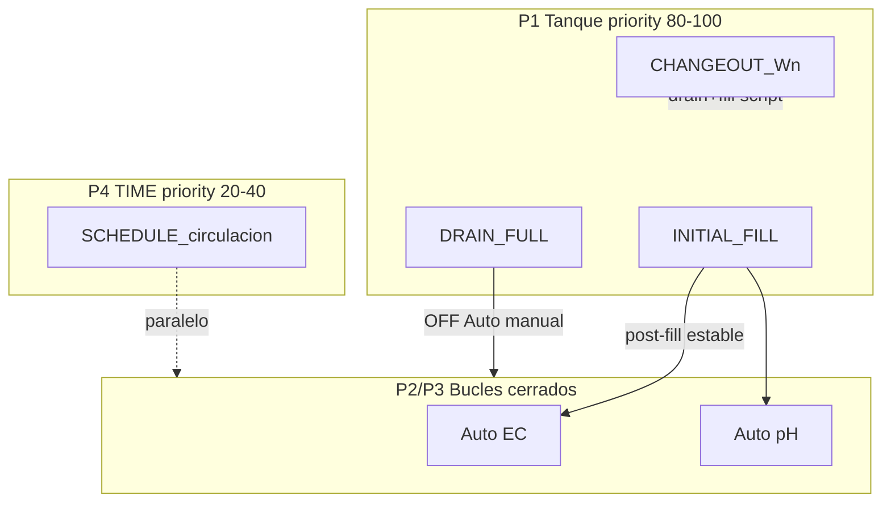
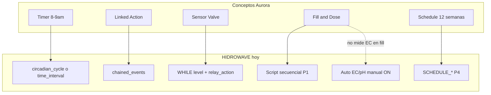
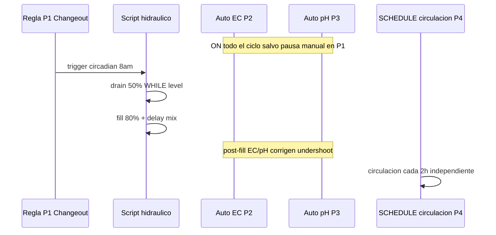

# S01 — Schedules, Rules y Auto EC/pH — Grow Cycle (17/jun/2026)

**Fecha:** 17 jun 2026  
**Prerequisito:** lectura rápida de [00_GUIA_DOSING_VS_METRICAS.md](../00_GUIA_DOSING_VS_METRICAS.md) (capas eventos vs métricas)  
**Duración estimada:** 30–45 min  
**Tipo:** handoff dev — mapeo Aurora/Nuravine → HIDROWAVE + roadmap mínimo  
**Siguiente:** bancada §10; luego [ph/S09_EC_PH_COORDINACAO.md](../ph/S09_EC_PH_COORDINACAO.md) si hay changeout con Auto EC/pH ON

**Índice serial:** [00_INDICE_SERIAL.md](00_INDICE_SERIAL.md)

**Device ref:** `ESP32_HIDRO_269844` · **17/jun/2026**

---

## 1. Resumen ejecutivo

### Veredicto de diseño

El modelo **schedules + rules + Auto EC/pH** de guías tipo Aurora/Nuravine es **moderadamente sensato**, no excesivo, si se respeta la separación que HIDROWAVE ya documenta en `/processos`:

| Capa | Qué hace | Cuándo actúa |
|------|----------|--------------|
| **P1** Tanque | Fill, Drain, Changeout | Eventos discretos (día 0, changeout semanal, drain total) |
| **P2** Auto EC | Bucle cerrado continuo | Entre changeouts; corrige consumo diario |
| **P3** Auto pH | Bucle cerrado continuo | Paralelo a P2 (interlock G5 en producción) |
| **P4** TIME | Circulación, UC Roots | Pulso periódico independiente del PV |

La guía Aurora refleja restricciones físicas reales: priming de bomba, no secar el drenaje, undershoot en primera dosis, estabilización entre pasos.

### Principio de simplicidad (acordado)

- **Auto EC y Auto pH permanecen ON** durante el ciclo de cultivo.
- Las reglas P1 solo manipulan **hidráulica** (válvulas, bombas, delays).
- La corrección química la hacen los bucles P2/P3 solos.
- **Roadmap:** interlock firmware que pause dosaje P2/P3 mientras un script P1 está activo (Fase 2).

### Dónde sería “demasiado”

Replicar Aurora al pie de la letra en HIDROWAVE hoy:

- UI de schedule multi-semana (12 semanas)
- Tipo de acción monolítico “Fill and Dose” o “Sensor Valve”
- Togglear Auto EC/pH en cada regla vía RPC

Eso añade superficie sin valor mientras el Decision Engine ESP32 esté ~35% implementado.

---

## 2. Modelo P1–P4 — convivencia



**Regla de oro:** `tempo_recirculacao` de Auto EC/pH es dead-time **post-dosis** (homogeneización). La bomba de circulación 24/7 es regla **TIME P4** separada — no confundir (ver `/processos/agendamentos`).

---

## 3. Mapeo Aurora/Nuravine → HIDROWAVE

### Tabla de términos

| Concepto Aurora | HIDROWAVE hoy | Notas |
|-----------------|---------------|-------|
| Timer 8–9 am | `circadian_cycle` o condición `time_interval` | Ventana de una hora = trigger único diario |
| Linked Action | `chained_events[]` en `rule_json.script` | `trigger_on: success \| failure`, `delay_ms` |
| Sensor Valve | `WHILE` + condición nivel + `relay_action` válvula | **No hay tipo Sensor Valve** en código |
| Fill and Dose | Script secuencial P1 (`priority` 80+) | Sin acción monolítica; dosaje inicial manual o Auto EC post-fill |
| Mix After Fill | Instrucción `delay` post-fill | Esperar homogeneización antes de confiar en EC/pH |
| Schedule 12 semanas | Patrón operativo doc (no UI) | Reglas por `rule_id` + triggers circadianos |
| Turn on circulation pump | `relay_action` ON o `switch` | Relé bomba circulación |
| Activate Auto EC/pH | RPC manual hoy | `activate_auto_ec` / `activate_auto_ph` — ver §7 |



### Archivos clave en código

| Área | Archivo |
|------|---------|
| UI scripts | `src/components/SequentialScriptEditor.tsx`, `CreateRuleModal.tsx` |
| Validación | `src/lib/validate-decision-rule.ts` |
| Schedules relé | `src/components/DeviceControlPanel.tsx`, `src/app/api/automation/rules/route.ts` |
| Auto EC | `src/app/automacao/AutomacaoPageClient.tsx`, RPC `activate_auto_ec` |
| Auto pH | `src/components/PhControllerPanel.tsx`, RPC `activate_auto_ph` |
| Docs UI P1–P4 | `src/lib/translations/processos/es.ts` |
| Prioridad numérica | `src/lib/translations/support/es.ts` → `priority-numeric` |

---

## 4. JSON de ejemplo por regla

> **Placeholders:** sustituir `DEVICE_ID`, `SLAVE_MAC`, `relay_number` y sensores según instalación. Los números de relé son ejemplos.

### 4.1 Initial Fill and Dose — `INITIAL_FILL` (priority 90)

Equivalente a la regla “Initial Fill and Dose” Aurora: trigger 8–9 am, priming >20%, circulación ON, fill 80%, mix delay.

**Paso A — Priming (Linked Action / Sensor Valve Aurora):**

```json
{
  "device_id": "DEVICE_ID",
  "rule_id": "INITIAL_FILL_PRIME",
  "rule_name": "Initial Fill — Prime Circulation",
  "priority": 90,
  "enabled": true,
  "rule_json": {
    "script": {
      "instructions": [
        {
          "type": "relay_action",
          "relay_number": 3,
          "action": "on",
          "target": "slave",
          "slave_mac": "SLAVE_MAC",
          "comment": "Fill Valve — start open"
        },
        {
          "type": "while",
          "condition": { "sensor": "water_level", "operator": ">", "value": "baixo" },
          "body": [],
          "max_duration_ms": 600000,
          "comment": "Stop when level > 20% OR 10 min timeout"
        },
        {
          "type": "relay_action",
          "relay_number": 3,
          "action": "on",
          "comment": "Finish open (valve stays open)"
        }
      ],
      "loop_interval_ms": 5000,
      "max_iterations": 1,
      "cooldown": 3600,
      "max_executions_per_hour": 1
    }
  }
}
```

**Paso B — Circulation ON (Linked Action pump):**

```json
{
  "rule_id": "INITIAL_FILL_CIRC_ON",
  "rule_name": "Initial Fill — Circulation ON",
  "priority": 88,
  "rule_json": {
    "script": {
      "instructions": [
        {
          "type": "relay_action",
          "relay_number": 7,
          "action": "on",
          "comment": "Circulation Pump"
        }
      ],
      "loop_interval_ms": 1000,
      "max_iterations": 1
    }
  }
}
```

**Paso C — Fill to 80% + mix delay (Fill and Dose — sin medir EC en fase fill):**

```json
{
  "rule_id": "INITIAL_FILL_DOSE",
  "rule_name": "Initial Fill and Dose",
  "priority": 90,
  "rule_json": {
    "script": {
      "instructions": [
        {
          "type": "relay_action",
          "relay_number": 3,
          "action": "on",
          "comment": "Fill Valve start open"
        },
        {
          "type": "while",
          "condition": { "sensor": "level_1", "operator": "<", "value": 80 },
          "body": [],
          "max_duration_ms": 1200000,
          "comment": "Fill until 80% OR 20 min"
        },
        {
          "type": "relay_action",
          "relay_number": 3,
          "action": "off",
          "comment": "Fill Valve finish closed"
        },
        {
          "type": "delay",
          "duration_ms": 300000,
          "comment": "Mix after fill — 5 min (ajustar a cycle size / tempo_recirculacao)"
        }
      ],
      "loop_interval_ms": 5000,
      "max_iterations": 1,
      "chained_events": [
        {
          "target_rule_id": "INITIAL_FILL_CIRC_ON",
          "trigger_on": "success",
          "delay_ms": 0
        }
      ]
    }
  }
}
```

**Nota crítica:** Aurora Fill and Dose **no mide EC durante el fill**. Tras `delay` de mezcla, el operador activa Auto EC/pH (hoy manual) o deja que P2/P3 corrijan undershoot. Ver [S09_EC_PH_COORDINACAO.md](../ph/S09_EC_PH_COORDINACAO.md).

**Dosaje inicial de nutrientes (Hypo, A, B, pH Down):** no hay acción “FillAndDose” con bombas en script. Opciones hoy:

1. Undershoot intencional + Auto EC/pH post-fill (recomendado).
2. Secuencia manual de `relay_action` por bomba dosificadora (fuera de scope Aurora automático).

### 4.2 Drain Rule — `DRAIN_FULL` (priority 95)

```json
{
  "rule_id": "DRAIN_FULL",
  "rule_name": "Drain Rule",
  "priority": 95,
  "enabled": true,
  "rule_json": {
    "script": {
      "instructions": [
        {
          "type": "relay_action",
          "relay_number": 7,
          "action": "off",
          "comment": "Step 2 — Stop circulation pump"
        },
        {
          "type": "relay_action",
          "relay_number": 8,
          "action": "on",
          "comment": "Step 3 — Start drain pump"
        },
        {
          "type": "relay_action",
          "relay_number": 4,
          "action": "on",
          "comment": "Step 4 — Drain valve open"
        },
        {
          "type": "while",
          "condition": { "sensor": "level_4", "operator": "!=", "value": "vazio" },
          "body": [],
          "max_duration_ms": 900000,
          "comment": "Drain until <5% (level_4 vacío) OR 15 min"
        },
        { "type": "delay", "duration_ms": 60000, "comment": "Step 5 — Extra drain 1 min" },
        {
          "type": "relay_action",
          "relay_number": 8,
          "action": "off",
          "comment": "Step 6 — Drain pump OFF"
        },
        { "type": "delay", "duration_ms": 60000, "comment": "Step 7 — Level stabilize 1 min" },
        {
          "type": "switch",
          "relay_number": 8,
          "on_duration_ms": 60000,
          "off_duration_ms": 0,
          "comment": "Step 8 — Final drain ON 1 min then OFF"
        },
        {
          "type": "relay_action",
          "relay_number": 4,
          "action": "off",
          "comment": "Step 9 — Close drain valve"
        }
      ],
      "loop_interval_ms": 3000,
      "max_iterations": 1,
      "cooldown": 3600,
      "max_executions_per_hour": 1
    }
  }
}
```

**Trigger 8–9 am:** añadir regla compuesta con `conditions` sensor horario o `circadian_cycle` que habilite/dispare este script (según capacidad del executor en bancada).

### 4.3 Changeout Rule — `CHANGEOUT_W01_W02` (priority 85)

```json
{
  "rule_id": "CHANGEOUT_W01_W02",
  "rule_name": "Week 1 to Week 2 Changeout",
  "priority": 85,
  "enabled": true,
  "rule_json": {
    "script": {
      "instructions": [
        {
          "type": "relay_action",
          "relay_number": 8,
          "action": "on",
          "comment": "Drain pump ON — partial drain"
        },
        {
          "type": "relay_action",
          "relay_number": 4,
          "action": "on",
          "comment": "Drain valve open"
        },
        {
          "type": "while",
          "condition": { "sensor": "water_level", "operator": "<=", "value": "medio" },
          "body": [],
          "max_duration_ms": 1200000,
          "comment": "Until 50% (medio) OR 20 min"
        },
        {
          "type": "relay_action",
          "relay_number": 8,
          "action": "off",
          "comment": "Drain pump OFF — ready for fill"
        }
      ],
      "loop_interval_ms": 5000,
      "max_iterations": 1,
      "chained_events": [
        {
          "target_rule_id": "INITIAL_FILL_DOSE",
          "trigger_on": "success",
          "delay_ms": 5000,
          "comment": "Step 6 — chain to Fill and Dose rule"
        }
      ]
    }
  }
}
```

Convención naming: `CHANGEOUT_W{n}_W{n+1}` para tracking semanal.

### 4.4 Schedule circulación P4 — `SCHEDULE_*` (priority 25)

Creado desde **Dispositivos → Schedule** (`DeviceControlPanel`):

```json
{
  "rule_id": "SCHEDULE_SLAVEMAC_RELAY7",
  "rule_name": "Circulation 15min every 2h",
  "priority": 25,
  "enabled": true,
  "interval_between_executions": 7200,
  "rule_json": {
    "conditions": [
      { "sensor": "time_interval", "operator": "==", "value": 7200 }
    ],
    "actions": [
      {
        "relay_id": 7,
        "relay_name": "Circulation Pump",
        "duration": 900,
        "target_device": "SLAVE_MAC"
      }
    ]
  }
}
```

> **Gap schema:** el POST de schedule usa `relay_id`/`target_device`; el tipo `DecisionRule` oficial usa `relay_ids[]`/`slave_mac_address`. Normalizar en executor o migración futura.

---

## 5. Matriz de prioridad numérica

Cuando varias `decision_rules` compiten, el ESP32 ordena por `priority` DESC (mayor gana). Auto EC/pH **no usan** esta columna — corren en `HydroControl.cpp`.

| `rule_id` sugerido | Priority | Capa | Notas |
|--------------------|----------|------|-------|
| `DRAIN_FULL` | 95 | P1 | Seguridad — máxima prioridad tanque |
| `INITIAL_FILL`, `INITIAL_FILL_DOSE` | 90 | P1 | Primera carga |
| `INITIAL_FILL_PRIME`, `INITIAL_FILL_CIRC_ON` | 88–90 | P1 | Sub-pasos encadenados |
| `CHANGEOUT_W*_W*` | 85 | P1 | Changeout semanal |
| Scripts operacionales (mezcla forzada) | 50–79 | — | Entre tanque y TIME |
| `SCHEDULE_*` circulación | 20–40 | P4 | No competir con P1 |
| Luz UV, aireador | 0–19 | P4 | Auxiliar |

Referencia UI: `src/lib/translations/support/es.ts` → sección `priority-numeric`.

---

## 6. Flujo semanal tipo (sin UI calendario 12 semanas)

Patrón operativo para ciclo de 12 semanas (84 días) — **documentación**, no feature:

| Día | Acción | Regla / mecanismo |
|-----|--------|-------------------|
| 0 | Initial Fill and Dose | `INITIAL_FILL_*` — trigger circadian 8 am |
| 0 post-fill | Activar Auto EC + Auto pH | Manual RPC (hoy) |
| 1–6 | Mantenimiento | P2/P3 ON; P4 circulación |
| 7 | Changeout W1→W2 | `CHANGEOUT_W01_W02` |
| 14, 21, … | Changeouts siguientes | `CHANGEOUT_W02_W03`, etc. |
| 84 | Drain total fin ciclo | `DRAIN_FULL`; desactivar Auto EC/pH manual |



**Setpoints por semana:** tabla manual del operador (fuera de scope BD). Ajustar `ec_setpoint` / `ph_setpoint` en `/automacao` al inicio de cada fase vegetativa/flip si aplica.

---

## 7. Coordinación Auto EC/pH

### Hoy (manual)

| Acción | Mecanismo | Archivo |
|--------|-----------|---------|
| Activar Auto EC | RPC `activate_auto_ec` + `auto_enabled=true` | `AutomacaoPageClient.tsx` |
| Activar Auto pH | RPC `activate_auto_ph` | `PhControllerPanel.tsx` |
| Desactivar | Update `auto_enabled=false` en views | idem |
| Reglas → Auto EC/pH | **No existe** | — |

**Cuándo activar tras Initial Fill:**

1. Nivel estable (fill completado + válvula cerrada).
2. Delay de mezcla completado (`Mix After Fill`).
3. Badges EC/pH en `idle` (sin recirc activa de dosaje previo).
4. Entonces: Salvar parámetros → Ativar Auto EC → Ativar Auto pH.

**Durante script P1 activo (hoy):** operador **desactiva temporalmente** Auto EC/pH hasta que el script termine — evita dosaje durante vaciado/llenado.

### Poll vs dosaje

Config remota (poll 30 s) es **independiente** del ciclo dosificador. Ver [S09_EC_PH_COORDINACAO.md](../ph/S09_EC_PH_COORDINACAO.md).

### Mutex existente

- **G5 (producción):** pH bloqueado mientras EC secuencial activo (`PH_PROTOTYPE_RELAX_GUARDS=0`).
- **ph_low_control:** regla legacy firmware saltada si `auto_ph_active` (`DecisionEngine.cpp`).

### Mutex faltante (roadmap Fase 2)

Script P1 activo (`priority` ≥ 80) debería **skip** `checkAutoEC` / `checkAutoPH` en firmware — ver §8.

---

## 8. Gaps y riesgos

| Capacidad | Estado | Riesgo |
|-----------|--------|--------|
| Stack P1–P4 conceptual | ✅ Docs UI | — |
| Scripts WHILE/IF/delay/relay | ✅ UI + JSON | Executor ESP32 parcial |
| `chained_events` | ✅ UI persiste | Executor encadenamiento parcial |
| `SCHEDULE_*` | ✅ POST API | Sin upsert; sin reload UI |
| Auto EC/pH desde reglas | ❌ | Operación manual |
| Templates Fill/Drain/Changeout | ❌ | Editor libre — errores operador |
| “Sensor Valve” | ❌ | Patrón WHILE documentado aquí |
| Schedule 12 semanas UI | ❌ | Patrón doc §6 |
| `toggleRule` enabled | ❌ No persiste | `AutomacaoPageClient.tsx` |
| Interlock P1 → P2/P3 | ❌ Parcial | Carrera en changeout |
| Schema schedule vs DecisionRule | ⚠️ | `relay_id` vs `relay_ids[]` |

**Advertencia obligatoria:** Decision Engine secuencial en ESP32 **~35%** ([HANDOFF_CHECKPOINT_JUN2026.md](../../HANDOFF_CHECKPOINT_JUN2026.md)). Validar **toda** secuencia Drain/Changeout en bancada antes de producción crítica.

---

## 9. Roadmap mínimo (simplicidad primero)

### Fase 0 — Solo documentación ✅

Este handoff S01. Sin código nuevo.

### Fase 1 — Operación manual documentada

Procedimiento operativo (sin features):

1. Configurar Auto EC + Auto pH **una vez** al inicio del ciclo (setpoints en `/automacao`).
2. Crear 3 familias de scripts P1 con `rule_id` fijos: `INITIAL_FILL_*`, `CHANGEOUT_W*_W*`, `DRAIN_FULL`.
3. Encadenar Changeout → Fill vía `chained_events` (ver §4.3).
4. Tras Initial Fill: activar Auto EC/pH cuando nivel estable (§7).
5. Durante P1 activo: desactivar temporalmente Auto EC/pH hasta existir Fase 2.

### Fase 2 — Interlock firmware (simple, alto valor)

**Implementar solo si bancada §10 lo exige.**

En `ESP-HIDROWAVE-main/src/HydroControl.cpp`:

- Si Decision Engine reporta regla P1 en ejecución (`priority` ≥ 80 o flag `tank_script_active`), **skip** `checkAutoEC()` y `checkAutoPH()`.
- Evita toggles RPC por regla; Auto EC/pH pueden permanecer `auto_enabled=true`.

Criterio: preferir Fase 2 sobre Fase 3 si el único problema es dosaje durante drain/fill.

### Fase 3 — chained_events → activar controladores (opcional)

Solo si Fase 2 no basta para el flujo post-fill automático.

Extensión mínima — **no** nuevo tipo de acción en UI:

```json
{
  "target_rule_id": "ACTIVATE_CONTROLLERS",
  "trigger_on": "success",
  "delay_ms": 300000,
  "side_effect": "rpc:activate_auto_ec,activate_auto_ph"
}
```

- Una regla fantasma `ACTIVATE_CONTROLLERS` reutilizable.
- RPC desde frontend executor o Supabase Edge — **no** desde ESP32.
- Máximo 1 regla, no RPC por cada changeout.

### Explícitamente fuera de scope

- UI calendario 12 semanas
- Tipo acción “Sensor Valve” o “FillAndDose” monolítica
- Auto-setpoint por semana en BD
- Togglear Auto EC/pH en cada regla individual

---

## 10. Checklist bancada

Ejecutar en `ESP32_HIDRO_269844` (o device de prueba) antes de automatizar changeout en producción.

### 10.1 Initial Fill

- [ ] Trigger circadian 8–9 am dispara script (o disparo manual equivalente).
- [ ] Priming: válvula fill abre; para a >20% o timeout 10 min; válvula queda abierta.
- [ ] Circulación ON tras encadenamiento.
- [ ] Fill hasta 80% o 20 min; válvula cierra al final.
- [ ] Delay mix completado; **sin** filas `nutrient_dosages` durante fase fill (EC no dosifica en fill).
- [ ] Tras activar Auto EC/pH: primera dosagem solo después de delay + idle.

### 10.2 Changeout con Auto EC/pH ON

- [ ] Con Auto EC/pH activos, disparar `CHANGEOUT_W01_W02`.
- [ ] Durante drain parcial: documentar si hubo dosaje no deseado (gap interlock P1).
- [ ] Si hubo dosaje: desactivar Auto EC/pH manual antes de P1 (workaround Fase 1).
- [ ] `chained_events` dispara `INITIAL_FILL_DOSE` tras drain.
- [ ] Post-fill: EC/pH corrigen undershoot dentro de tolerancia en < 3 ciclos.

### 10.3 Drain Rule

- [ ] Circulación OFF antes de drain pump ON.
- [ ] Drain hasta `level_4 == vazio` o timeout 15 min.
- [ ] Delays 1 min ejecutados (serial / rule_executions si disponible).
- [ ] Toggle final drain 1 min ON luego OFF.
- [ ] Válvula drain cerrada al final; bombas OFF.
- [ ] Auto EC/pH desactivados manualmente antes del drain total.

### 10.4 Timeout sensor valve (patrón WHILE)

- [ ] Simular sensor nivel pegado: script aborta por `max_duration_ms`, no loop infinito.
- [ ] Válvulas en estado seguro tras timeout (documentar estado observado).

### 10.5 Convivencia P4 + P1 + P2/P3

- [ ] `SCHEDULE_*` circulación (priority 25) no bloquea script P1 (priority 85+).
- [ ] Durante recirc Auto EC, badge UI muestra recirc > flash relé circulación P4.
- [ ] Sin conflicto `relay-allocation` en válvulas compartidas (ver `src/lib/relay-allocation.ts`).

### 10.6 Gates de cierre

- [ ] `node scripts/verify-e2e-schema.js` OK (si se valida telemetría post-proceso).
- [ ] Decision Engine: al menos un `rule_executions` o equivalente serial por script probado.
- [ ] Documentar desviaciones en issue/checkpoint.

---

## 11. Referencias cruzadas

| Doc | Uso |
|-----|-----|
| [00_GUIA_DOSING_VS_METRICAS.md](../00_GUIA_DOSING_VS_METRICAS.md) | Eventos vs métricas EC/pH |
| [ph/S09_EC_PH_COORDINACAO.md](../ph/S09_EC_PH_COORDINACAO.md) | Poll vs dosaje; G5 |
| [HANDOFF_CHECKPOINT_JUN2026.md](../../HANDOFF_CHECKPOINT_JUN2026.md) | Macro Decision Engine |
| [ARQUITETURA_DECISION_RULES_COMPLETA.md](../../../ARQUITETURA_DECISION_RULES_COMPLETA.md) | Schema completo |
| `/processos` UI | Stack P1–P4 operador |

---

## 12. Criterios de éxito de este handoff

- [x] Un dev traduce pantallas Aurora (Fill, Drain, Changeout) a JSON `decision_rules` sin adivinar.
- [x] Queda claro qué es manual hoy vs roadmap Fase 1–3.
- [x] No se promete UI schedule multi-semana ni tipos de acción nuevos.
- [x] Checklist bancada §10 reproducible antes de changeout en producción.
