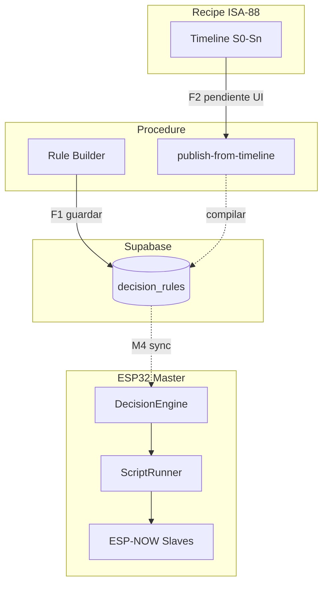

# S02 — Decision Engine procedural + Timeline + Rule Builder (jul/2026)

**Punto de entrada:** [DECISION_ENGINE_PROCEDURE_STANDARD.md](./DECISION_ENGINE_PROCEDURE_STANDARD.md)  
**Relacionado:** [S01_GROW_CYCLE_RULES_17JUN2026.md](./S01_GROW_CYCLE_RULES_17JUN2026.md), [GROW_CYCLE_TIMELINE_IMPLEMENTATION.md](./GROW_CYCLE_TIMELINE_IMPLEMENTATION.md), [RULE_BUILDER_UX_SPEC.md](./RULE_BUILDER_UX_SPEC.md)

---

## 1. Resumen ejecutivo

Entrega **F0 + F1 (frontend)** del motor procedural HIDROWAVE, conectada al ciclo de cultivo (timeline) y al patrón Aurora (Timer → Sensor Valve → Linked).

| Capa | Estado jul/2026 |
|------|-----------------|
| **Timeline cultivo F0** | ✅ UI mock + chart SVG + simulación |
| **Rule Builder F1** | ✅ Edición + guardar `decision_rules` |
| **Schema `RuleProcedure`** | ✅ types + validate + compile |
| **Publish timeline → rules** | ⚠️ Lib `publish-from-timeline.ts` — **sin botón UI** |
| **Firmware ScriptRunner** | ⚠️ `ScriptRunner.cpp` existe — validar en bancada |
| **Sync Supabase → LittleFS** | ❌ Pendiente |

---

## 2. Rutas UI

| Ruta | Fase | Qué hace |
|------|------|----------|
| `/processos/timeline-cultivo` | F0 | Chart EC/pH S0–Sn, playhead, log simulación, tooltip métricas live (opcional) |
| `/automacao/procedimento` | F1 | Rule Builder: Initial Fill, editar triggers/steps, guardar Supabase |
| `/automacao` | — | Nova Regra + relay picker master+slave |
| `/processos` | — | Cards discovery timeline + rule builder |

---

## 3. Arquitectura (macro → micro)



---

## 4. Inventario de archivos (frontend)

### Timeline cultivo (F0)

| Archivo | Rol |
|---------|-----|
| `src/lib/grow-cycle-timeline/types.ts` | `GrowCyclePlan`, P1 events |
| `src/lib/grow-cycle-timeline/mock-rdwc-12w.ts` | Demo 12 semanas |
| `src/lib/grow-cycle-timeline/simulation-engine.ts` | Log simulado P1–P4 |
| `src/components/grow-cycle/GrowCycleTimelineChart.tsx` | Chart barras SVG |
| `src/components/grow-cycle/GrowCycleWeekHoverTooltip.tsx` | Tooltip métricas live |
| `src/app/processos/timeline-cultivo/*` | Página |

### Rule procedure (F0/F1)

| Archivo | Rol |
|---------|-----|
| `src/lib/rule-procedure/types.ts` | `RuleProcedure`, steps, triggers |
| `src/lib/rule-procedure/validate-procedure.ts` | Validación pre-save |
| `src/lib/rule-procedure/compile-procedure.ts` | → `rule_json` + `procedure_canonical` |
| `src/lib/rule-procedure/save-procedure.ts` | CRUD `decision_rules` |
| `src/lib/rule-procedure/publish-from-timeline.ts` | Tank events → procedures |
| `src/lib/rule-procedure/templates/initial-fill-demo.ts` | Plantilla Aurora |
| `src/components/rule-procedure/*` | Editors + JSON preview |
| `src/app/automacao/procedimento/*` | Rule Builder page |

### Actuadores master + slave

| Archivo | Rol |
|---------|-----|
| `src/lib/master-relay-options.ts` | Keys master/slave, parse MAC |
| `src/components/instruction-editors/RelayActionEditor.tsx` | Dropdown MASTER + SLAVE |
| `src/lib/slave-relay-allocation.ts` | Allocación slaves (dilución, etc.) |

---

## 5. Firmware (ESP-HIDROWAVE-main)

| Archivo | Rol |
|---------|-----|
| `include/ScriptRunner.h` | State machine scripts |
| `src/ScriptRunner.cpp` | WHILE, delay, relay, time_window |
| `src/DecisionEngine.cpp` | Integra `ScriptRunnerManager` |

**Validar en bancada:** flash master, regla `INITIAL_FILL` en Supabase, poll/sync, log serial paso a paso.

---

## 6. Master vs Slave — regla operativa

| Recurso | Dónde | Protocolo |
|---------|-------|-----------|
| Sensores EC/pH/nivel | Master | I2C/ADC/Modbus |
| Relé válvula/bomba local | Master R0–7 | GPIO |
| Relé remoto | Slave MAC + R0–7 | ESP-NOW |
| Auto EC/pH (P2/P3) | `HydroControl` | Fuera del Rule Builder |

En Rule Builder y `RelayActionEditor`: elegir **MASTER** o **SLAVE** por paso.

---

## 7. Fases — hecho vs pendiente

### ✅ Completado

- [x] Doc `DECISION_ENGINE_PROCEDURE_STANDARD.md`
- [x] Doc `GROW_CYCLE_TIMELINE_IMPLEMENTATION.md`
- [x] Timeline mock profesional (chart + simulación)
- [x] Rule Builder F1 (editar + guardar Supabase)
- [x] `RuleProcedure` schema + compile + validate
- [x] Plantilla Initial Fill demo
- [x] Relay picker master + slave en scripts
- [x] `publish-from-timeline.ts` (generador procedures desde plan)
- [x] Tooltip métricas live en timeline (device opcional)
- [x] Cards hub `/processos`

### ⚠️ Parcial

- [ ] Botón **Publicar** en timeline → `saveProcedure` batch (lib lista, UI falta)
- [ ] `ProcedureStepEditor` — actuator master/slave dropdown (hoy relayIndex manual)
- [ ] Chain editor en Rule Builder UI
- [ ] Firmware ScriptRunner — código presente, E2E bancada pendiente
- [ ] `time_window` triggers en firmware — verificar ventana 08:00

### ❌ Pendiente (F2–F4)

- [ ] Tabla `grow_cycle_plans` persistida
- [ ] Sync Supabase → LittleFS automático
- [ ] Setpoints semanales EC/pH desde timeline (F3 grow)
- [ ] Checklist `BANCADA_DECISION_ENGINE_E2E.md`

---

## 8. Flujo operador recomendado (hoy)

1. **Diseñar ciclo:** `/processos/timeline-cultivo` — ajustar semanas, simular log.
2. **Crear procedimiento P1:** `/automacao/procedimento` — Initial Fill, editar steps, seleccionar device, **Guardar**.
3. **Verificar en Automação:** regla aparece en lista `decision_rules`.
4. **Bancada:** flash master con ScriptRunner; confirmar ejecución o upload manual LittleFS.
5. **Post-fill:** activar Auto EC/pH manual (RPC) — ver S01 §7.

---

## 9. JSON canónico en `rule_json`

Al guardar, `rule_json` incluye:

```json
{
  "procedure_canonical": { "id": "INITIAL_FILL", "steps": [], "triggers": [] },
  "script": {
    "instructions": [],
    "loop_interval_ms": 5000,
    "max_iterations": 1,
    "chained_events": []
  }
}
```

Firmware debe leer `script.instructions` vía `ScriptRunnerManager::loadFromRuleJson`.

---

## 10. Próximos pasos (prioridad)

| # | Tarea | Owner |
|---|-------|-------|
| 1 | Botón Publicar en timeline + batch save | Frontend F2 |
| 2 | Actuator dropdown en `ProcedureStepEditor` (master/slave) | Frontend |
| 3 | E2E bancada Initial Fill + checklist doc | Firmware + QA |
| 4 | Sync cloud rules → LittleFS | Firmware M4 |
| 5 | `grow_cycle_plans` table | Backend F1 timeline |

---

## 11. Gates

| Gate | Criterio |
|------|----------|
| `PROCEDURE_UI_F1` | Guardar Initial Fill sin error en Supabase |
| `TIMELINE_PUBLISH_F2` | Publicar 12 sem → N reglas P1 en BD |
| `SCRIPT_RUNNER_BENCH` | ESP32 ejecuta paso sensor_valve + timeout |
| `CYCLE_E2E` | S0 fill → semanas → S12 drain en bancada |
